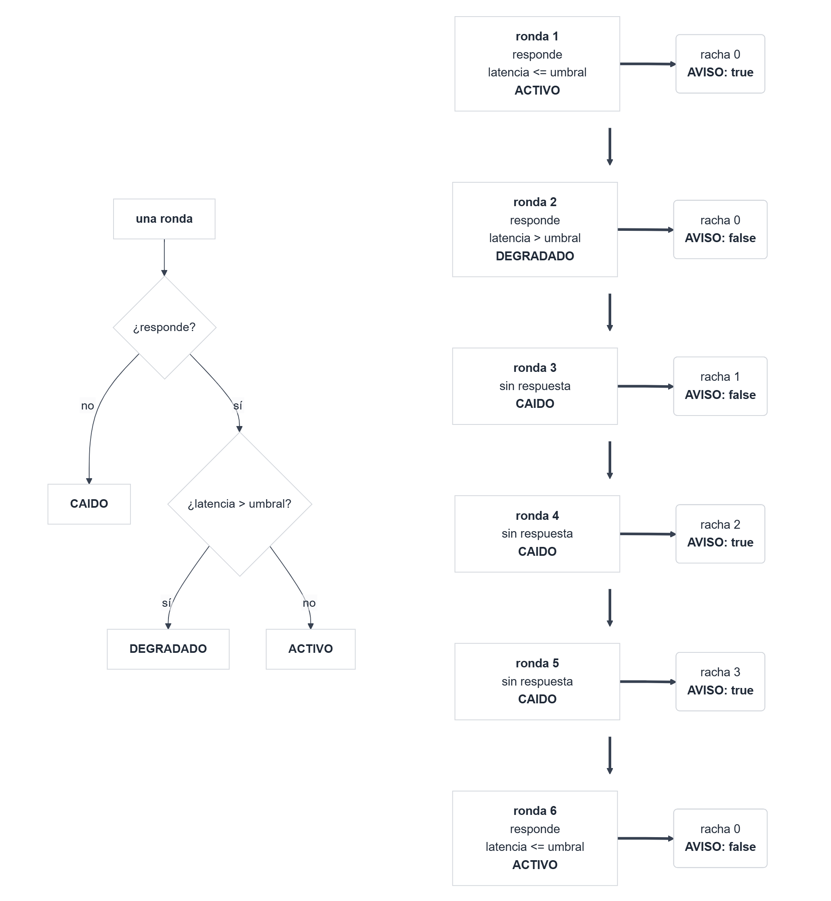

## Introducción

En Programación I aprendiste a escribir programas que funcionan. En esta asignatura vas a aprender a escribir programas que *siguen* funcionando cuando cambian los requisitos, cuando crecen y cuando los mantiene otra persona. La diferencia no es menor: en un proyecto real, escribir la primera versión del código cuesta una fracción pequeña del esfuerzo total; el resto se va en modificarlo, corregirlo y ampliarlo. Por eso este tema, aunque repasa los fundamentos de la orientación a objetos en Java, los presenta desde el punto de vista del **diseño**: cómo repartir el trabajo entre clases, cómo decidir qué sabe cada una y qué oculta, y cómo hacer que un cambio en un lugar no obligue a reescribir media aplicación.

El tema tiene cuatro secciones, que siguen los acápites de la guía docente. En la primera (1.1) revisamos los conceptos fundamentales de la orientación a objetos, pero con la mirada del diseñador y con los recursos del Java moderno (`record`, `var`, *pattern matching* para `instanceof`). En la segunda (1.2) presentamos los principios SOLID y seis patrones de diseño que los ponen en práctica. En la tercera (1.3) estudiamos la genericidad y la Stream API, que permiten escribir código reutilizable y expresivo sobre colecciones. En la cuarta (1.4) damos el primer paso hacia la verificación con pruebas unitarias en JUnit 5.

::: {.callout-tip appearance="simple"}
A lo largo del tema verás dos tipos de ejemplos de código, **ejemplos breves** y el **ejemplo unificador** que se plantea a continuación (@nte-ejemplo-unificador). Los **ejemplos breves**, autocontenidos, sirven para presentar cada concepto de la forma más limpia posible. 

Todo el código del tema es Java 25, se organiza en proyectos Maven y vive en el paquete `es.uib.prgava.tema1` (el ejemplo unificador es `es.uib.prgava.tema1.monitor`). Los listados son completos y compilables salvo cuando se indica lo contrario.
:::

::: {#nte-ejemplo-unificador .callout-note title="Monitor de servicios de red (planteamiento)"}
El **ejemplo unificador** es un **monitor de servicios de red** que irá evolucionando a lo largo del tema y de la asignatura. 

:::: {.ampliacion}
Se motiva por el siguiente requerimiento que el COO (Chief Operating Officer) le envía a tu jefe el CTO (Chief Technology Officer):

> **De:** Director de Operaciones (COO)
>
> **Para:** Director de Tecnología (CTO)
>
> **Asunto:** Asignación prioritaria: avisos de caída — necesitamos algo nuestro
>
> Por medio del presente, te hago llegar un requerimiento prioritario derivado de que ayer el portal de un cliente estuvo caído cuarenta minutos y nos enteramos porque llamó él. Hoy «vigilar» en nuestro sistema consiste en que quien está de guardia abre el navegador cada tanto y mira. Quiero un programa que lo haga solo.
>
> De momento son tres cosas: el portal del cliente, el servidor DNS que resuelve su dominio y el puerto 25 de su servidor de correo. Cada pocos minutos, comprobar si responden y cuánto tardan. Si algo falla, que avise: por ahora con que lo escriba por consola me vale, la semana que viene querré correo, y en cuanto funcione el cliente pedirá que le llegue al móvil.
>
> Dos cosas más. No quiero un aviso por cada fallo suelto, porque la red tiene microcortes y nos saturaríamos; quiero avisar cuando falle **de verdad**. Qué significa «de verdad» lo hablamos, porque no lo tengo claro y seguramente cambie con cada cliente. Y hay que guardar lo que se mida: a fin de mes tenemos que decirle a cada cliente qué disponibilidad le hemos dado.
>
> Y sí, ya sé lo que me vas a preguntar: que si Nagios, Zabbix o Prometheus. Es la pregunta correcta y ya me la he planteado. Para vigilar nuestra propia red los usamos y los seguiremos usando. Lo que no nos resuelven es esto: el informe de disponibilidad con el que facturamos sale de nuestro sistema, con nuestros umbrales y nuestro formato, y tiene que ir dentro del equipo que instalamos en casa del cliente, donde no vamos a meter un Zabbix. Así que la parte que mide y decide la escribimos nosotros.
>
> Del plazo ya hablaremos. Lo que no quiero es que dentro de dos meses, cuando te pida lo del correo, me contestes que hay que rehacerlo entero.
::::

Se trata de una pequeña aplicación que mantiene una lista de servicios a vigilar (un servidor web, un servidor DNS, un puerto TCP), los comprueba, guarda los resultados y avisa cuando alguno falla. Es un problema pequeño, pero tiene todo lo necesario para hablar de diseño: varios tipos de servicios, varias formas de avisar, políticas de alerta que cambian, un historial sobre el que hacer informes y una parte (la comprobación real) que conviene aislar para poder probar el resto.

Un primer esquema de cómo se reparte el trabajo entre las piezas del monitor es el siguiente:

```{mermaid}
%%| label: fig-monitor
%%| fig-cap: "Reparto de responsabilidades del monitor cuando esté terminado."
flowchart TB
    S(["Servicios a vigilar:<br/>un servidor web, un DNS, un puerto TCP"])
    S --> M

    M["<b>Monitor</b><br/><i>coordina cada ronda</i>"]

    M -- "1 · ¿responde?" --> P["<b>Sonda</b><br/><i>comprueba un servicio<br/>y mide cuánto tarda</i>"]
    P -- "2 · resultado" --> M
    M -- "3 · guarda el resultado" --> R["<b>Repositorio</b><br/><i>historial de comprobaciones</i>"]
    M -- "4 · ¿hay que alertar?" --> A["<b>Política de alerta</b><br/><i>qué se considera preocupante</i>"]
    M -- "5 · si procede, avisa" --> N["<b>Notificador</b><br/><i>consola, registro, correo…</i>"]

    style M fill:#e8f0fe,stroke:#0060A8,stroke-width:2px
    style S fill:#ffffff,stroke:#9aa0a6
```

Así queda repartido el trabajo cuando el monitor esté terminado: una pieza por responsabilidad, y ninguna sabe cómo trabajan las demás. No hace falta que entiendas todavía cómo se construye; vuelve a este esquema cuando cada caja vaya apareciendo a lo largo del tema, porque el reparto **es** el contenido de 1.2. Los nombres están en castellano a propósito: en el código serán `Monitor`, `Sonda`, `Repositorio…`, `PoliticaDeAlerta` y `Notificador`.

La comprobación de un servicio la hará una interfaz `Sonda` cuyas implementaciones simulan la respuesta: simular es lo que permite que una prueba sepa qué debe ocurrir (1.4). En el Tema 3, la `Sonda` ejecutará las comprobaciones concurrentemente; y en el Tema 4, el historial se podrá guardar en una base de datos. Al acabar el curso se habrá construido el sistema completo, pieza a pieza.
:::

::: {.callout-tip appearance="simple"}
**Ejecuta los ejemplos mientras lees.** Todo el código de este tema está en el repositorio
[`t1-ejemplos`](https://github.com/UIB-22354-Programacion-Avanzada/t1-ejemplos), listo para
abrirse en un entorno de desarrollo en el navegador (VS Code en un Codespace de GitHub), sin instalar nada:

[](https://codespaces.new/UIB-22354-Programacion-Avanzada/t1-ejemplos)

Necesitas una **cuenta de GitHub** (gratuita) y haber iniciado sesión; el entorno se crea en tu
cuenta y la primera vez tarda unos minutos. También puedes clonar el repositorio y abrirlo en tu IDE favorito (IntelliJ, Eclipse, VS Code...). En cualquier caso, compila y ejecuta los ejemplos para ver cómo funcionan y experimentar con ellos.
:::

## 1.1. Conceptos fundamentales de la POO en Java

### 1.1.1 Objetos, clases y estado

La programación orientada a objetos (*object-oriented programming*, POO) nació para simular sistemas complejos y se convirtió en el paradigma dominante porque ofrece una forma de gestionar la complejidad: modelar el problema como un conjunto de **objetos** que tienen datos (**atributos**) y acciones (**métodos**), y que colaboran enviándose mensajes. Suele resumirse en cuatro pilares: **encapsulación**, **herencia**, **polimorfismo** y **abstracción**. Los cuatro aparecen en esta sección, pero no como definiciones que memorizar, sino como herramientas para decidir cómo se reparte el trabajo entre las partes de un programa.

#### **Clases y objetos**

::: {#imp-claobj .callout-important title="Clases y objetos"}
Una **clase** es la plantilla que define la estructura (qué atributos) y el comportamiento (qué métodos) de un tipo de objetos. Un **objeto** es una instancia concreta de una clase, creada en tiempo de ejecución, con sus propios valores en los atributos.

Una analogía útil: la clase es el plano de una casa; los objetos son las casas construidas a partir de él. El plano dice cuántas habitaciones hay y dónde van las puertas, pero no es una casa, y de un mismo plano se construyen muchas casas, cada una con sus propios muebles.
:::

En Java una clase se declara con la palabra clave `class`, y su esqueleto general es:

```java
// Fragmento: estructura general de una clase
[modificadores] class NombreDeLaClase [extends Superclase] [implements Interfaz1, Interfaz2] {
    // atributos (campos): el estado
    // constructores: cómo se crea un objeto
    // métodos: el comportamiento
}
```

Los nombres de clase se escriben en *UpperCamelCase* (`DispositivoRed`), y los de atributos, métodos y variables en *lowerCamelCase* (`direccionIp`, `activar`). Las cláusulas `extends` e `implements` son opcionales y las veremos en las secciones de herencia e interfaces.

Un objeto tiene **identidad**, **estado** y **comportamiento**: 

- La identidad lo distingue de cualquier otro objeto aunque ambos tengan el mismo estado; 
- el estado es el valor de sus atributos en un instante dado; 
- el comportamiento son los métodos que puede ejecutar. 

::: {#imp-atrimet .callout-important title="Atributos, métodos y constructores de una clase"}
- Un **atributo de instancia** (*instance field*) es una variable que pertenece a cada objeto: en la clase `DispositivoRed` del @nte-dispositivo-red cada dispositivo tiene su propio `nombre`y su `direccionIp`. 

- Un **atributo de clase (declarado con la palabra clave `static`)** (*static field*) es una variable que pertenece a la clase y es compartido por todos sus objetos: en la clase `DispositivoRed` del @nte-dispositivo-red `dispositivosCreados` es un contador de dispositivos creados. Lo mismo vale para los métodos: un método `static` no opera sobre ningún objeto concreto y se invoca sobre la clase (`Math.max(2, 3)`).

- Un **método de instancia** es una operación definida dentro de una clase que se ejecuta sobre un objeto. Se diferencia de una función en que está asociado a un objeto y recibe **implícitamente** ese objeto, accesible como `this`, además de sus parámetros explícitos. Por eso puede leer y modificar los atributos del objeto sin que se los pasen.

- Un **método de clase (declarado con la palabra clave `static`)** es un método que **pertenece a la clase en sí misma**, y no a los objetos individuales (instancias) creados a partir de ella.
    - **No requiere objetos:** Puedes llamarlo directamente usando el nombre de la clase, sin necesidad de usar `new`. Dado el @nte-dispositivo-red podemos emplear `DispositivoRed.getDispositivosCreados()`.
    - **Aislamiento:** Al no pertenecer a un objeto, **no puede usar la palabra clave `this**` ni acceder a variables o métodos de la clase que no sean estáticos.
    - **Propósito:** Se utilizan habitualmente para crear funciones de utilidad, herramientas globales o constantes que no dependen del estado particular de ningún objeto.

- Un **constructor** es un miembro especial que lleva el nombre de la clase, no declara tipo de retorno y se ejecuta al crear un objeto (inicializar una instancia) con `new`. Su cometido es dejar el objeto en un estado inicial válido. Una clase puede declarar varios constructores con distintos parámetros (**sobrecarga**, *overloading*), y uno puede llamar a otro con `this(...)`. **Si no declaras ninguno, Java añade uno vacío sin parámetros**.

Los **modificadores de acceso** controlan desde dónde es visible cada miembro (atributos, métodos y constructores) y son la base de la encapsulación:

| Modificador | Visible desde |
|---|---|
| `public` | cualquier clase |
| `protected` | la propia clase, las clases del mismo paquete y las subclases (aunque estén en otro paquete) |
| *(ninguno)* | la propia clase y las clases del mismo paquete (*package-private*) |
| `private` | solo la propia clase |

El modificador **`final`** indica que un elemento no puede ser modificado de determinadas formas después de su definición. Su significado depende de dónde se utilice:

- **Atributo:** Un atributo declarado como `final` no puede ser reasignado después de su inicialización.
- **Método:** Un método declarado como `final` no puede ser sobrescrito por subclases.
- **Clase:** Una clase declarada como `final` no puede ser extendida (no puede tener subclases).
- **Variable local:** Una variable local declarada como `final` no puede ser reasignada después de su inicialización.

:::

La práctica habitual, que seguiremos siempre, es declarar los atributos `private` y exponer solo los métodos necesarios. Cuando hace falta leer o modificar un atributo desde fuera se escriben **métodos de acceso** (*getters*) y **de modificación** (*setters*), que permiten a la clase controlar cómo se accede a su estado: validar, calcular, o negarse. Esto se verá en la sección de encapsulación e invariantes.

Veamos todo esto reunido en un ejemplo del dominio de la telemática: un [dispositivo de red]{.glos} (*network device*) con nombre y [dirección]{.glos data-termino="direccion-ip"} IPv4, que puede estar activo o inactivo, y cuya clase lleva la cuenta de cuántos dispositivos se han creado.

::: {#nte-dispositivo-red .callout-note title="Una clase completa: `DispositivoRed`"}
```java
// DispositivoRed.java
package es.uib.prgava.tema1.poo;

import java.util.Objects;

public class DispositivoRed {

    // Atributo de clase (static): uno solo, compartido por todos los objetos
    private static int dispositivosCreados = 0;

    // Atributos de instancia: cada objeto tiene los suyos
    private String nombre;
    private String direccionIp;
    private boolean activo;

    // Constructor principal
    public DispositivoRed(String nombre, String direccionIp) {
        this.nombre = nombre;
        this.direccionIp = esIpValida(direccionIp) ? direccionIp : "0.0.0.0";
        this.activo = false;
        dispositivosCreados++;
    }

    // Constructor sobrecargado: delega en el principal con this(...)
    public DispositivoRed() {
        this("desconocido", null);
    }

    // Comportamiento
    public void activar()    { activo = true; }
    public void desactivar() { activo = false; }

    // Métodos de acceso y de modificación
    public String getNombre()               { return nombre; }
    public void setNombre(String nombre)    { this.nombre = nombre; }
    public String getDireccionIp()          { return direccionIp; }
    public boolean isActivo()               { return activo; }

    // Método de clase: se invoca como DispositivoRed.getDispositivosCreados()
    public static int getDispositivosCreados() { return dispositivosCreados; }

    // Igualdad por estado: dos dispositivos son el mismo si coinciden nombre e IP
    @Override
    public boolean equals(Object otro) {
        return otro instanceof DispositivoRed d
                && nombre.equals(d.nombre)
                && direccionIp.equals(d.direccionIp);
    }

    @Override
    public int hashCode() {
        return Objects.hash(nombre, direccionIp);
    }

    @Override
    public String toString() {
        return "DispositivoRed[nombre=" + nombre + ", ip=" + direccionIp + ", activo=" + activo + "]";
    }

    // Método auxiliar privado: comprueba el formato de una dirección IPv4
    private static boolean esIpValida(String ip) {
        if (ip == null || ip.isBlank()) {
            return false;
        }
        String octeto = "(25[0-5]|2[0-4][0-9]|[01]?[0-9][0-9]?)";
        return ip.matches("^" + octeto + "(\\." + octeto + "){3}$");
    }
}
```

Lo que hay que observar en la clase:

- El atributo `dispositivosCreados` es `static`: pertenece a la clase, no a un objeto. Cada constructor lo incrementa, y `getDispositivosCreados()` también es `static` porque no necesita ningún objeto para responder.
- Hay dos constructores. El segundo no repite la lógica del primero, sino que lo llama con `this("desconocido", null)`; así la validación de la IP está en un único sitio.
- Los atributos son `private` y se accede a ellos con `getNombre`, `setNombre`, `getDireccionIp` e `isActivo`. Es la convención *JavaBeans* (`getX`, `setX`, y `isX` para los booleanos), que reconocen los IDE y muchas bibliotecas. Más adelante veremos que los registros usan otra convención (`nombre()` en lugar de `getNombre()`).
- No hay `setDireccionIp`: una vez creado el dispositivo, su IP no cambia desde fuera. Decidir qué *setters* **no** escribir es tan importante como escribir los que hacen falta.
- El método `esIpValida` es `private static`: un detalle de implementación que nadie fuera de la clase necesita. La expresión regular acepta cuatro octetos de 0 a 255: `25[0-5]` cubre 250–255, `2[0-4][0-9]` cubre 200–249 y `[01]?[0-9][0-9]?` cubre 0–199.
- Los métodos `equals`, `hashCode` y `toString` redefinen (`@Override`) métodos heredados de `Object`. Volveremos sobre los dos primeros enseguida, porque encierran el error más frecuente de esta sección (@cau-equals-sin-hashcode).
- Actualmente, la forma más limpia, segura y recomendada de sobrescribir `hashCode()` en una clase de Java es utilizando el método `Objects.hash()` de la clase de utilidad **`java.util.Objects`** (disponible desde Java 7). Le pasas **exactamente los mismos atributos** que utilizas dentro de tu método `equals()`
:::

La **jerarquía de clases en Java** es la estructura en árbol que se forma mediante la herencia, donde unas clases heredan de otras para compartir código y comportamientos, teniendo en la cúspide a la clase `Object`.

::: {#imp-objeto .callout-important title="Todas las clases descienden de `Object`"}
Todas las clases de Java heredan de `java.lang.Object`, la raíz de la jerarquía: si una clase no declara `extends`, extiende implícitamente a `Object`. De ella heredan `equals`, `hashCode`, `toString` y algunos métodos más que conviene conocer (consulta su documentación en la [API de Java](https://docs.oracle.com/en/java/javase/25/docs/api/java.base/java/lang/Object.html)). 

La anotación `@Override` no es obligatoria, pero úsala siempre que redefinas un método: si te equivocas en la firma (por ejemplo, `equals(DispositivoRed otro)` en lugar de `equals(Object otro)`), el compilador te avisará en lugar de crear silenciosamente un método nuevo que nadie llama.
:::

#### **Crear objetos y referencias**

Un objeto se crea con `new` seguido de una llamada a un constructor. El operador `new` reserva memoria para el objeto, ejecuta el constructor y devuelve una **referencia** al objeto. La variable en la que la guardas no *contiene* el objeto: contiene la referencia, algo parecido a una dirección. Dos variables pueden referirse al mismo objeto, y una variable puede no referirse a ninguno (`null`).

En los listados verás a menudo `var` en lugar del nombre del tipo, como en `var enrutador = new DispositivoRed(...)`. No es un tipo «dinámico» ni nada parecido: la variable tiene exactamente el mismo tipo que tendría si lo hubieras escrito, solo que **lo deduce el compilador** a partir del valor que se le asigna. Solo puede usarse en variables locales y solo cuando ese valor está a la vista, de modo que quien lee el código tampoco tenga dudas.

```java
// DemoDispositivos.java
package es.uib.prgava.tema1.poo;

public class DemoDispositivos {
    public static void main(String[] args) {
        var enrutador = new DispositivoRed("enrutador-1", "192.168.1.1");
        enrutador.activar();
        System.out.println(enrutador);                     // usa toString()

        var servidor = new DispositivoRed("servidor-a", "256.0.0.1");   // IP inválida
        System.out.println(servidor.getDireccionIp());     // 0.0.0.0

        var anonimo = new DispositivoRed();                // constructor sin parámetros
        System.out.println(anonimo);

        var alias = enrutador;                             // misma referencia, mismo objeto
        alias.desactivar();
        System.out.println(enrutador.isActivo());          // false: alias y enrutador son el mismo objeto

        var copia = new DispositivoRed("enrutador-1", "192.168.1.1");   // otro objeto, mismo estado
        System.out.println(enrutador == copia);            // false: identidades distintas
        System.out.println(enrutador.equals(copia));       // true: igualdad por estado

        System.out.println("Dispositivos creados: " + DispositivoRed.getDispositivosCreados());
    }
}
```

```text
DispositivoRed[nombre=enrutador-1, ip=192.168.1.1, activo=true]
0.0.0.0
DispositivoRed[nombre=desconocido, ip=0.0.0.0, activo=false]
false
false
true
Dispositivos creados: 4
```

Las dos últimas comparaciones son el núcleo de este apartado. Las variables `alias` y `enrutador` son **la misma** referencia: desactivar por una se ve por la otra. 

En cambio, `copia` es **otro** objeto con el mismo estado. Y aquí es donde Java tiene dos nociones de «ser iguales»: el operador `==` compara **identidad** (¿es la misma referencia?), mientras que `equals` compara **estado** según el criterio que la clase decida. Si una clase no redefine `equals`, hereda la versión de `Object`, que compara identidad, y entonces `equals` y `==` dicen lo mismo.

#### **Igualdad por estado: `equals` y `hashCode`**

Para la mayoría de las clases que representan *valores* (un punto, una fecha, una dirección, el resultado de una comprobación) queremos que dos objetos con el mismo estado sean iguales. Eso obliga a redefinir `equals`, y `equals` viene con un contrato que la documentación de `Object` fija con precisión [@objectdoc]: 

- debe ser reflexivo (`x.equals(x)` es `true`), 
- simétrico (`x.equals(y)` si y solo si `y.equals(x)`), 
- transitivo, consistente (varias llamadas devuelven lo mismo si el estado no cambia) y `x.equals(null)` debe devolver `false`. 

La versión de `DispositivoRed` en el @nte-dispositivo-red cumple todo esto: `otro instanceof DispositivoRed d` devuelve `false` para `null` y para objetos de otras clases, y la comparación de campos es simétrica y transitiva. Y además, siempre que se redefine `equals` **hay que redefinir `hashCode`**, de modo que dos objetos iguales tengan el mismo código *hash*; `Objects.hash(nombre, direccionIp)` lo garantiza. Este último punto es el que se olvida.

::: {#cau-equals-sin-hashcode .callout-caution title="Redefinir `equals` sin redefinir `hashCode`"}
La regla de oro en Java dice lo siguiente: ***Si dos objetos son iguales según tu método `equals()`, entonces ambos objetos deben devolver exactamente el mismo número en su método `hashCode()***`.

Si sobrescribes `equals()` para que compare los datos del objeto, pero no haces lo mismo con `hashCode()`, este último seguirá usando su comportamiento por defecto (que genera el número basándose en la dirección de memoria del objeto).

Si haces esto, **las colecciones basadas en tablas hash (`HashSet`, `HashMap`, `Hashtable`) dejarán de funcionar correctamente** (se verán en el tema 2). Las colecciones basadas en tablas *hash* localizan un elemento en dos pasos: primero usan `hashCode` para elegir el «cajón» donde buscar, y solo después usan `equals` dentro de ese cajón. Si dos objetos son iguales según `equals` pero tienen `hashCode` distintos, la colección los buscará en cajones diferentes y no los encontrará.

```java
// PuntoRoto.java
package es.uib.prgava.tema1.poo;

import java.util.HashSet;

public class PuntoRoto {
    private final int x, y;

    public PuntoRoto(int x, int y) { this.x = x; this.y = y; }

    @Override
    public boolean equals(Object o) {
        return o instanceof PuntoRoto p && p.x == x && p.y == y;
    }
    // ¡Falta hashCode!

    public static void main(String[] args) {
        var conjunto = new HashSet<PuntoRoto>();
        conjunto.add(new PuntoRoto(1, 2));
        System.out.println(conjunto.contains(new PuntoRoto(1, 2)));
        // false (casi siempre): lo busca en otro "cajón"
        conjunto.add(new PuntoRoto(1, 2));
        System.out.println(conjunto.size());
        // 2: el "conjunto" tiene duplicados
    }
}
```

El intento de buscar `new PuntoRoto(1, 2)` en el `HashSet` falla porque el *hash* de ese objeto no coincide con el *hash* del objeto que ya está en el conjunto, aunque `equals` diga que son iguales. Por eso el tamaño del conjunto es 2, cuando debería ser 1 (un conjunto no admite duplicados). La lógica de `equals` es correcta y el programa compila; el error solo aparece al usar la clase en una colección *hash*, a menudo lejos del punto donde se escribió. 

El compilador puede ayudarte: con `javac -Xlint:all` (o activando las inspecciones de IntelliJ) obtendrás el aviso `Class PuntoRoto overrides equals, but neither it nor any superclass overrides hashCode method`. Acostúmbrate a compilar con todos los avisos activados. Bloch dedica a este contrato un capítulo entero de *Effective Java* [@bloch2018, ítems 10 y 11].
:::

Fíjate en la sintaxis `o instanceof PuntoRoto p && ...`: es *pattern matching* para `instanceof`, estándar desde Java 16. Declara la variable `p` ya convertida al tipo, evitando el *cast* explícito que se escribía tradicionalmente. La usaremos a menudo.

La forma correcta de escribir `equals` y `hashCode` a mano es mecánica, y precisamente por eso Java 16 introdujo los **registros** (`record`), que los generan automáticamente junto con el constructor, los métodos de acceso y `toString`.

::: {#imp-javarecords .callout-important title="Tipo especial de clase, el `record`"}

Los **Records** en Java (introducidos de forma oficial en Java 16) son un tipo especial de clase diseñada específicamente para ser **portadores transparentes de datos inmutables**.

Su objetivo principal es hacerte la vida más fácil eliminando el *código repetitivo* (boilerplate) que normalmente tienes que escribir al crear una clase que solo sirve para guardar información. Antes de los Records, si querías crear una clase sencilla para representar unas coordenadas en un plano, tenías que escribir todo esto:

```java
// Fragmento: antes de Java 16, sin Records

// El método tradicional (mucho código)
public class Punto {
    private final int x;
    private final int y;

    public Punto(int x, int y) {
        this.x = x;
        this.y = y;
    }

    public int getX() { return x; }
    public int getY() { return y; }

    // Además tendrías que escribir o generar:
    // equals(), hashCode() y toString()
}

```

Con un Record, puedes hacer exactamente lo mismo en una sola línea de código:

```java
// Punto.java
package es.uib.prgava.tema1.poo;

public record Punto(int x, int y) { }
```

Al escribir esto, el compilador de Java hace la magia por ti y genera automáticamente:

- Un **constructor** que recibe ambos parámetros.
- Los métodos de lectura (ojo: se llaman `x()` y `y()`, no usan el prefijo `get`).
- Implementaciones estándar y correctas de `equals()`, `hashCode()` y `toString()`.

Con esta única línea, podemos escribir código que funcione igual que antes, pero sin el *boilerplate*. Por ejemplo:

```java
// DemoPunto.java
package es.uib.prgava.tema1.poo;

public class DemoPunto {
    public static void main(String[] args) {
        Punto p1 = new Punto(5, 10);
        Punto p2 = new Punto(5, 10);

        // 1. Uso de toString()
        // Se llama automáticamente al imprimir el objeto
        System.out.println("Imprimiendo p1: " + p1.toString()); 
        // Salida: Imprimiendo p1: Punto[x=5, y=10]

        // 2. Uso de hashCode()
        System.out.println("Hash de p1: " + p1.hashCode());
        System.out.println("Hash de p2: " + p2.hashCode());
        
        // Como tienen los mismos datos, el hashCode es idéntico
        System.out.println("¿Tienen el mismo hash? " + (p1.hashCode() == p2.hashCode())); 
        // Salida: true
    }
}

``` 

**Características clave que debes conocer**

- **Son inmutables:** Una vez que creas un objeto Record (ej. `new Punto(10, 20)`), no puedes cambiar sus valores. Los campos son constantes (`final`) por defecto y no hay métodos *setters* [@jep395].
- **No hay herencia:** Los Records no pueden heredar de otras clases (porque ya heredan internamente de `java.lang.Record`), y tampoco pueden ser heredados por otras clases (son `final`).
- **Sí aceptan interfaces:** Aunque no puedan heredar clases, un Record sí puede implementar interfaces.
- **Puedes añadir métodos:** Si necesitas lógica adicional o validar datos al construirlos, puedes abrir las llaves `{}` y escribir tus propios métodos o constructores personalizados.
:::

En el monitor de servicios (@nte-ejemplo-unificador) ¿qué significa que dos servicios sean «el mismo»? Un servicio HTTP queda determinado por su URL; un servicio DNS, por el dominio que se consulta; un puerto TCP, por el par anfitrión y puerto. Dos objetos que describen el mismo servicio deben ser iguales aunque se hayan creado por separado (por ejemplo, uno al leer la configuración y otro al consultar el historial). Son valores, y por tanto los modelaremos como registros al construir el vocabulario del monitor, en 1.2.2.

::: {#imp-identidad-vs-igualdad .callout-important title="Identidad e igualdad"}
El operador de igualdad `==` compara identidad: retorna `true` si dos referencias apuntan al mismo objeto. El método `equals` compara igualdad según el criterio de la clase. 

Para una clase que representa un **valor**, dos objetos con el mismo estado deben ser iguales: redefine `equals` y `hashCode` juntos o, mejor, usa un `record`. 

Para una clase que representa una **entidad** con identidad propia (una conexión, un hilo, una cuenta bancaria concreta), la igualdad por identidad heredada de `Object` suele ser la correcta.
:::

### 1.1.2 Encapsulación e invariantes

Si hubiera que quedarse con una sola idea de la orientación a objetos, sería esta: **un objeto es
responsable de su propia coherencia**, no lo son quienes lo instancian y lo usan.

::: {#imp-encapsulación .callout-important title="Encapsulación"}
La **encapsulación** (*encapsulation*) es la ocultación del estado de un objeto tras una interfaz
de métodos. Con los modificadores de acceso que vimos en 1.1.1 ya tienes el mecanismo; lo que
importa ahora es para qué sirve.

Suele presentarse como «poner los atributos en `private` y ofrecer métodos de acceso». Eso es la
mecánica. La idea es otra: **el estado se oculta para que la clase pueda responder de él**. Si
cualquiera pudiera modificarlo, ninguna garantía sería posible, y la responsabilidad se repartiría
entre todos los que tocan el objeto — es decir, no sería de nadie.

Y esa responsabilidad, una vez asumida, vale mucho. Si nadie puede modificar un objeto sin pasar
por sus métodos, y sus métodos comprueban lo que hace falta, entonces la clase puede afirmar que
ciertas propiedades se cumplen **siempre**, pase lo que pase fuera de ella: que el puerto está
entre 1 y 65 535, que la latencia nunca es negativa, que la lista de servicios no está vacía. Quien use la clase no tiene que comprobarlo, ni acordarse de comprobarlo, ni desconfiar. Esas promesas se llaman **invariantes**.
:::

De lo anterior sigue una consecuencia que conviene asumir pronto, porque contradice una costumbre muy extendida: **un atributo privado con su `get` y su `set` generados automáticamente no está
encapsulado**.

```java
// Fragmento: encapsulación aparente
public class Umbral {
    private long milisegundos;

    public long getMilisegundos()            { return milisegundos; }
    public void setMilisegundos(long valor)  { this.milisegundos = valor; }   // acepta 0, -7...
}
```

Esta clase ofrece exactamente las mismas garantías que si el campo fuera `public`: ninguna. El
El modificador `private` solo ha añadido dos métodos y la ilusión de control. Generar un par de accesores por cada campo, que es lo que hacen los asistentes de los IDE con un par de clics, produce clases así con mucha facilidad. La pregunta que hay que hacerse ante cada clase no es «¿he puesto los atributos en `private`?», sino **«¿qué tiene que ser siempre cierto aquí, y qué camino podría romperlo?»**.

::: {#imp-invariante .callout-important title="Invariante de clase"}
Un **invariante de clase** es una condición sobre el estado de un objeto que se cumple siempre que el objeto es observable desde fuera: al terminar el constructor y al terminar cada método público. Ejemplos: «la latencia nunca es negativa», «el puerto está entre 1 y 65535», «la lista de servicios no contiene `null`». La clase es responsable de establecer el invariante en el constructor y de preservarlo en cada método. Si un invariante puede violarse desde fuera, la encapsulación está rota.
:::

La idea de invariante viene del *diseño por contrato* de Meyer [@meyer1997]: cada método tiene precondiciones (lo que exige a quien lo llama), postcondiciones (lo que garantiza al terminar) y la clase entera tiene invariantes. Java no tiene sintaxis para expresarlos, pero el lugar natural para comprobarlos es el constructor y los métodos que cambian el estado. En el @nte-dispositivo-red, el constructor comprueba que la IP es válida y la corrige si no lo es; los métodos `activar` y `desactivar` no pueden violar ningún invariante, así que no hacen comprobaciones.

En un `record` los invariantes se definen en el **constructor compacto**. Dado que los Records son portadores de datos inmutables, el compilador genera automáticamente un constructor canónico con todos sus campos. El constructor compacto sirve para interceptar ese proceso de creación. Se declara únicamente con el modificador de acceso, el nombre del Record y las llaves, omitiendo por completo la lista de argumentos. Dentro de las llaves se puede escribir código que valide los argumentos y lance excepciones si no cumplen el invariante. En el ejemplo siguiente, un `Puerto` válido está entre 1 y 65535:

```{#puerto .java}
// Puerto.java
package es.uib.prgava.tema1.poo;

public record Puerto(int numero) {
    public Puerto {                       // constructor compacto: sin lista de parámetros
        if (numero < 1 || numero > 65_535) {
            throw new IllegalArgumentException("Puerto fuera de rango: " + numero);
        }
    }
}
```

El constructor compacto se ejecuta antes de asignar los campos y recibe los parámetros con el mismo nombre que los componentes. Si lanza una excepción, el objeto nunca llega a existir: es imposible tener un `Puerto` con número inválido. Compáralo con la alternativa de validar en un método `setNumero` de una clase mutable: entre la construcción y la llamada al *setter*, el objeto existe en un estado inválido, y nada impide que alguien lo use.

Esto nos lleva a una regla de diseño que en Java moderno se ha convertido en la opción por defecto: **la inmutabilidad**. Un objeto inmutable no cambia de estado tras su construcción. Sus ventajas son sustanciales: el invariante se comprueba una sola vez; el objeto puede compartirse libremente entre partes del programa (y, como veremos en el Tema 3, entre hilos) sin riesgo de que una parte lo modifique a espaldas de otra; y su comportamiento es más fácil de razonar y de probar. Bloch lo resume en «minimiza la mutabilidad» [@bloch2018, ítem 17].

::: {.callout-tip appearance="simple"}
Regla práctica: haz cada clase inmutable salvo que tengas una razón concreta para no hacerlo. Si necesita ser mutable, restringe al mínimo los métodos que cambian el estado y comprueba el invariante (@imp-invariante) en cada uno de ellos.
:::

### 1.1.3 Herencia y composición

::: {#imp-herencia .callout-important title="Herencia"}
La **herencia** es otro de los pilares fundamentales de la POO. Es el mecanismo que permite que una nueva clase (llamada *subclase* o clase hija) se construya basándose en una clase ya existente (llamada *superclase* o clase padre). La **subclase** (o clase hija) recibe los atributos y métodos de la **superclase** (o clase padre), puede añadir otros y puede redefinir (*override*) los heredados. Entre las ventajas de la herencia destacan: 

- **La relación «es un» (*is-a*):** La herencia modela conceptualmente el mundo real, pero solo tiene sentido lógico si puedes afirmar que el hijo "es un" tipo del padre. Por ejemplo, un `Gato` *es un* `Animal`. Un `Enrutador` ([*router*]{.glos data-termino="router"}) *es un* `DispositivoRed` y un `Conmutador` ([*switch*]{.glos data-termino="switch"}) *es un* `DispositivoRed`.
- **Reutilización de código:** Es su beneficio más inmediato. Si todos los dispositivos de red tienen un método `activar()`, lo programas una sola vez en la superclase `DispositivoRed`, y tanto las clases `Enrutador` como `Conmutador` lo obtienen gratis.
- **Especialización:** Permite diseñar sistemas partiendo de lo general (el padre) y especializando o refinando el comportamiento a medida que desciendes en la jerarquía (los hijos).
- **Polimorfismo:** La herencia es el cimiento que permite que un programa trate a un objeto de la clase hija exactamente como si fuera de la clase padre, facilitando un código mucho más flexible.
:::

Veamos un ejemplo de herencia con dos nuevas clases que heredan de `DispositivoRed`: `Enrutador` y `Conmutador`. Ambas reciben los atributos y los métodos de la superclase `DispositivoRed`, y añaden los suyos propios. La relación es unidireccional: cada subclase conoce a su superclase, pero la superclase no sabe qué subclases tiene ni puede usar lo que estas añaden. Un método escrito en `DispositivoRed` no puede llamar a un método que solo exista en `Enrutador`, ni leer un atributo que solo tenga `Conmutador`. Lo que sí ocurre, y lo veremos en 1.1.4, es lo contrario de lo que podría parecer: cuando la subclase **redefine** un método heredado, el código de la superclase que lo llame ejecutará la versión de la subclase.

::: {#nte-herenciaejemplo .callout-note title="Clases `Enrutador` y `Conmutador` que heredan de `DispositivoRed`"}
En Java el concepto de herencia se declara con `extends`. La mecánica tiene tres piezas: `extends` en la declaración, `super(...)` en el constructor para inicializar la parte heredada, y `@Override` en los métodos que se redefinen. 

Por ejemplo, un enrutador con clase `Enrutador` tiene todo lo que tiene un `DispositivoRed`, más un número de [puertos]{.glos data-termino="puerto"} y un comportamiento de enrutamiento:

```java
// Enrutador.java
package es.uib.prgava.tema1.poo;

public class Enrutador extends DispositivoRed {

    private final int numeroDePuertos;     // atributo nuevo, solo de los enrutadores

    public Enrutador(String nombre, String direccionIp, int numeroDePuertos) {
        super(nombre, direccionIp);        // primero, el constructor de la superclase
        this.numeroDePuertos = numeroDePuertos;
    }

    public int getNumeroDePuertos() { return numeroDePuertos; }

    public void encaminar(String origen, String destino) {   // comportamiento nuevo
        System.out.println(getNombre() + " encamina un paquete de " + origen + " a " + destino);
    }

    @Override                                                 // comportamiento redefinido
    public String toString() {
        return "Enrutador[" + getNombre() + ", ip=" + getDireccionIp()
                + ", puertos=" + numeroDePuertos + "]";
    }
}
```

Un conmutador con clase `Conmutador` tiene todo lo que tiene un `DispositivoRed`, más un número de puertos y un comportamiento de reenvío de [tramas]{.glos data-termino="trama"} (*frame forwarding*):

```java
// Conmutador.java
package es.uib.prgava.tema1.poo;

public class Conmutador extends DispositivoRed {

    private final int numeroDePuertos;

    public Conmutador(String nombre, String direccionIp, int numeroDePuertos) {
        super(nombre, direccionIp);
        this.numeroDePuertos = numeroDePuertos;
    }

    public int getNumeroDePuertos() { return numeroDePuertos; }

    public void reenviarTrama() {
        System.out.println(getNombre() + " reenvía una trama");
    }
}
```

- Un `Enrutador` tiene todo lo que tiene un `DispositivoRed` (`activar`, `getNombre`, `equals`...) más el mecanismo de [encaminamiento]{.glos} (*routing*) con el método `encaminar`. 
- Observa que accede a los atributos heredados a través de los *getters* y no directamente: son `private` en `DispositivoRed`, y `private` significa privado también para las subclases. 
- La llamada `super(nombre, direccionIp)` debe ser la primera instrucción del constructor; si la omites, Java intenta llamar al constructor sin parámetros de la superclase, y si este no existe, el código no compila. 
- Lo mismo ocurre con un `Conmutador`: tiene todo lo que tiene un `DispositivoRed`, más el mecanismo de reenvío de tramas con el método `reenviarTrama`.
:::

Hasta aquí hemos visto la herencia como un mecanismo para «reutilizar código». Esa visión es incompleta y, a menudo, perjudicial. La herencia es, ante todo, una relación de **subtipo**: declara que cualquier objeto de la subclase puede usarse donde se espera uno de la superclase. Esa promesa es fuerte, y solo debe hacerse cuando es cierta. En términos prácticos: **usa herencia cuando exista una relación es-un auténtica**, cuando las subclases compartan atributos e implementación (no solo una interfaz) y cuando la superclase esté bajo tu control. La declaración `Enrutador extends DispositivoRed` cumple las tres. El ejemplo siguiente no.

Considera un ejemplo clásico [@bloch2018, ítem 18], adaptado a nuestro dominio. Supón que en tu proyecto ya existe —escrita por otro equipo, o traída de una biblioteca— una clase que registra eventos de red (*event log*):

::: {.resaltar data-lineas="10-12"}
```java
// RegistroEventos.java
package es.uib.prgava.tema1.poo;

public class RegistroEventos {

    public void registrar(String evento) {
        System.out.println("[registro] " + evento);
    }

    public void registrarVarios(String... eventos) {
        for (String evento : eventos) {
            registrar(evento);                  // uso propio: se llama a sí misma
        }
    }
}
```
:::

El `String... eventos` en la línea 10 indica un **número variable de argumentos** (*varargs*). Permite llamar al método con la cantidad de eventos (tipo `String`) que deseemos, `registrarVarios("uno")` o `registrarVarios("uno", "dos", "tres")`, y dentro se comporta como un array que se puede recorrer con un `for` mejorado (línea 11).

Necesitas la misma funcionalidad de `RegistroEventos`, pero además contando cuántos eventos se han registrado a lo largo de la vida del objeto. Heredar parece lo más directo:

::: {.resaltar data-lineas="25"}
```java
// RegistroContador.java
package es.uib.prgava.tema1.poo;

public class RegistroContador extends RegistroEventos {

    private int registrados = 0;

    @Override
    public void registrar(String evento) {
        registrados++;
        super.registrar(evento);
    }

    @Override
    public void registrarVarios(String... eventos) {
        registrados += eventos.length;
        super.registrarVarios(eventos);
    }

    public int registrados() { return registrados; }

    public static void main(String[] args) {
        var registro = new RegistroContador();
        registro.registrarVarios("enlace caído", "enlace restaurado", "latencia alta");
        System.out.println(registro.registrados());   // esperábamos 3; imprime 6
    }
}
```
:::

El `println` en la línea 25 imprime **6** en lugar de **3**. La razón está en la línea 12 del código de la clase `RegistroEventos`: `registrarVarios` funciona llamando a `registrar` para cada evento, de modo que nuestra redefinición cuenta dos veces, una en `registrarVarios` y otra en cada `registrar`.

Podríamos «arreglarlo» quitando la redefinición de `registrarVarios`. Pero entonces nuestra clase dependería de un detalle interno de `RegistroEventos` que nadie ha prometido mantener: si mañana alguien reescribe `registrarVarios` para que no use `registrar`, nuestra cuenta se rompe sin que hayamos tocado una sola línea de nuestro código.

::: {#tip-clase-base-fragil .callout-tip title="La herencia rompe la encapsulación"}
Una subclase depende de detalles de implementación de su superclase: qué métodos llaman a cuáles, en qué orden, con qué estado intermedio. Esos detalles no forman parte de la interfaz pública y pueden cambiar sin previo aviso, rompiendo la subclase sin que esta haya cambiado una línea. 

Es el **problema de la clase base frágil** (*fragile base class problem*). Por eso la herencia solo es segura cuando la superclase ha sido **diseñada y documentada para ser extendida** (como las **clases abstractas** que uno mismo escribe con ese fin) o cuando ambas clases están bajo el control del mismo equipo. Heredar de una clase concreta de una biblioteca es casi siempre una mala idea.
:::

La alternativa es la **composición**: en lugar de *ser* un `RegistroEventos`, nuestra clase *tiene* uno y le delega el trabajo.

::: {#imp-composicion-concepto .callout-important title="Composición"}
La **composición** es la otra forma de construir una clase a partir de otras: en lugar de heredar de ellas, la clase **contiene** referencias a objetos de esas clases y les delega parte del trabajo.

Se entiende mejor contrapuesta a la herencia:

- **Herencia — relación «es un» (*is-a*)**: un `Enrutador` *es un* `DispositivoRed`.
- **Composición — relación «tiene un» (*has-a*)**: un `Enrutador` *tiene una* tabla de rutas; un `RegistroContador` *tiene un* `RegistroEventos`.

La clase que compone decide **qué** expone y **qué** delega: puede ofrecer solo parte de las operaciones del objeto interno, cambiarles el nombre, añadir comportamiento antes o después de delegar, o incluso sustituir el objeto interno por otro durante la ejecución. Nada de eso es posible al heredar, donde la subclase recibe la interfaz completa de la superclase, le convenga o no.

Usa herencia solo cuando exista una relación **es-un** auténtica y sustituible (volveremos a esto con el principio de sustitución de Liskov en 1.2) y la superclase esté diseñada para ser extendida. En cualquier otro caso, usa **composición**: la clase contiene una referencia a otra y le delega parte del trabajo. La composición es más flexible (la referencia puede cambiarse, incluso en tiempo de ejecución), no expone detalles de implementación y es la base de casi todos los patrones de diseño que veremos.
:::

Veamos cómo reescribir `RegistroContador` usando composición en lugar de herencia.

::: {#nte-composicion-ejemplo .callout-note title="Ejemplo de composición, `RegistroContador` con un `RegistroEventos`"}
La clase `RegistroContador` se modifica para que contenga un `RegistroEventos` al que le delega el trabajo. Desde la clase `RegistroContador` se controla qué se llama y cuándo:

```java
// RegistroContador.java (versión con composición)
package es.uib.prgava.tema1.poo;

public class RegistroContador {

    private final RegistroEventos interno = new RegistroEventos();   // TIENE un registro
    private int registrados = 0;                                     // en vez de SER uno

    public void registrar(String evento) {
        registrados++;
        interno.registrar(evento);
    }

    public void registrarVarios(String... eventos) {
        for (String evento : eventos) {
            registrar(evento);            // aquí el uso propio lo controlamos nosotros
        }
    }

    public int registrados() { return registrados; }

    public static void main(String[] args) {
        var registro = new RegistroContador();
        registro.registrarVarios("enlace caído", "enlace restaurado", "latencia alta");
        System.out.println(registro.registrados());   // 3
    }
}
```

Ahora el comportamiento no depende de cómo `RegistroEventos` implemente `registrarVarios`, porque quien decide qué se llama somos nosotros. El precio es escribir los métodos que delegan; a cambio, la clase es robusta y su interfaz pública es exactamente la que queremos, ni más ni menos.
:::

**¿Cuándo es adecuada la herencia, entonces?** Principalmente en dos situaciones: 

1. para **clases abstractas** (se introducen a continuación) que uno diseña expresamente como esqueleto: definen el algoritmo general y dejan a las subclases los pasos que varían (es el patrón Template Method, que veremos en 1.2). 
2. para modelar jerarquías de tipos que realmente son taxonomías: un `Conmutador` es un `DispositivoRed` y un `ServicioHttp` **«es un»** `Servicio`.

::: {#imp-clase-abstracta .callout-important title="Clases abstractas"}
Las clases abstractas en Java son como **plantillas o moldes incompletos** que sirven de base para crear otras clases. No puedes crear objetos directamente a partir de ellas (no se pueden instanciar), ya que su propósito principal es ser heredadas y completadas por sus "clases hijas" (subclases). Para definirlas, se utiliza la palabra reservada `abstract`.

Se usan cuando tienes un grupo de clases que comparten características o comportamientos comunes, pero cada una realiza ciertas acciones de una forma única. La clase abstracta define "qué" debe hacerse, y la clase hija define el "cómo".

**Reglas Clave**

1. **Bloqueo de instanciación:** Nunca puedes usar `new ClaseAbstracta()`.
2. **Sintaxis de métodos:** Si un método tiene la palabra `abstract`, no lleva llaves `{}`. Simplemente termina en punto y coma `;` (el método no tiene cuerpo; toda subclase concreta debe implementarlo).
3. **Contagio abstracto:** Si una clase tiene al menos un método abstracto, **toda la clase** debe ser declarada obligatoriamente como `abstract`.
4. **Contrato estricto:** Cuando una clase hereda de una clase abstracta, está obligada a proporcionar el código para todos los métodos abstractos (a menos que la clase hija también decida ser abstracta).
:::

Veamos un ejemplo sencillo de uso de una clase abstracta en un contexto geométrico.

::: {#nte-clase-abstracta-ejemplo .callout-note title="Clase abstracta `Figura` y subclase `Circulo`"}

Veamos un ejemplo sencillo de clase abstracta: `Figura` define el comportamiento común de todas las figuras geométricas, pero no puede instanciarse por sí misma. Cada figura concreta (como `Circulo`) debe implementar el método `area()` para calcular su área específica.

::: {.resaltar data-lineas="12"}
```java
// Figura.java
package es.uib.prgava.tema1.poo;

public abstract class Figura {
    private final String nombre;

    protected Figura(String nombre) { this.nombre = nombre; }

    public abstract double area();

    public String describir() {
        return nombre + " de área " + area();   // llama al método abstracto: enlace dinámico
    }
}
```
:::

::: {.resaltar data-lineas="4"}
```{#circulo .java}
// Circulo.java
package es.uib.prgava.tema1.poo;

public final class Circulo extends Figura {
    private final double radio;

    public Circulo(double radio) {
        super("círculo");
        this.radio = radio;
    }

    @Override
    public double area() { return Math.PI * radio * radio; }
}
```
:::

Observa el uso de `final` (línea 4) en la definición de la [clase `Circulo`](#circulo): declara que la clase no está diseñada para ser extendida. Bloch recomienda que toda clase sea `final` salvo que se haya diseñado y documentado para la herencia [@bloch2018, ítem 19]. Es el equivalente, para clases, de hacer los campos `private` por defecto.
:::

### 1.1.4 Polimorfismo e interfaces

::: {#imp-polimorfismo .callout-important title="Polimorfismo"}
**Polimorfismo** significa literalmente «muchas formas»: un mismo nombre de operación se comporta de forma distinta según el objeto sobre el que se invoca. Es un concepto general de la programación orientada a objetos, independiente de Java.

La forma que nos interesa aquí es el **polimorfismo de subtipo**: si `B` es un subtipo de `A`, allí donde el programa espera un `A` puede recibir un `B`, y al llamar a un método el objeto responde con *su* versión, no con la de `A`. Quien escribe el código que llama no necesita saber qué subtipo tiene delante.

Esa es la razón de ser del mecanismo: permite escribir código que trabaja con «una figura», «un dispositivo» o «una sonda» sin enumerar los casos posibles, y que por tanto **no hay que modificar cuando aparece un tipo nuevo**.

Existen otras formas de polimorfismo que también verás en el curso: la **sobrecarga** de métodos (varios métodos con el mismo nombre y distintos parámetros, resuelta al compilar) y el **polimorfismo paramétrico**, que en Java son los genéricos (1.3). Cuando en este tema decimos «polimorfismo» a secas nos referimos al de subtipo.
:::

Veamos primero un error frecuente que permite apreciar el concepto: escribir código que pregunta de qué tipo es un objeto en lugar de dejar que el polimorfismo haga su trabajo. Vamos a trabajar, por el momento, con la definición de `Figura` y `Circulo` que acabamos de ver.

::: {#cau-instanceof-en-cadena .callout-caution title="Preguntar el tipo en lugar de usar polimorfismo"}
Junto al círculo, añadimos una segunda figura, tan sencilla como él, un cuadrado. La clase `Cuadrado` es muy parecida a `Circulo`, pero con su atributo `lado` y su propia fórmula de área:

```java
// Cuadrado.java
package es.uib.prgava.tema1.poo;

public final class Cuadrado extends Figura {
    private final double lado;

    public Cuadrado(double lado) {
        super("cuadrado");
        this.lado = lado;
    }

    @Override
    public double area() { return lado * lado; }
}
```

Y ahora queremos introducir una operación nueva sobre todas las figuras: ampliarlas o reducirlas. La clase abstracta `Figura` solo declara `area()`, así que vamos a resolver esto desde fuera de ella, con una función que pregunte de qué tipo es cada figura y la escale en consecuencia. Para que esto funcione necesitamos primero que `Circulo` y `Cuadrado` expongan sus medidas con *getters* rompiendo la encapsulación. No lo vamos a hacer, vamos solo a asumir que tenemos los métodos `getRadio()` y `getLado()`: es solo para ilustrar el problema de la solución tradicional siguiente:

```java
// Fragmento: incorrecto
static Figura escalar(Figura figura, double factor) {
    if (figura instanceof Circulo c) {
        return new Circulo(c.getRadio() * factor);
    } else if (figura instanceof Cuadrado q) {
        return new Cuadrado(q.getLado() * factor);
    }
    throw new IllegalArgumentException("figura desconocida: " + figura);
}
```

Funciona, y ese es el problema: funciona hasta que aparece una figura nueva. Entonces hay que volver a este método —y a todos los que tengan la misma cadena repartidos por el programa— y añadirle un caso. Si olvidas uno, **el compilador no dirá nada**: el fallo aparecerá en ejecución, con esa excepción, el día que alguien escale la figura que falta. Con la cadena de `instanceof`, olvidar el caso compila perfectamente y falla en ejecución, tal vez meses después. **Esa es la diferencia entre un error que te encuentra el compilador y uno que te encuentra un usuario.** La cadena de `instanceof` sobre una jerarquía abierta es uno de los **olores de código** (*code smells*) [@fowler2018] más reconocibles.

Fíjate en el precio adicional: para poder escalar desde fuera, `Circulo` y `Cuadrado` han tenido que exponer sus medidas con *getters*, rompiendo la encapsulación que conseguimos en 1.1.2 (@imp-encapsulación).
:::

La solución polimórfica es **que cada figura sepa escalarse a sí misma**. La operación abstracta se declara donde corresponde, en `Figura`: la superclase dice *qué* se puede hacer con una figura, no *cómo*.

::: {#nte-polimorfismo .callout-note title="Polimorfismo con `Figura`"}
Primero redefinimos `Figura` para que declare un método abstracto `escalar(double factor)`, y cada subclase lo implementa con su propia lógica. 

```java
// Figura.java (con escalar)
package es.uib.prgava.tema1.poo;

public abstract class Figura {
    private final String nombre;

    protected Figura(String nombre) { this.nombre = nombre; }

    public abstract double area();

    /** Devuelve una figura del mismo tipo con el tamaño multiplicado por el factor. */
    public abstract Figura escalar(double factor);

    public String describir() {
        return nombre + " de área " + area();   // llama al método abstracto: enlace dinámico
    }
}
```

Cada subclase implementa `escalar` con lo que solo ella conoce, su propio atributo privado, y los *getters* dejan de hacer falta. Ahora redefinimos las subclases `Circulo` y `Cuadrado` (observa que ya no se necesitan *getters*) para que implementen `escalar` :

```java
// Circulo.java (con escalar)
package es.uib.prgava.tema1.poo;

public final class Circulo extends Figura {
    private final double radio;

    public Circulo(double radio) {
        super("círculo");
        this.radio = radio;
    }

    @Override
    public double area() { return Math.PI * radio * radio; }

    @Override
    public Circulo escalar(double factor) { return new Circulo(radio * factor); }
}
```

```java
// Cuadrado.java (con escalar)
package es.uib.prgava.tema1.poo;

public final class Cuadrado extends Figura {
    private final double lado;

    public Cuadrado(double lado) {
        super("cuadrado");
        this.lado = lado;
    }

    @Override
    public double area() { return lado * lado; }

    @Override
    public Cuadrado escalar(double factor) { return new Cuadrado(lado * factor); }
}
```

Vamos a añadir una figura nueva, un anillo:

```java
// Anillo.java
package es.uib.prgava.tema1.poo;

public final class Anillo extends Figura {
    private final double exterior;
    private final double interior;

    public Anillo(double exterior, double interior) {
        super("anillo");
        this.exterior = exterior;
        this.interior = interior;
    }

    @Override
    public double area() { return Math.PI * (exterior * exterior - interior * interior); }

    @Override
    public Anillo escalar(double factor) {
        return new Anillo(exterior * factor, interior * factor);
    }
}
```

Supongamos que queremos escalar varias figuras y mostrar su descripción antes y después de escalar. La clase `DemoPolimorfismo` hace exactamente eso, demostrando el polimorfismo en acción:

::: {.resaltar data-lineas="6-7,13-14,17,19-22,26-28"}
```java
// DemoPolimorfismo.java
package es.uib.prgava.tema1.poo;

public class DemoPolimorfismo {

    // Dos métodos con el mismo nombre y distinto tipo de parámetro: sobrecarga
    static String etiquetar(Figura figura)   { return "[figura]  " + figura.describir(); }
    static String etiquetar(Circulo circulo) { return "[círculo] " + circulo.describir(); }

    public static void main(String[] args) {

        // 1. Una variable, dos tipos
        Figura f = new Circulo(1.0);
        System.out.println(f.describir());        // se ejecuta Circulo.area()

        // 2. Muchos objetos distintos tratados como uno solo
        Figura[] figuras = { new Circulo(1.0), new Cuadrado(3.0), new Anillo(2.0, 1.0) };
        double total = 0;
        for (var figura : figuras) {
            System.out.println(figura.describir());
            total += figura.area();               // cada una aporta su propia fórmula
        }
        System.out.println("área total: " + total);

        // 3. Lo que devuelve escalar() también es polimórfico
        for (var figura : figuras) {
            System.out.println(figura.escalar(2).describir());
        }

        // 4. Sobrescritura frente a sobrecarga, sobre EL MISMO objeto
        Circulo c = new Circulo(1.0);
        Figura g = c;                             // misma referencia al mismo objeto

        System.out.println(c.area() == g.area()); // true: sobrescritura -> tipo dinámico
        System.out.println(etiquetar(c));         // etiquetar(Circulo)
        System.out.println(etiquetar(g));         // etiquetar(Figura), ¡mismo objeto!
    }
}
```
:::

```text
círculo de área 3.141592653589793
círculo de área 3.141592653589793
cuadrado de área 9.0
anillo de área 9.42477796076938
área total: 21.566370614359172
círculo de área 12.566370614359172
cuadrado de área 36.0
anillo de área 37.69911184307752
true
[círculo] círculo de área 3.141592653589793
[figura]  círculo de área 3.141592653589793
```

En la línea 17 de `DemoPolimorfismo.java` tenemos la justificación mayor del poder del polimorfismo. 

- La variable `figuras` es un array `Figura[]` (tipo **estático**, el que aparece escrito a su izquierda en su declaración en la línea 17) al que se le asignan tres figuras distintas, `Circulo`, `Cuadrado` y `Anillo`. 
- El bucle `for` en las líneas 19-22 recorre el array y llama a `describir()` y a `area()` para cada una. El compilador no sabe qué hay dentro del array, pero el **enlace dinámico** (*dynamic dispatch*) asegura que cada objeto responde con su propia versión de `area()` (el tipo **dinámico**, el del objeto real). Esto es **polimorfismo de subtipo**.
- En bucle `for`de las líneas 26-28 vemos que el polimorfismo también actúa en el *valor de retorno*. La invocación `figura.escalar(2)` devuelve un `Circulo`, un `Cuadrado` o un `Anillo` según el objeto, y encadenar `.describir()` vuelve a despachar dinámicamente. Dos niveles seguidos, sin una sola comprobación de tipo.

Si mañana se añade un `Triangulo`, los bucles `for` no cambian. Aquí el polimorfismo deja de ser una curiosidad del lenguaje y se ve como lo que es: **una forma de escribir código que no hay que tocar**.

Conviene no confundir dos mecanismos de nombre parecido, **sobreescritura** (*overriding*) y **sobrecarga** (*overloading*):

- La sobrescritura es lo que vemos en `Circulo`, `Cuadrado` y `Anillo` con `area()` y `escalar()`: una subclase redefine un método de la superclase con **la misma firma** (nombre y parámetros), y la versión que se ejecuta se decide en tiempo de ejecución según el tipo dinámico.
- La sobrecarga es tener en una misma clase varios métodos con el mismo nombre y **distintos parámetros** como los dos `etiquetar` en las línea 7 y 8. Cuál se llama se decide en tiempo de compilación según los tipos de los argumentos. Solo la primera es polimorfismo.
- Tenemos que `c` y `g` son **la misma referencia al mismo objeto** (línea 32); no hay copia, no hay conversión. Y aun así:

    - Las llamadas `c.area()` y `g.area()` dan lo mismo, porque la **sobrescritura** se resuelve por el tipo **dinámico**, que en ambos casos es `Circulo`.
    - Las llamadas `etiquetar(c)` y `etiquetar(g)` llaman a métodos distintos, porque la **sobrecarga** se resuelve por el tipo **estático**, que es `Circulo` en un caso y `Figura` en el otro, y la decide el compilador.
    - El `true` de `c.area() == g.area()` seguido de dos etiquetas distintas ([círculo] y [figura]) es una demostración limpia de que ambos mecanismos existen y son independientes.

:::

Ahora bien, para obtener polimorfismo no hace falta herencia de clases. En Java, las **interfaces y el polimorfismo** son dos conceptos fundamentales de la POO que trabajan juntos para crear código flexible, modular y fácil de mantener.

#### **Interfaces**

::: {#imp-interfaz .callout-important title="Interfaz"}
Una **interfaz** es un contrato: una lista de operaciones que quien la implemente se compromete a ofrecer, **sin decir cómo** las realiza y sin imponer ninguna jerarquía de clases. Es también un concepto general de la POO.

La diferencia con la herencia es de naturaleza, no de sintaxis. Una superclase describe **lo que un objeto es** y le transmite implementación; una interfaz describe **lo que un objeto sabe hacer**. Por eso una clase tiene una sola superclase pero puede implementar tantas interfaces como quiera, y dos clases sin ninguna relación entre sí pueden implementar la misma interfaz.

Programar **a través de la interfaz** en lugar de depender de una clase concreta permite sustituir una implementación por otra sin modificar el código cliente. Este principio sustenta la **inversión de dependencias (1.2)** y es la base de la mayoría de técnicas de verificación mediante pruebas.

**En Java, una interfaz se declara con `interface` y una clase declara que la cumple con `implements`**. El compilador comprueba que la clase proporciona todos los métodos prometidos; si falta alguno, no compila.

En el diseño orientado a objetos de Java, las interfaces existen para resolver varios problemas fundamentales:

- **Alternativa a la herencia múltiple:** Java prohíbe que una clase herede de múltiples clases padre (para evitar el "problema del diamante", donde hay ambigüedad sobre qué método heredar). Sin embargo, una clase puede implementar múltiples interfaces, permitiéndole adquirir diferentes comportamientos sin los problemas de la herencia múltiple de estado.
- **Polimorfismo puro:** Permiten agrupar objetos de clases completamente distintas bajo un mismo tipo. Si tanto un `Pajaro` como un `Avion` implementan la interfaz `Volador`, puedes tratarlos de la misma manera en tu código (ej. iterar sobre una lista de `Volador` y llamar al método `volar()`) sin importar que internamente funcionen de forma totalmente diferente.
- **Desacoplamiento (Loose Coupling):** Fomentan programar "hacia una interfaz, no hacia una implementación". Esto significa que si una parte de tu sistema necesita guardar datos, puedes usar una interfaz `Repositorio`. Más adelante, puedes cambiar la implementación concreta (de base de datos SQL a un archivo de texto) sin tener que alterar el código que utiliza dicha interfaz.
- **Diseño de APIs (Contratos):** Actúan como un manual de instrucciones para otros programadores. Si obligas a una clase a implementar una interfaz, el compilador garantiza que esa clase contendrá todos los métodos definidos en ella, evitando errores en tiempo de ejecución.

Las interfaces no añaden capacidad de computación fundamental. No hacen posible algo que sea imposible sin ellas. **Su valor está en el diseño del software**.
:::

Hasta ahora el polimorfismo nos lo ha dado la herencia: `Circulo`, `Cuadrado` y `Anillo` pueden tratarse igual porque **descienden** de `Figura`, y esa ascendencia común es la que aporta el tipo compartido. El problema es que ese camino solo está disponible cuando las clases pertenecen a la misma familia, y en un programa real muchas cosas que conviene tratar igual no la comparten, ni tendría sentido forzarlas a compartirla.

Una interfaz invierte el orden: en lugar de esperar a que las clases tengan un antepasado común, **se declara primero el tipo común y luego se pide a las clases que lo cumplan**. El ejemplo que sigue lo lleva al extremo a propósito —una figura geométrica y un puerto TCP— para que quede claro que el parentesco no interviene en absoluto: lo único que ambos comparten es saber hacer una cosa, y eso es suficiente para que exista un tipo que los abarque a los dos.

Una figura geométrica y un puerto TCP no tienen absolutamente nada en común: ni comparten superclase (otra que `Object`), ni la podrían compartir, ni pertenecen al mismo dominio. Y sin embargo ambos saben hacer lo mismo: describirse con una línea de texto. Eso es justo lo que el interfaz `Describible` sabe capturar.

::: {#nte-describible .callout-note title="Interfaz `Describible`"}
Vamos a declarar la interfaz `Describible` con un único método `describir()`, que devuelve un `String` con la descripción del objeto. Cualquier clase que implemente esta interfaz se compromete a proporcionar su propia versión de este método:

```java
// Describible.java
package es.uib.prgava.tema1.poo;

public interface Describible {
    String describir();
}
```

La clase `Figura` la cumple **sin escribir una línea nueva**, porque su método `describir()` ya existe; solo hay que declarar el compromiso extendiendo su definición con `implements Describible`. 

```java
// Figura.java (implementa Describible)
package es.uib.prgava.tema1.poo;

public abstract class Figura implements Describible {
    private final String nombre;

    protected Figura(String nombre) { this.nombre = nombre; }

    public abstract double area();

    /** Devuelve una figura del mismo tipo con el tamaño multiplicado por el factor. */
    public abstract Figura escalar(double factor);

    @Override
    public String describir() {
        return nombre + " de área " + area();
    }
}
```

La clase `Puerto` ([el `record` de 1.1.2](#puerto)) la cumple añadiendo su propio `describir()`. Fíjate en que `Puerto` no hereda de nadie (un `record` no puede) y aun así comparte contrato con `Figura`:

```java
// Puerto.java (implementa Describible)
package es.uib.prgava.tema1.poo;

public record Puerto(int numero) implements Describible {
    public Puerto {
        if (numero < 1 || numero > 65_535) {
            throw new IllegalArgumentException("Puerto fuera de rango: " + numero);
        }
    }

    @Override
    public String describir() { return "puerto TCP " + numero; }
}
```

Declarar una interfaz no escribe solo un contrato: **crea un tipo**. La interfaz `Describible` puede aparecer en cualquier sitio donde aparecería el nombre de una clase —como tipo de una variable, de un parámetro o de un valor de retorno—, con una única excepción: no se puede escribir `new Describible()`, porque una interfaz no tiene implementación que instanciar. Lo que sí puede alojar una variable de tipo `Describible` es un objeto de **cualquier** clase que la implemente.

Y ahí está el segundo tipo estático posible para una variable, junto a las clases. Una variable declarada `Describible` puede contener un `Circulo` o un `Puerto`, y el código que la use no sabe ni necesita saber cuál: es el polimorfismo de subtipo de antes, obtenido esta vez **sin herencia**.

Desde Java 8 las interfaces pueden tener **métodos `default`** (con implementación, que las clases heredan y pueden redefinir) y **métodos `static`**. Los métodos `default` permiten ampliar una interfaz sin romper las clases que ya la implementan, y sirven para ofrecer comportamiento derivado de los **métodos abstractos** (los que la interfaz declara sin cuerpo; en una interfaz son abstractos aunque no se escriba la palabra `abstract`, porque no hay otra cosa que puedan ser):

```java
// Describible.java (ampliada)
package es.uib.prgava.tema1.poo;

public interface Describible {
    String describir();

    default void mostrar() {                       // derivado del método abstracto
        System.out.println(describir());
    }
}
```

El método `mostrar()` lo heredan gratis `Figura`, `Puerto` y cualquier futuro implementador, sin tocar ninguna de esas clases. Si mañana alguna de ellas quisiera mostrarse de otro modo, puede redefinirlo; si no dice nada, se queda con esta versión.

Fíjate en que ninguno de los dos métodos obliga a `Figura` ni a `Puerto` a cambiar. Una interfaz puede crecer con comportamiento sin romper a quienes ya la implementaban, y esa es precisamente la razón por la que Java 8 introdujo los métodos `default`: permitieron ampliar interfaces de la biblioteca que llevaban años en uso.

```java
// DemoDescribible.java
package es.uib.prgava.tema1.poo;

public class DemoDescribible {
    public static void main(String[] args) {
        Describible[] cosas = {
            new Circulo(1.0),      // una figura
            new Puerto(443),       // un puerto TCP: ninguna relación con la anterior
            new Cuadrado(3.0)
        };

        for (var cosa : cosas) {
            cosa.mostrar();        // método default, heredado de la interfaz
        }
    }
}
```

```text
círculo de área 3.141592653589793
puerto TCP 443
cuadrado de área 9.0
```
:::

Con clases abstractas e interfaces sobre la mesa, la pregunta natural es cuándo usar cada una. Ambas sirven para la **abstracción** (definir qué se hace sin fijar cómo), pero no son intercambiables:

| | Clase abstracta | Interfaz |
|---|---|---|
| Métodos | abstractos y concretos | abstractos, `default` y `static` |
| Estado | atributos de instancia | solo constantes (`static final`) |
| Constructores | sí | no |
| Cuántas puede tener una clase | una sola superclase | cualquier número de interfaces |
| Expresa | «es un», con implementación compartida | «sabe hacer», un contrato |

La regla práctica: define el **contrato** como interfaz (`Describible`, y más adelante `Sonda` y `Notificador`), y usa una clase abstracta solo cuando varias implementaciones compartan atributos y código (lo haremos en 1.2 con `SondaBase`). Como una clase puede implementar muchas interfaces pero extender una sola clase, empezar por la interfaz deja todas las puertas abiertas.

::: {#imp-javainterfaces .callout-important title="Interfaz `Comparable` de la biblioteca Java"}
Java trae ya definidas muchas interfaces que su propia biblioteca utiliza, y la más útil de todas para empezar es `Comparable`. No la escribes tú: está en `java.lang` y su declaración es, esencialmente, esta:

```java
// Fragmento: declaración simplificada de la interfaz de la biblioteca
public interface Comparable<T> {
    int compareTo(T otro);
}
```

El `<T>` entre ángulos es un **parámetro de tipo** —la maquinaria de los genéricos, que estudiaremos en 1.3—; por ahora basta leer `Comparable<Puerto>` como «comparable con otros `Puerto`».

El contrato de `compareTo` es una convención de signo, no de valor, `a.compareTo(b)` debe devolver un número:

- **negativo** si `a` va antes que `b` (`a` es "menor que" `b`), 
- **cero** si ambos cuentan como iguales para el orden (`a` es "igual que" `b`),
- **positivo** si `a` va después (`a` es "mayor que" `b`). 

Cuánto vale exactamente ese número es irrelevante; solo se mira el signo.

Implementarla equivale a declarar el **orden natural** de la clase: cómo se ordenan sus objetos cuando nadie dice otra cosa. Y aquí está lo interesante: no eres tú quien llama a `compareTo`. Lo llaman las operaciones de ordenación y búsqueda de la biblioteca, que están escritas contra la interfaz y por tanto funcionan con **cualquier** clase que la implemente, incluidas las tuyas (las veremos en el Tema 2). Ese es el polimorfismo de subtipo aplicado al revés de lo habitual: el código de la biblioteca, escrito años antes que el tuyo, invoca tu método.
:::

Aquí el record `Puerto` gana su segunda interfaz. Una clase puede implementar tantas como quiera, así que basta con añadirla a la lista:

```java
// Puerto.java (implementa Describible y Comparable)
package es.uib.prgava.tema1.poo;

public record Puerto(int numero) implements Describible, Comparable<Puerto> {
    public Puerto {
        if (numero < 1 || numero > 65_535) {
            throw new IllegalArgumentException("Puerto fuera de rango: " + numero);
        }
    }

    @Override
    public String describir() { return "puerto TCP " + numero; }

    @Override
    public int compareTo(Puerto otro) {
        return Integer.compare(numero, otro.numero);   // negativo, cero o positivo
    }
}
```

El método `Integer.compare(a, b)` hace justo eso y evita el error clásico de escribir `a - b` (@cau-resta-compareto).

::: {#cau-resta-compareto .callout-caution title="Implementar `compareTo` restando"}
Escribir `return numero - otro.numero;` parece equivalente y casi siempre lo es. Pero si `numero` vale 2 000 000 000 y `otro.numero` vale −2 000 000 000, la resta no cabe en un `int`: desborda y devuelve un número **negativo**, invirtiendo el orden sin aviso. El programa no falla, simplemente ordena mal, y encontrarlo cuesta horas. Usa siempre `Integer.compare`, `Double.compare` o el `compareTo` del tipo correspondiente.
:::

La volveremos a encontrar en 1.3, donde aparecerá en la firma de los métodos genéricos.

:::: {.ampliacion}
Desde Java 25, un programa puede escribirse sin declarar una clase ni un `main` con la firma completa [@jep512]:

```java
// Hola.java
void main() {
    IO.println("Hola, mundo");
}
```

Estos «ficheros fuente compactos» importan implícitamente los tipos más habituales de `java.base` y exponen `IO.println` para la salida. Son útiles para experimentos y para los primeros programas de un curso introductorio; en esta asignatura usaremos la forma clásica (`public static void main(String[] args)` dentro de una clase) porque todo el código vive en proyectos Maven con varias clases y paquetes, donde la forma compacta no aporta nada.
::::

## 1.2. Principios SOLID y patrones de diseño canónicos

### 1.2.1 Qué es un buen diseño

Un programa puede ser correcto y estar mal diseñado. **La corrección se juzga con una ejecución; el diseño se juzga con el tiempo, cuando hay que cambiar el programa**. Dos propiedades resumen casi todo lo que distingue un diseño bueno de uno malo: el **acoplamiento** y la **cohesión**.

El **acoplamiento** (*coupling*) mide cuánto depende un módulo de otros: cuántas clases conoce, cuántos detalles de ellas usa, cuántas se romperían si cambiara. El **grado de cohesión** (*cohesion*) mide hasta qué punto las partes de un módulo pertenecen juntas, es decir, si sirven a un mismo propósito. El diseño busca **bajo acoplamiento y alta cohesión**: módulos que hacen una cosa y que saben lo mínimo de los demás. La idea se remonta al artículo de Parnas de 1972 sobre cómo descomponer un sistema en módulos [@parnas1972], cuya tesis sigue vigente: cada módulo debe **ocultar una decisión de diseño** que probablemente cambie, de modo que el cambio quede confinado dentro de él.

::: {#imp-diseno-para-el-cambio .callout-important title="Diseño para el cambio"}
El objetivo del diseño orientado a objetos no es que el programa funcione hoy, sino que el **coste de cada cambio futuro sea proporcional al tamaño del cambio**, y no al tamaño del programa. Un diseño es bueno cuando añadir un tipo de servicio, una forma de aviso o una política de alerta al monitor consiste en *añadir* una clase, no en *modificar* diez. Los principios y patrones de esta sección son formas concretas de conseguirlo.
:::

Cuando el diseño empieza a degradarse aparecen síntomas reconocibles, que Fowler bautizó como **olores de código** (*code smells*) [@fowler2018]. Algunos de los más frecuentes: la *clase Dios* que lo hace todo (@cau-clase-dios); el *método largo* que necesita comentarios para separar sus fases; la *envidia de características*, un método que usa más datos de otra clase que de la suya; las *cadenas de `if`/`else if` sobre el tipo* que se repiten en varios sitios; y la *lista de parámetros larga*. Ninguno es un error, pero todos son señales de que el próximo cambio costará más de lo que debería.

Nada de esto se puede juzgar en abstracto: el acoplamiento y la cohesión no se aprecian leyendo una definición, sino intentando cambiar un programa concreto y comprobando cuánto hay que tocar. Ese programa, de aquí al final del tema, es el monitor de servicios (@nte-ejemplo-unificador). La sección siguiente le da primero un vocabulario —los tipos con los que habla— y después una primera versión escrita a propósito de la peor manera, con todas las responsabilidades metidas en una sola clase. Funciona; lo que no resiste es el primer cambio. De ahí en adelante, cada principio y cada patrón aparecerá cuando haga falta para arreglar algo que ya hayamos visto fallar, y no como una regla que haya que memorizar.

### 1.2.2 El monitor de servicios: vocabulario y versión 0

De acuerdo con la definición en @nte-ejemplo-unificador, el monitor de servicios 

> Se trata de una pequeña aplicación que mantiene una lista de servicios a vigilar (un servidor web, un servidor DNS, un puerto TCP), los comprueba, guarda los resultados y avisa cuando alguno falla.

Antes de escribirla, conviene **definir y nombrar las cosas** de las que está formada. Un buen diseño empieza por un buen vocabulario: los nombres que se eligen para los tipos y sus operaciones son la primera documentación del programa.

#### **Clase `Monitor`**

Primero vamos a definir en que consiste «vigilar» en este contexto. **Vigilar un servicio** es repetir indefinidamente una **ronda** de cuatro pasos sobre él. No es «ver si está caído»: es medir, clasificar, recordar y decidir.

1. **Sondear.** Preguntarle al **servicio** desde fuera, como lo haría un cliente, y medir **cuánto tarda en responder** (latencia). La sonda solo devuelve dos cosas: si respondió, y la latencia. No juzga.
2. **Clasificar.** Con esa latencia y un **umbral**, el resultado cae en uno de tres estados: 

    - `ACTIVO` si responde dentro del umbral, 
    - `DEGRADADO` si responde por encima, 
    - `CAIDO` si no responde. 
    
    Los tres estados son el corazón del ejemplo: un servicio lento no está caído, pero tampoco está bien, y esa distinción es la que un «¿responde sí o no?» pierde.
3. **Guardar.** El resultado —servicio, instante, estado, latencia— se añade al **historial** de ese servicio. Sin historial no hay informe de disponibilidad a fin de mes, que era la mitad del encargo.
4. **Decidir si avisar.** Y aquí está el punto que hace interesante el ejemplo: la decisión **no se toma con la comprobación que acaba de hacerse, sino con el historial completo**. Por eso el encargo decía «no quiero un aviso por cada fallo suelto, porque la red tiene microcortes»: un fallo aislado no es una caída. Quién decide qué cuenta como caída es una *política* intercambiable —dos fallos seguidos, dos en las últimas cinco comprobaciones, latencia excesiva sostenida—, y el monitor no la conoce.

Vamos a nombrar `Monitor` a la clase que ordena los cuatro pasos anteriores de una ronda. Fíjate en el verbo: **ordena**. Los cuatro pasos son parte de vigilar y `Monitor` los ejecuta, pero **no tiene que implementar ninguno**: de cada paso define **cuándo** ocurre, nunca **cómo**. 

La clase `Monitor` se queda con el orden y con nada más porque el orden es lo único estable que hay aquí: la secuencia —sondear, guardar, decidir, avisar— *es* la definición de vigilar, mientras que cómo se sondea, qué cuenta como fallo y por dónde se avisa cambian por motivos ajenos entre sí y a ritmos distintos. Reunir en una clase lo que no varía y repartir en otras clases o interfaces lo que sí, es lo que hace que un cambio frecuente no obligue a tocar código que no tenía ninguna razón para cambiar.

Cómo se sondea cada clase de servicio es asunto de la **sonda**; qué cuenta como fallo, de la **política**; a quién se avisa y por qué medio, de los **notificadores**; y dónde se guarda el historial, del **repositorio**.

Esa forma de repartir el trabajo tiene nombre: `Monitor` **tiene una** sonda, **tiene una** política, **tiene un** repositorio y **tiene** notificadores, y les delega los cuatro pasos. Es composición (@imp-composicion-concepto).

Veamos ahora cómo se representan (modelan) otros conceptos que el monitor necesita para vigilar. 

#### **Servicios**

Empezaremos por los servicios que son tres distintos: 

- un servidor web que atiende peticiones [HTTP]{.glos}, 
- un servidor [DNS]{.glos} que resuelve nombres, y 
- cualquier servicio que escuche en un [puerto]{.glos data-termino="puerto"} [TCP]{.glos} determinado. 

Cada servicio se identifica con datos distintos: una URL, un dominio, o un [host]{.glos} con un número de puerto (conviene notar que un puerto no es un servicio, sino el extremo por el que se llega a él; identificamos el servicio por su puerto porque, desde fuera, es lo único observable). 

En esta implementación, el modelo no necesita capturar lo que el servicio es en el mundo, sino el papel que juega en la aplicación. Esto nos permite decidir modelar los servicios como records de Java (véase @tip-valor-vs-entidad a continuación) y no como clases.

::: {#tip-valor-vs-entidad .callout-tip title="Objetos-valor y entidades: lo decide el programa, no el mundo"}
Los objetos se dividen en dos familias según de dónde sacan su **identidad**. Una **entidad** tiene identidad propia, independiente de su estado: sigue siendo el mismo objeto aunque algunos de sus datos o estados cambien (como el `DispositivoRed` de 1.1.3, que se activa y se desactiva y no deja de ser ese dispositivo). Un **objeto-valor** no tiene identidad separada de su estado: *es* sus datos, y dos objetos-valor con los mismos datos son indistinguibles y por tanto intercambiables, como el `Punto` de 1.1.1. La distinción, con estos nombres, viene del diseño dirigido por el dominio [@evans2003], y lo importante es que la pregunta que decide **no es «¿qué es esta cosa?», sino «¿qué hace mi programa con ella?»**.

En el mundo, un servicio web es una entidad de libro: se para, se arranca y sigue siendo el mismo
después de reiniciarlo. Una herramienta de administración lo modelaría así. El monitor no hace nada de eso: **nunca actúa sobre el servicio, solo lo nombra para observarlo**, y un nombre para observar algo es un valor. 

Las consecuencias son concretas. Un objeto-valor se escribe como `record` [@jep395]: campos finales, igualdad y código de resumen por componentes, y ninguna operación que lo modifique [@bloch2018, ítem 17]; a cambio se puede copiar, compartir y usar como clave de un diccionario sin riesgo, y es trivial de probar.
:::

Tenemos tres servicios diferentes que se implementarán como `record`. Pero ellos no se identifican con los mismos atributos: uno se identifica con una URL, otro con un dominio, el tercero con un host y un número. Evidentemente se necesitan tres records distintos, pero el monitor los va a tratar de forma igual: los sondea, guarda su estado y decide si avisar. Para poder tratarlos igual, necesitamos un **tipo común** que los abarque a todos. Sin un tipo común habría que escribir el monitor tres veces, una por clase, o preguntarle a cada objeto «¿de qué clase eres?» en cada sitio donde aparezca.

Una interfaz `Servicio` resuelve eso sin exigir parecido: declara un **tipo**, `Servicio`, y cada clase se compromete a cumplirlo conservando sus propios datos. Gracias a ella se pueden emplear en `Monitor` construcciones como `List<Servicio>`, `sondear(Servicio)` o `historial(Servicio)` que funcionarán también con un cuarto tipo de servicio que aparezca mañana.

¿Qué es lo que el resto del programa necesita saber de un servicio? Solamente su nombre para ponerlo en un aviso o en la línea de un informe. La URL, el dominio y el puerto solo le interesan a quien va a llamar al servicio. Una interfaz no se escribe para compartir código: se escribe para poder tratar por igual a cosas distintas, y debe pedir lo mínimo que eso requiera. Por ello escribimos `Servicio` con un único método `nombre()`:

```java
// Servicio.java
package es.uib.prgava.tema1.monitor;

public interface Servicio {
    String nombre();
}
```

Cada clase de servicio se escribe después como un `record` que cumple ese contrato. 

**Record `ServicioHttp`:**

Un servicio HTTP queda identificado por su URL, que el constructor rechaza si no nombra un host. Para comprobarlo se emplean las facilidades de la [clase `URI`](https://docs.oracle.com/en/java/javase/25/docs/api/java.base/java/net/URI.html) de la biblioteca estándar, que sabe analizar y normalizar direcciones web:

```java
// ServicioHttp.java
package es.uib.prgava.tema1.monitor;

import java.net.URI;

public record ServicioHttp(URI url) implements Servicio {
    public ServicioHttp {
        if (url == null || url.getHost() == null) {
            throw new IllegalArgumentException("URL HTTP inválida: " + url);
        }
    }

    @Override
    public String nombre() { return url.toString(); }
}
```

Aquí `nombre()` duplica a `toString()` por simplicidad, pero la defensa de `nombre()` es que dice cosas distintas, «con qué nombre aparece en un informe» frente a «cómo se muestra esto» (el formato de `toString()`) y que el día que el informe quiera un prefijo u otro detalle, cambia `nombre()` y no `toString()`.

**Record `ServicioDns`:**

Lo que se vigila de un DNS no es una máquina concreta, sino que un nombre de dominio se resuelva; por eso lo que identifica al servicio es el dominio que se consulta:

```java
// ServicioDns.java
package es.uib.prgava.tema1.monitor;

public record ServicioDns(String dominio) implements Servicio {
    public ServicioDns {
        if (dominio == null || dominio.isBlank()) {
            throw new IllegalArgumentException("Dominio DNS vacío");
        }
        dominio = dominio.strip().toLowerCase();
    }

    @Override
    public String nombre() { return "dns:" + dominio; }
}
```

En el constructor compacto se comprueba que el dominio no esté vacío y se normaliza a minúsculas y sin espacios al principio ni al final. La normalización es un ejemplo de lo que solo pueden hacer los constructores compactos: modificar los parámetros antes de asignarlos a los campos finales.

**Record `ServicioTcp`:**

Y un servicio que escucha en un puerto TCP queda identificado por la pareja host y puerto, con el puerto dentro del rango que permite el protocolo:

```java
// ServicioTcp.java
package es.uib.prgava.tema1.monitor;

public record ServicioTcp(String host, int puerto) implements Servicio {
    public ServicioTcp {
        if (host == null || host.isBlank()) {
            throw new IllegalArgumentException("Host vacío");
        }
        if (puerto < 1 || puerto > 65_535) {
            throw new IllegalArgumentException("Puerto fuera de rango: " + puerto);
        }
    }

    @Override
    public String nombre() { return host + ":" + puerto; }
}
```

Los tres registros son la aplicación literal de lo visto en 1.1.2: el constructor compacto comprueba el invariante y, si los datos no describen nada posible, no deja nacer al objeto. La excepción [`IllegalArgumentException`](https://docs.oracle.com/en/java/javase/25/docs/api/java.base/java/lang/IllegalArgumentException.html) es la que la biblioteca estándar reserva para «este argumento no vale»; lanzarla interrumpe la construcción y el mensaje viaja con ella hasta quien pueda hacer algo al respecto. El constructor de `ServicioDns` hace además algo que solo pueden hacer los constructores compactos: **normalizar** antes de asignar, de modo que `DNS:UIB.ES ` y `uib.es` produzcan el mismo objeto.

**Enumeración `Estado`:**

El estado en que se encuentra un servicio observado toma un número fijo de valores que ya definimos, y para eso Java tiene los **tipos enumerados**:

```java
// Estado.java
package es.uib.prgava.tema1.monitor;

public enum Estado {
    ACTIVO,      // responde dentro del tiempo esperado
    DEGRADADO,   // responde, pero con latencia por encima del umbral
    CAIDO        // no responde
}
```

::: {#imp-enum .callout-important title="Enumeraciones (`enum`) en Java"}
Un [**`enum`** (enumeración)](https://docs.oracle.com/javase/specs/jls/se25/html/jls-8.html#jls-8.9) en Java es un tipo de clase especial diseñado para representar un grupo fijo y predefinido de constantes con una estricta seguridad de tipos (*type safety*). Los `enum` en Java son objetos completamente funcionales con las siguientes propiedades:

- **Estructura de clase:** Pueden contener constructores —que nunca son públicos—, atributos de instancia y métodos propios.
- **Instancias únicas:** Java garantiza que cada constante de la enumeración se instancie una sola vez en toda la ejecución, de modo que dos referencias a la misma constante son el mismo objeto y pueden compararse con `==`.
- **Integración:** Funcionan de manera nativa con la estructura `switch`.
- **Métodos integrados:** El compilador añade automáticamente métodos útiles como `values()` para obtener un array con todas las constantes y `valueOf(String)` para convertir una cadena en su constante correspondiente.
::: 

El `enum` `Estado` hace que un estado inventado no compile: los únicos valores posibles son las tres constantes declaradas en el fichero, `ACTIVO`, `DEGRADADO` y `CAIDO`. Si el estado se guardara como texto, `"CAIDO"` y `"caido"` serían dos estados distintos y `"CIADO"` pasaría inadvertido hasta que alguien leyera un informe con un estado que nadie reconoce.

**`Resultado` de una comprobación:**

En los requerimientos del COO (consulta @nte-ejemplo-unificador) se señala que:

> ... Cada pocos minutos, comprobar si responden y cuánto tardan. Si algo falla, que avise: por ahora con que lo escriba por consola me vale, la semana que viene querré correo, y en cuanto funcione el cliente pedirá que le llegue al móvil.
>
> Dos cosas más. No quiero un aviso por cada fallo suelto, porque la red tiene microcortes y nos saturaríamos; quiero avisar cuando falle **de verdad**. Qué significa «de verdad» lo hablamos, porque no lo tengo claro y seguramente cambie con cada cliente...

Vamos a asumir que «de verdad» significa que varias comprobaciones consecutivas fallan. Por ejemplo, si fijamos ese número en dos, tenemos la lógica que se presenta en la figura siguiente.

{#fig-logcom width="70%"}

De los requerimientos y observando la figura @fig-logcom se tiene que el resultado de una comprobación queda descrito por cuatro datos:

- el **servicio** que se ha comprobado,
- el **instante** en que se hizo la comprobación,
- el **estado** en que se encontraba el servicio, y
- la **latencia** de la comprobación.

Estos cuatro datos solo significan algo juntos, así que necesitan un tipo propio. Ese tipo describe un hecho ocurrido en un instante, y un hecho no cambia ni tiene identidad al margen de sus datos, de modo que es un objeto-valor y se escribe como `record`.

::: {.resaltar data-lineas="4-6"}
```java
// Resultado.java
package es.uib.prgava.tema1.monitor;

import java.time.Duration;
import java.time.Instant;
import java.util.Objects;

public record Resultado(Servicio servicio, Instant instante, Estado estado, Duration latencia) {

    public Resultado {
        Objects.requireNonNull(servicio, "servicio");
        Objects.requireNonNull(instante, "instante");
        Objects.requireNonNull(estado, "estado");
        Objects.requireNonNull(latencia, "latencia");
        if (latencia.isNegative()) {
            throw new IllegalArgumentException("Latencia negativa: " + latencia);
        }
    }

    public static Resultado activo(Servicio servicio, Duration latencia) {
        return new Resultado(servicio, Instant.now(), Estado.ACTIVO, latencia);
    }

    public static Resultado degradado(Servicio servicio, Duration latencia) {
        return new Resultado(servicio, Instant.now(), Estado.DEGRADADO, latencia);
    }

    public static Resultado caido(Servicio servicio) {
        return new Resultado(servicio, Instant.now(), Estado.CAIDO, Duration.ZERO);
    }

    public boolean esFallo() {
        return estado == Estado.CAIDO;
    }
}
```
:::

Aparecen aquí dos tipos de la biblioteca [`java.time`](https://docs.oracle.com/en/java/javase/25/docs/api/java.base/java/time/package-summary.html) que conviene presentar (líneas 4 y 5), porque se usarán en todo el tema. 

- Un [`Instant`](https://docs.oracle.com/en/java/javase/25/docs/api/java.base/java/time/Instant.html) es un punto en el tiempo, y `Instant.now()` devuelve el actual; 
- una [`Duration`](https://docs.oracle.com/en/java/javase/25/docs/api/java.base/java/time/Duration.html) es un intervalo de tiempo, y se construye con `Duration.ofMillis(300)` o `Duration.ofSeconds(2)`. 

Los dos son inmutables y los dos se comparan con `compareTo` —la interfaz `Comparable` de 1.1.4—, que es como se decide si una latencia supera un umbral.

El método `Objects.requireNonNull` es una utilidad estática de la clase [`java.util.Objects`](https://docs.oracle.com/en/java/javase/25/docs/api/java.base/java/util/Objects.html) diseñada para validar referencias. Su comportamiento es directo: evalúa si un objeto es `null`; si lo es, lanza una excepción `NullPointerException`, y si no lo es, devuelve la misma referencia al objeto. 

Cuando utilizas `Objects.requireNonNull(T obj, String message)`, los dos argumentos tienen una función muy específica:

- **El primer argumento (`obj`): el dato a evaluar.** Es la variable u objeto que quieres comprobar. El método inspecciona este valor; si resulta ser `null`, lanza la excepción, que interrumpe ahí mismo la construcción del objeto. Si contiene un dato válido, el método devuelve exactamente ese mismo valor.
- **El segundo argumento (`message`): el texto del error.** Es el mensaje personalizado que acompaña a la excepción, y que aparecerá en la traza de la pila (*stack trace*) si nadie la captura.

Rechazar los nulos en el constructor compacto de `Resultado` es lo que hace que el fallo aparezca donde es fácil de diagnosticar —en el punto que construyó mal el objeto— y no mucho más tarde, en el lugar arbitrario donde alguien lo usara. Observa que también se comprueba que la latencia no sea negativa: un `Duration` negativo no tiene sentido en este contexto, y si alguien lo pasa, el constructor lanza una excepción `IllegalArgumentException` con un mensaje que describe el problema.

Los métodos `activo`, `degradado` y `caido` son **métodos de clase**, declarados `static` como se vio en 1.1.1: se invocan sobre el tipo, `Resultado.activo(...)`, y no sobre un objeto, porque cuando se los llama ellos mismos construyen la instancia. 

A un método de clase con ese cometido —construir una instancia y devolverla bajo un nombre que diga qué es— se le llama **fábrica estática** (*static factory method*), y es preferible a un constructor sobrecargado precisamente porque el nombre dice qué se está construyendo [@bloch2018, ítem 1]. Volveremos sobre ella como patrón más adelante en esta sección.

Con esto, el modelo de datos del monitor queda así:

```{mermaid}
classDiagram
    class Servicio {
        <<interface>>
        +nombre() String
    }
    class ServicioHttp {
        <<record>>
        +url URI
    }
    class ServicioDns {
        <<record>>
        +dominio String
    }
    class ServicioTcp {
        <<record>>
        +host String
        +puerto int
    }
    class Estado {
        <<enum>>
        ACTIVO
        DEGRADADO
        CAIDO
    }
    class Resultado {
        <<record>>
        +servicio Servicio
        +instante Instant
        +estado Estado
        +latencia Duration
        +esFallo() boolean
    }
    Servicio <|.. ServicioHttp
    Servicio <|.. ServicioDns
    Servicio <|.. ServicioTcp
    Resultado --> Servicio
    Resultado --> Estado
```

#### **Lista de resultados y versión 0 del `Monitor`**

Falta un detalle antes de escribir el programa: el monitor comprueba los servicios una y otra vez, así que tiene que guardar un número indeterminado de resultados. Para eso usaremos una **lista**, la primera colección que aparece en el curso. De momento basta con esto:

- El tipo `List<Resultado>` es una **secuencia ordenada** de elementos, todos del tipo escrito entre ángulos; a diferencia de un array, no hay que decidir de antemano cuántos caben.
- La expresión `new ArrayList<Resultado>()` crea una lista vacía a la que se van añadiendo elementos con `add(...)`. El método `size()` dice cuántos hay, `isEmpty()` si está vacía, `get(i)` devuelve el elemento de la posición `i` (contando desde 0, como en un array), y el `for (var x : lista)` la recorre entera.
- El método `List.of(a, b, c)` crea una lista **inmutable** con esos elementos, y `List.copyOf(lista)` una copia inmutable de otra lista: quien la reciba puede leerla, pero no añadir ni quitar nada. Es la forma de aplicar a una colección lo que ya sabemos de la encapsulación (@imp-encapsulación): si devolviéramos la lista original, cualquiera podría modificarla a nuestras espaldas.

El Tema 2 está dedicado a las colecciones: qué tipos hay, en qué se diferencian y cuánto cuesta cada operación. Aquí solo se usan como almacén.

Ya tenemos el "vocabulario" y la lógica. Escribamos ahora el monitor de la forma en que probablemente lo harías si tuvieras prisa: todo en una clase. Funciona, pero está lleno de *code smells*.

La clase `MonitorV0` a continuación **no sondea de verdad**: el paso de comprobar está simulado con un generador de números aleatorios. Una de cada diez comprobaciones se da por fallida y produce un `Resultado.caido`; el resto inventa una latencia de entre 50 y 449 ms y la compara con un umbral de 300 ms para decidir entre `Resultado.activo` y `Resultado.degradado`. Los servicios que se le pasan —la web, el DNS, el puerto de correo— solo actúan de etiqueta: nunca se abre una conexión hacia ellos.

Sondear de verdad exigiría tiempos de espera, errores de red y que las máquinas consultadas estén levantadas, cosas ajenas a lo que aquí interesa; la simulación, en cambio, se ejecuta igual en cualquier ordenador y entrega exactamente lo que el resto del monitor necesita, que son resultados bien formados. La semilla del generador es fija (`new Random(42)`), de modo que la salida es siempre la misma, aunque, como veremos, eso no basta para poder probar el programa.

::: {#nte-monitorv0 .callout-note title="MonitorV0: un ejemplo de clase con demasiadas responsabilidades"}

::: {.resaltar data-lineas="16-17,32"}
```java
// MonitorV0.java
package es.uib.prgava.tema1.monitor;

import java.net.URI;
import java.time.Duration;
import java.util.ArrayList;
import java.util.List;
import java.util.Random;

public class MonitorV0 {
    private final List<Resultado> historial = new ArrayList<>();
    private final Random aleatorio = new Random(42);
    private final Duration umbral = Duration.ofMillis(300);

    public void ejecutar(List<Servicio> servicios, int rondas) {
        for (int ronda = 1; ronda <= rondas; ronda++) {
            for (var servicio : servicios) {
                // 1. Comprobar (simulado): latencia aleatoria, 10 % de fallos
                Resultado resultado;
                if (aleatorio.nextInt(10) == 0) {
                    resultado = Resultado.caido(servicio);
                } else {
                    var latencia = Duration.ofMillis(50 + aleatorio.nextInt(400));
                    resultado = latencia.compareTo(umbral) > 0
                            ? Resultado.degradado(servicio, latencia)
                            : Resultado.activo(servicio, latencia);
                }
                // 2. Guardar
                historial.add(resultado);
                // 3. Decidir si hay que avisar: dos fallos seguidos
                int seguidos = 0;
                for (int i = historial.size() - 1; i >= 0; i--) {
                    var r = historial.get(i);
                    if (!r.servicio().equals(servicio)) continue;
                    if (r.esFallo()) seguidos++; else break;
                }
                // 4. Avisar por consola
                if (seguidos >= 2) {
                    System.out.println("ALERTA: " + servicio.nombre() + " lleva "
                            + seguidos + " fallos consecutivos");
                }
            }
        }
        // 5. Informe final
        for (var servicio : servicios) {
            long fallos = 0;
            for (var resultado : historial) {
                if (resultado.servicio().equals(servicio) && resultado.esFallo()) {
                    fallos++;
                }
            }
            System.out.println(servicio.nombre() + ": " + fallos + " fallos de " + rondas);
        }
    }

    public static void main(String[] args) {
        List<Servicio> servicios = List.of(
                new ServicioHttp(URI.create("https://www.uib.es")),
                new ServicioDns("uib.es"),
                new ServicioTcp("mail.uib.es", 25));
        new MonitorV0().ejecutar(servicios, 20);
    }
}
```
::: 
:::   

Al ejecutar `MonitorV0`, la salida es siempre esta:

```text
ALERTA: https://www.uib.es lleva 2 fallos consecutivos
https://www.uib.es: 5 fallos de 20
dns:uib.es: 1 fallos de 20
mail.uib.es:25: 4 fallos de 20
```

Diez fallos en sesenta comprobaciones y una sola alerta, que es justo lo que se intentaba. La mayoría de los fallos son microcortes aislados y no merecen aviso, y solo la coincidencia de dos seguidos en la web lo provoca. Con fallos independientes al 10 %, dos seguidos ocurren en un 1 % de los pares de rondas, así que el aviso es un suceso raro por construcción, no por casualidad de esta ejecución.

Los bucles anidados en las líneas 16 y 17 del código comprueban los servicios uno tras otro; con sondas reales, un servicio caído retrasaría a todos los demás mientras se agota su tiempo de espera — y esa será la puerta de entrada del Tema 3.

Con el servicio respondiendo —lo habitual— el ciclo `for` en la línea 32 sale tras consultar unas pocas entradas, tantas como servicios haya. Pero recorre el historial entero cuando el servicio ha fallado en todas sus rondas anteriores, que es el caso de un servicio muerto desde el principio. Y ese caso no es raro: es precisamente el que el monitor existe para vigilar. El `for` de la línea 32 tiene un tercer nivel de anidamiento, porque está dentro de los bucles de rondas y servicios. Aquí el coste pasa a ser cuadrático en el número de rondas (lo veremos en el Tema 2).

#### **Cambios en la versión 0**

Después de esta versión se nos ocurren varios cambios razonables:

- Que la comprobación deje de depender de números aleatorios, para poder repetirla y predecir su resultado; hay que reescribir el bloque 1, que está enterrado dentro del bucle.
- Avisar por correo además de por consola; hay que tocar el bloque 4.
- Aplicar otra política de alerta, por latencia media o por porcentaje de fallos; hay que reescribir el bloque 3.
- Guardar el historial en una base de datos; hay que cambiar el campo `historial` y los bloques 2, 3 y 5.
- Probar que la política de alerta funciona; imposible sin ejecutar todo, con números aleatorios y salida por consola.

Cada cambio toca el mismo método, y cada cambio puede romper los demás. Esta clase tiene, en la expresión de Robert C. Martin, demasiadas razones para cambiar [@martin2003].

### 1.2.3 Los principios SOLID

SOLID es el acrónimo de cinco principios que Robert C. Martin reunió a principios de los años 2000 [@martin2003; @martin2017], recogiendo ideas anteriores de Meyer, Liskov y otros. No son reglas mecánicas sino heurísticas: cada una nombra una forma concreta de reducir el acoplamiento o aumentar la cohesión. Los aplicaremos uno a uno al monitor.

#### **S: principio de responsabilidad única (Single Responsibility Principle)**

> Una clase debe tener una única razón para cambiar.

La formulación habla de *razones para cambiar*, no de «hacer una sola cosa»; la diferencia importa. Una clase que calcula una nómina y la imprime tiene dos razones para cambiar: que cambie la legislación fiscal o que cambie el formato del informe. Si esas dos razones responden a personas distintas (el departamento de recursos humanos y el de diseño), las dos acabarán pisándose en la misma clase.

Un ejemplo breve fuera del monitor:

```java
// Fragmento: dos responsabilidades en una clase
public class InformeVentas {
    private final List<Venta> ventas;
    public double total() { /* suma de importes */ }
    public void guardarComoCsv(Path destino) { /* abre fichero, escribe líneas */ }
}
```

El método `total` cambia si cambia la regla de negocio (descuentos, impuestos); `guardarComoCsv` cambia si cambia el formato de salida. Separarlas (`InformeVentas` por un lado y un `ExportadorCsv` por otro) hace que cada una tenga una sola razón para cambiar, y de paso que `InformeVentas` sea trivial de probar, porque ya no toca el sistema de ficheros.

En `MonitorV0` hay al menos cinco responsabilidades: comprobar, almacenar, decidir, avisar e informar. Las nombramos y convertimos en **interfaces** algunas de ellas, porque lo que queremos no es solo separarlas sino poder sustituirlas.

| Responsabilidad | Interfaz | ¿Qué hace? |
|---|---|---|
| Decidir | `PoliticaDeAlerta` | `boolean debeAlertar(List<Resultado>)`: mira el historial de un servicio y responde si justifica una alerta. Cambia con cada cliente. |
| Avisar | `Notificador` | `void notificar(Alerta)`: hace llegar la alerta por un medio concreto —consola, correo, móvil—. Cambia cuando cambia el medio. |
| Almacenar | `RepositorioResultados` | `void guardar(Resultado)` y `List<Resultado> historial(Servicio)`: conserva lo observado y lo devuelve cuando se le pide. Cambia con el soporte: memoria hoy, base de datos en el Tema 4. |
| Comprobar | `Sonda` | `Resultado sondear(Servicio)`: interroga al servicio desde fuera y devuelve lo observado. Cambia con la clase de servicio y permite un doble en las pruebas. |

#### **Decidir: `PoliticaDeAlerta`**

```java
// PoliticaDeAlerta.java
package es.uib.prgava.tema1.monitor;

import java.util.List;

@FunctionalInterface
public interface PoliticaDeAlerta {
    /** Decide si el historial reciente de un servicio (del más antiguo al más nuevo) justifica una alerta. */
    boolean debeAlertar(List<Resultado> historial);
}
```

La anotación `@FunctionalInterface` no cambia lo que la interfaz hace ni cómo se usa: le pide al compilador que compruebe que tiene **exactamente un método abstracto**, y que dé un error si alguien añade un segundo. Sirve para dejar escrito que esa interfaz está pensada para nombrar una única operación, que es lo que la hace sustituible con facilidad; en 1.3 veremos qué formas de escribir implementaciones desbloquea esa propiedad.

#### **Alerta**

Antes de la interfaz que avisa hace falta un tipo más, que no es una responsabilidad sino **lo que viaja entre dos de ellas**. Quien decide y quien avisa no se conocen, así que necesitan una moneda común: un aviso con el servicio afectado, un mensaje y el instante en que se produjo. Eso es `Alerta`, y por lo mismo que `Resultado` (@tip-valor-vs-entidad) es un `record`: describe un hecho, no cambia, y no tiene identidad al margen de sus datos.

```java
// Alerta.java
package es.uib.prgava.tema1.monitor;

import java.time.Instant;
import java.util.Objects;

public record Alerta(Servicio servicio, String mensaje, Instant instante) {
    public Alerta {
        Objects.requireNonNull(servicio);
        Objects.requireNonNull(mensaje);
        Objects.requireNonNull(instante);
    }

    public static Alerta ahora(Servicio servicio, String mensaje) {
        return new Alerta(servicio, mensaje, Instant.now());
    }
}
```

Fíjate en lo que se gana al darle nombre. Si `notificar` recibiera un `String` ya formado, el que decide tendría que redactar el texto, y con él quedarían fijados el idioma y el formato para todos los medios: el mismo mensaje en la consola, en un correo y en un móvil. Con un `Alerta` cada notificador recibe los datos y decide cómo presentarlos.

#### **Avisar y almacenar: `Notificador` y `RepositorioResultados`**

```java
// Notificador.java
package es.uib.prgava.tema1.monitor;

@FunctionalInterface
public interface Notificador {
    void notificar(Alerta alerta);
}
```

```java
// RepositorioResultados.java (primera versión; la refinaremos con el principio I)
package es.uib.prgava.tema1.monitor;

import java.util.List;

public interface RepositorioResultados {
    void guardar(Resultado resultado);
    List<Resultado> historial(Servicio servicio);
}
```

#### **Comprobar: `Sonda`**

Falta la cuarta, la comprobación en sí, que es una [sonda]{.glos} (*probe*). Su firma se lee entera con los dos tipos de 1.2.2: recibe un `Servicio` y devuelve un `Resultado`.

```java
// Sonda.java
package es.uib.prgava.tema1.monitor;

public interface Sonda {
    Resultado sondear(Servicio servicio);

    default boolean disponible(Servicio servicio) {
        return sondear(servicio).estado() != Estado.CAIDO;
    }
}
```

El método `default disponible` es comportamiento derivado, como el `mostrar()` de `Describible` en 1.1.4: quien implemente `Sonda` lo obtiene sin escribirlo. 

#### **`Monitor` primera versión**

Con las cuatro interfaces y el record `Alerta`, el monitor deja de *hacer* las cosas y pasa a **coordinarlas**:

```java
// Monitor.java (primera versión)
package es.uib.prgava.tema1.monitor;

import java.util.List;

public final class Monitor {
    private final Sonda sonda;
    private final PoliticaDeAlerta politica;
    private final RepositorioResultados repositorio;
    private final Notificador notificador;

    public Monitor(Sonda sonda, PoliticaDeAlerta politica,
                   RepositorioResultados repositorio, Notificador notificador) {
        this.sonda = sonda;
        this.politica = politica;
        this.repositorio = repositorio;
        this.notificador = notificador;
    }

    public void comprobar(List<Servicio> servicios) {
        for (var servicio : servicios) {
            var resultado = sonda.sondear(servicio);
            repositorio.guardar(resultado);
            if (politica.debeAlertar(repositorio.historial(servicio))) {
                notificador.notificar(Alerta.ahora(servicio, "alerta según " + politica));
            }
        }
    }
}
```

Doce líneas de lógica, y cada una de las responsabilidades vive en otro sitio. Todavía no hemos escrito las implementaciones, pero ya se ve el efecto: para comprobar de otra manera escribiremos otra `Sonda`; para avisar por correo, otro `Notificador`; y `Monitor` no cambia.

Fíjate en que `Monitor` no implementa ninguna interfaz: las **usa**. Toda interfaz tiene un lado que promete —el que escribe `implements`— y otro que exige, que es el que declara campos y parámetros de ese tipo. `Monitor` está en el segundo, y por eso no menciona ni una sola clase concreta.

Fíjate también en lo que ha desaparecido: el número de rondas. `MonitorV0` recibía `rondas` y repetía por dentro; `comprobar` hace **una sola** ronda y termina. Repetirla —y decidir cada cuánto, y hasta cuándo— es una decisión de calendario, que cambia por motivos ajenos a en qué consiste vigilar, así que vive fuera, en `Principal`. Dos ventajas inmediatas: una prueba puede ejecutar exactamente una ronda y comprobar qué ocurrió, y el día que la repetición la gobierne un planificador de verdad (Tema 3), `Monitor` no se enterará.

::: {#cau-clase-dios .callout-caution title="La clase que lo sabe todo"}
El síntoma más claro de una violación del principio S es una clase con muchos campos de tipos no relacionados (`Random`, `Path`, `List<Resultado>`, `PrintStream`...) y métodos que usan subconjuntos disjuntos de esos campos. Cada subconjunto es una clase que pide salir. El remedio no es partir la clase por tamaño, sino por **razones de cambio**: pregúntate quién pediría cada modificación y agrupa lo que cambiaría junto.
:::

#### **O: principio abierto/cerrado**

> Las entidades de software deben estar abiertas a la extensión pero cerradas a la modificación.

Formulado por Meyer [@meyer1997], suena contradictorio hasta que se entiende el mecanismo: se consigue con **abstracción y polimorfismo**. Si `Monitor` depende de la interfaz `PoliticaDeAlerta`, puedes extender el sistema con políticas nuevas (abierto a extensión) sin tocar `Monitor` (cerrado a modificación).

El ejemplo canónico de violación es la cadena de `if` sobre el tipo:

```java
// Fragmento: cerrado a la extensión
static double area(Object figura) {
    if (figura instanceof Circulo c) return Math.PI * c.radio() * c.radio();
    if (figura instanceof Cuadrado q) return q.lado() * q.lado();
    throw new IllegalArgumentException("Figura desconocida");
}
```

Añadir un anillo obliga a modificar `area` y cualquier otro método con la misma cadena. Es exactamente la cadena de `instanceof` de @cau-instanceof-en-cadena. Con la clase abstracta `Figura` y un método `area()` polimórfico (como en 1.1), añadir un anillo es añadir una clase y nada más.

#### **Diferentes políticas de alerta en `Monitor`**

En el monitor (@nte-ejemplo-unificador) las políticas de alerta son el caso perfecto. Tres implementaciones de políticas de alerta en las clases `FalloSimple`, `FallosConsecutivos` y `LatenciaExcesiva` a continuación:

```java
// FalloSimple.java
package es.uib.prgava.tema1.monitor;

import java.util.List;

public final class FalloSimple implements PoliticaDeAlerta {
    @Override
    public boolean debeAlertar(List<Resultado> historial) {
        return !historial.isEmpty() && historial.getLast().esFallo();
    }

    @Override
    public String toString() { return "fallo simple"; }
}
```

```java
// FallosConsecutivos.java
package es.uib.prgava.tema1.monitor;

import java.util.List;

public final class FallosConsecutivos implements PoliticaDeAlerta {
    private final int minimo;

    public FallosConsecutivos(int minimo) {
        if (minimo < 1) throw new IllegalArgumentException("El mínimo debe ser ≥ 1");
        this.minimo = minimo;
    }

    @Override
    public boolean debeAlertar(List<Resultado> historial) {
        if (historial.size() < minimo) return false;
        for (int i = historial.size() - minimo; i < historial.size(); i++) {
            if (!historial.get(i).esFallo()) return false;   // uno bueno rompe la racha
        }
        return true;
    }

    @Override
    public String toString() { return minimo + " fallos consecutivos"; }
}
```

```java
// LatenciaExcesiva.java
package es.uib.prgava.tema1.monitor;

import java.time.Duration;
import java.util.List;

public final class LatenciaExcesiva implements PoliticaDeAlerta {
    private final Duration umbral;
    private final int muestras;

    public LatenciaExcesiva(Duration umbral, int muestras) {
        this.umbral = umbral;
        this.muestras = muestras;
    }

    @Override
    public boolean debeAlertar(List<Resultado> historial) {
        if (historial.size() < muestras) return false;
        long totalMs = 0;                 // suma de latencias de las muestras que respondieron
        long activos = 0;                 // cuántas respondieron
        for (int i = historial.size() - muestras; i < historial.size(); i++) {
            var resultado = historial.get(i);
            if (!resultado.esFallo()) {
                totalMs += resultado.latencia().toMillis();
                activos++;
            }
        }
        return activos > 0 && totalMs / activos > umbral.toMillis();
    }

    @Override
    public String toString() { return "latencia media > " + umbral.toMillis() + " ms"; }
}
```

Ninguna de las tres exige cambiar `Monitor`, y la cuarta tampoco lo exigirá. Esta estructura (una interfaz con un método y varias implementaciones intercambiables) tiene nombre propio: es el patrón **Strategy**, y lo formalizaremos más adelante.

:::: {.ampliacion}
::: {#tip-problema-de-la-expresion .callout-tip title="Abierto/cerrado y polimorfismo: el problema de la expresión"}
Criticar las cadenas de `if` sobre el tipo no equivale a decir que el polimorfismo sea siempre la respuesta. Hay aquí una tensión de diseño real, conocida como **el problema de la expresión** (*expression problem*): con polimorfismo es fácil añadir *tipos* nuevos (una clase más, y ningún sitio que revisar) pero difícil añadir *operaciones* nuevas (un método más en cada clase de la jerarquía); si en lugar de repartir el comportamiento entre las clases se escribe fuera, en funciones que preguntan por el tipo, ocurre lo contrario: añadir una operación es escribir una función más, pero añadir un tipo obliga a revisar todas las funciones. 

Elige según qué eje esperas que crezca. Las políticas de alerta del monitor crecerán en número, y por eso son clases que implementan una interfaz. Los tipos de servicio son pocos y estables, y las operaciones sobre ellos (describir, serializar, sondear) son las que irán apareciendo; ahí la pregunta por el tipo, concentrada en un único sitio y no repetida por todo el programa, es defendible. Java ofrece además una forma de hacerla segura, las **jerarquías cerradas** (`sealed`), en las que el compilador comprueba que no falta ningún caso; no la usaremos en esta asignatura, pero conviene saber que el `if` sobre el tipo no siempre es un descuido.
:::
::::

#### **L: principio de sustitución de Liskov**

> Si S es un subtipo de T, los objetos de tipo T pueden sustituirse por objetos de tipo S sin alterar las propiedades deseables del programa.

Es la definición formal de lo que en @imp-composicion-concepto llamábamos «relación es-un sustituible» [@liskov1994]. El énfasis está en el **comportamiento**: no basta con que la subclase compile donde se espera la superclase; debe respetar su contrato. En términos de diseño por contrato, una subclase no puede **fortalecer las precondiciones** (exigir más), no puede **debilitar las postcondiciones** (garantizar menos) y debe **preservar los invariantes** de la superclase.

:::: {.ampliacion}
El ejemplo canónico es engañosamente simple. Matemáticamente, todo cuadrado es un rectángulo; en un diseño mutable, `Cuadrado extends Rectangulo` es un error (nada que ver con el `Cuadrado` inmutable de 1.1: el de aquí es deliberadamente mutable, que es justamente de donde viene el problema):

```java
// Fragmento: violación del principio L
public class Rectangulo {
    protected int base, altura;
    public void setBase(int b)   { base = b; }
    public void setAltura(int a) { altura = a; }
    public int area()            { return base * altura; }
}

public class Cuadrado extends Rectangulo {
    // Mantienen el invariante del cuadrado... rompiendo el contrato de Rectangulo
    @Override public void setBase(int b)   { base = b; altura = b; }
    @Override public void setAltura(int a) { base = a; altura = a; }
}

static void probar(Rectangulo r) {
    r.setBase(5);
    r.setAltura(4);
    assert r.area() == 20;   // falla si r es un Cuadrado: área 16
}
```

La clase `Rectangulo` promete, implícitamente, que `setAltura` no cambia la base. La subclase `Cuadrado` rompe esa postcondición, y cualquier código escrito contra `Rectangulo` deja de ser correcto cuando recibe un `Cuadrado`. El problema no está en la geometría sino en la **mutabilidad**: con registros inmutables, la cuestión desaparece, porque no hay *setters* cuyo contrato violar:

```java
// Fragmento: sin mutabilidad no hay violación
public record Rectangulo(int base, int altura) {
    public int area() { return base * altura; }
    public static Rectangulo cuadrado(int lado) { return new Rectangulo(lado, lado); }
}
```

Un cuadrado es simplemente un rectángulo construido de cierta manera. No hace falta jerarquía.

En el monitor (@nte-ejemplo-unificador) la interfaz `Sonda` tiene un contrato implícito que conviene hacer explícito: **`sondear` devuelve siempre un `Resultado`** (activo, degradado o caído) y no lanza excepciones por problemas del servicio; un servicio que no responde es un resultado `CAIDO`, no un error. Una implementación que lanzara `UnsupportedOperationException` para los servicios DNS, o que devolviera `null` cuando no puede conectar, violaría el principio: `Monitor` está escrito contra el contrato de `Sonda` y no está preparado para eso.

::: {#cau-redefinir-para-lanzar .callout-caution title="Redefinir un método para que lance una excepción"}
Implementar un método de una interfaz con `throw new UnsupportedOperationException()` es la violación más común del principio L: la clase declara que es un subtipo, pero no cumple el contrato. Si te encuentras haciéndolo, la interfaz es demasiado grande (véase el principio I) o la clase no debería implementarla. La única excepción aceptable son los métodos que la propia documentación de la interfaz declara *opcionales*, como `remove` en las colecciones inmutables de Java (un diseño que, precisamente, se considera una decisión desafortunada de la biblioteca).
:::
::::

#### **I: principio de segregación de interfaces**

> Ningún cliente debería verse obligado a depender de métodos que no usa.

Una interfaz grande acopla a todos sus clientes con todos sus métodos: si cambia un método que un cliente no usa, ese cliente puede verse obligado a recompilar, y cualquier implementación nueva debe implementar métodos que no tienen sentido para ella. El remedio es dividir las interfaces por **rol**, según lo que cada cliente necesita.

Ejemplo breve: una interfaz `Impresora` con `imprimir`, `escanear` y `enviarFax` obliga a una impresora básica a «implementar» el fax lanzando excepciones (violación de L). Tres interfaces (`Impresora`, `Escaner`, `Fax`) permiten que cada dispositivo implemente solo las que cumple y que un cliente que solo imprime dependa solo de `Impresora`.

En el monitor (@nte-ejemplo-unificador) el repositorio tiene dos clientes con necesidades distintas: `Monitor` guarda y consulta el historial reciente; el generador de informes que escribiremos en 1.3 solo lee. Y en el Tema 4 querremos una implementación sobre base de datos donde la escritura y la lectura pueden tener distintos requisitos. Separamos los roles:

```java
// LectorResultados.java
package es.uib.prgava.tema1.monitor;

import java.util.List;
import java.util.Set;

public interface LectorResultados {
    /** Historial de un servicio, del más antiguo al más reciente. */
    List<Resultado> historial(Servicio servicio);

    /** Servicios con al menos un resultado registrado. */
    Set<Servicio> servicios();
}
```

```java
// EscritorResultados.java
package es.uib.prgava.tema1.monitor;

@FunctionalInterface
public interface EscritorResultados {
    void guardar(Resultado resultado);
}
```

```java
// RepositorioResultados.java
package es.uib.prgava.tema1.monitor;

public interface RepositorioResultados extends LectorResultados, EscritorResultados { }
```

La interfaz `RepositorioResultados` reúne ambos roles para quien necesite los dos (como `Monitor`), pero el generador de informes dependerá solo de `LectorResultados`.

La implementación guarda todos los resultados en una única lista, en el orden en que llegan, y filtra por servicio cuando se lo piden. Aparece de paso la segunda colección básica del curso: el tipo `Set<Servicio>` es un **conjunto**, elementos sin repetir y sin orden garantizado, que es el tipo adecuado para «qué servicios hay», donde preguntar por el tercero no significa nada. Un `LinkedHashSet` es un conjunto que además recuerda el orden de inserción, de modo que la respuesta no cambie de una ejecución a otra. Que un servicio ya visto no se cuente dos veces depende de su `equals` y su `hashCode` (@imp-identidad-vs-igualdad): por eso los servicios son registros, que los traen escritos.

Una implementación en memoria, suficiente para este tema:

```java
// RepositorioEnMemoria.java
package es.uib.prgava.tema1.monitor;

import java.util.ArrayList;
import java.util.LinkedHashSet;
import java.util.List;
import java.util.Set;

public final class RepositorioEnMemoria implements RepositorioResultados {
    private final List<Resultado> datos = new ArrayList<>();

    @Override
    public void guardar(Resultado resultado) {
        datos.add(resultado);
    }

    @Override
    public List<Resultado> historial(Servicio servicio) {
        var suyos = new ArrayList<Resultado>();
        for (var resultado : datos) {
            if (resultado.servicio().equals(servicio)) {
                suyos.add(resultado);
            }
        }
        return List.copyOf(suyos);
    }

    @Override
    public Set<Servicio> servicios() {
        var vistos = new LinkedHashSet<Servicio>();
        for (var resultado : datos) {
            vistos.add(resultado.servicio());
        }
        return Set.copyOf(vistos);
    }
}
```

Observa que `historial` devuelve una **copia inmutable**: el repositorio no expone su lista interna, y quien reciba el historial no puede modificar el estado del repositorio. Es la encapsulación de 1.1 aplicada a una colección (@imp-encapsulación).

Esta implementación recorre toda la lista cada vez que se le pregunta por un servicio, de modo que el trabajo crece con el número de comprobaciones acumuladas. Con tres servicios y veinte rondas no se nota, y a cambio el código no necesita ninguna estructura de datos que no hayamos presentado. En el Tema 2 verás cómo medir ese coste y qué estructura —un diccionario indexado por servicio— lo convierte en constante; y entonces cambiar esta clase no obligará a tocar ninguna otra, porque `Monitor` depende de la interfaz. Que se pueda sustituir sin consecuencias es justamente lo que esta sección está construyendo.

#### **D: principio de inversión de dependencias**

> Los módulos de alto nivel no deben depender de los de bajo nivel; ambos deben depender de abstracciones. Las abstracciones no deben depender de los detalles; los detalles deben depender de las abstracciones.

Este principio es el que da sentido a los cuatro anteriores. En un diseño ingenuo, la clase de alto nivel (`Monitor`, que contiene la lógica del negocio) crea y usa directamente las clases de bajo nivel (una sonda concreta, un repositorio concreto): las dependencias apuntan «hacia abajo», hacia los detalles. Inversión significa darles la vuelta: `Monitor` depende de las interfaces `Sonda`, `PoliticaDeAlerta`, `RepositorioResultados` y `Notificador`, y las implementaciones concretas dependen de esas mismas interfaces. Las interfaces pertenecen conceptualmente al módulo de alto nivel (son *sus* necesidades expresadas como contratos), no al de bajo nivel.

```{mermaid}
classDiagram
    direction TB
    class Monitor
    class Sonda {
        <<interface>>
    }
    class PoliticaDeAlerta {
        <<interface>>
    }
    class Notificador {
        <<interface>>
    }
    class RepositorioResultados {
        <<interface>>
    }
    class SondaSimulada
    class FallosConsecutivos
    class NotificadorConsola
    class RepositorioEnMemoria
    Monitor --> Sonda
    Monitor --> PoliticaDeAlerta
    Monitor --> Notificador
    Monitor --> RepositorioResultados
    Sonda <|.. SondaSimulada
    PoliticaDeAlerta <|.. FallosConsecutivos
    Notificador <|.. NotificadorConsola
    RepositorioResultados <|.. RepositorioEnMemoria
```

Todas las flechas apuntan a las abstracciones; ninguna clase concreta conoce a otra clase concreta. La forma práctica de conseguirlo es la **inyección de dependencias** (*dependency injection*): en lugar de que `Monitor` haga `new RepositorioEnMemoria()`, recibe el repositorio **por el constructor**, ya construido. Nuestro `Monitor` de la sección S ya lo hacía. No hace falta ningún *framework* (Spring, Guice) para esto; un *framework* solo automatiza el «cableado» cuando hay cientos de clases. En esta asignatura lo haremos a mano, en una clase de arranque:

```java
// SondaSimulada.java (primera versión)
package es.uib.prgava.tema1.monitor;

import java.time.Duration;
import java.util.Random;

public final class SondaSimulada implements Sonda {
    private final Random aleatorio;
    private final double probabilidadFallo;
    private final Duration umbral;

    public SondaSimulada(long semilla, double probabilidadFallo, Duration umbral) {
        this.aleatorio = new Random(semilla);
        this.probabilidadFallo = probabilidadFallo;
        this.umbral = umbral;
    }

    @Override
    public Resultado sondear(Servicio servicio) {
        if (aleatorio.nextDouble() < probabilidadFallo) {
            return Resultado.caido(servicio);
        }
        var latencia = Duration.ofMillis(50 + aleatorio.nextInt(400));
        return latencia.compareTo(umbral) > 0
                ? Resultado.degradado(servicio, latencia)
                : Resultado.activo(servicio, latencia);
    }
}
```

```java
// NotificadorConsola.java
package es.uib.prgava.tema1.monitor;

public final class NotificadorConsola implements Notificador {
    @Override
    public void notificar(Alerta alerta) {
        System.out.printf("[%s] ALERTA %s: %s%n",
                alerta.instante(), alerta.servicio().nombre(), alerta.mensaje());
    }
}
```

```java
// Principal.java
package es.uib.prgava.tema1.monitor;

import java.net.URI;
import java.time.Duration;
import java.util.List;

public final class Principal {
    public static void main(String[] args) {
        List<Servicio> servicios = List.of(
                new ServicioHttp(URI.create("https://www.uib.es")),
                new ServicioDns("uib.es"),
                new ServicioTcp("mail.uib.es", 25));

        // Cableado: aquí, y solo aquí, se eligen las implementaciones concretas
        var monitor = new Monitor(
                new SondaSimulada(42L, 0.25, Duration.ofMillis(300)),
                new FallosConsecutivos(2),
                new RepositorioEnMemoria(),
                new NotificadorConsola());

        for (int ronda = 0; ronda < 20; ronda++) {
            monitor.comprobar(servicios);
        }
    }
}
```

Compara con `MonitorV0`. La lógica es la misma, pero ahora cambiar la sonda, la política, el repositorio o el notificador es cambiar **una línea de `Principal`**. Y, lo que veremos en 1.4 (@imp-disenar-para-probar), probar `Monitor` es construirlo con una sonda de mentira y un notificador que registre lo que recibe.

::: {#cau-new-dentro-de-la-clase .callout-caution title="`new` de colaboradores dentro de la clase"}
Cada `new` de una clase concreta dentro de un método es una dependencia oculta y fija. Escribir `new RepositorioEnMemoria()` dentro de `Monitor` significaría que `Monitor` **no puede** funcionar con otro repositorio, ni probarse sin él. La regla práctica: una clase crea sus **valores** (`new Resultado(...)`, `new ArrayList<>()`) pero recibe sus **colaboradores** (sondas, repositorios, notificadores) por el constructor. Si el constructor empieza a tener demasiados parámetros, es una señal de que la clase tiene demasiadas responsabilidades, no de que haya que esconderlos con `new`.
:::

### 1.2.4 Seis patrones de diseño

Un **patrón de diseño** es una solución recurrente a un problema recurrente de diseño, con nombre propio. El catálogo de referencia es el libro de Gamma, Helm, Johnson y Vlissides de 1994 [@gamma1994], conocido como «la banda de los cuatro» (*Gang of Four*, GoF), que describe veintitrés. Muchos de ellos han quedado absorbidos por el lenguaje o se usan poco; hemos elegido seis que aparecen constantemente en código Java real. De los seis, **tres resuelven una necesidad del monitor** y los desarrollamos sobre él con su implementación en Java 25: Strategy, Observer y Template Method, a los que se suma la fábrica estática que ya usamos en 1.2.2. Los otros dos, Builder y Decorator, no le hacen falta al monitor: de ellos veremos el problema que resuelven y dónde los vas a encontrar, y su desarrollo completo queda para la bibliografía. De todos señalamos, tan importante como lo anterior, **cuándo no usarlos**.

El valor de conocer los patrones no está tanto en aplicarlos como en el **vocabulario**: decir «esto es un Decorator» comunica en dos palabras una estructura que llevaría un párrafo explicar.

#### **Strategy**

**Problema.** Un algoritmo tiene varias variantes que deben poder intercambiarse, incluso en tiempo de ejecución, sin que el código que lo usa cambie.

**Estructura.** Una interfaz que declara el algoritmo, una clase concreta por variante y un *contexto* que mantiene una referencia a la interfaz y delega en ella.

```{mermaid}
classDiagram
    class Monitor {
        -politica: PoliticaDeAlerta
        +comprobar(List~Servicio~)
    }
    class PoliticaDeAlerta {
        <<interface>>
        +debeAlertar(List~Resultado~) boolean
    }
    Monitor o--> PoliticaDeAlerta
    PoliticaDeAlerta <|.. FalloSimple
    PoliticaDeAlerta <|.. FallosConsecutivos
    PoliticaDeAlerta <|.. LatenciaExcesiva
```

En el monitor (@nte-ejemplo-unificador) ya lo hemos construido: `PoliticaDeAlerta` es la estrategia y `Monitor` el contexto. Una clase con nombre es preferible cuando la estrategia tiene parámetros (`FallosConsecutivos(2)`), cuando conviene un `toString` descriptivo o cuando la lógica ocupa más de dos líneas; en 1.3 veremos que, cuando no se da ninguna de esas condiciones, Java permite escribir la estrategia sin declarar clase. La biblioteca estándar está llena de estrategias: `Comparator` es la estrategia de ordenación de `List.sort`, y `Runnable` la estrategia de trabajo de un hilo, que será el punto de partida del Tema 3.

Las estrategias se **combinan** sin tocar ninguna de las existentes: basta una política más que guarde dos y consulte a las dos, que es composición (@imp-composicion-concepto) aplicada a la estrategia. La biblioteca estándar ofrece esa combinación ya escrita en `Predicate.and` y `Predicate.or`, y la veremos en 1.3.

**Cuándo no usarlo.** Cuando solo hay una variante y no hay indicios de que vaya a haber más; una interfaz con una única implementación es abstracción sin beneficio. Añade la interfaz cuando aparezca la segunda variante (o cuando necesites la primera para probar, como en 1.4).

#### **Factory Method y fábricas estáticas**

**Problema.** Crear un objeto exige una decisión (qué clase concreta instanciar, con qué parámetros) que no queremos repartir por todo el código ni acoplar a las clases concretas.

**Estructura.** El patrón GoF define un método abstracto en una clase *creadora* que las subclases redefinen para instanciar el producto concreto. En Java es mucho más frecuente una variante más simple, la **fábrica estática** (*static factory method*): un método `static` que devuelve una instancia de la interfaz o clase, ocultando qué clase concreta construye [@bloch2018, ítem 1].

```{mermaid}
classDiagram
    class Servicio {
        <<interface>>
        +desde(String) Servicio$
    }
    Servicio <|.. ServicioHttp
    Servicio <|.. ServicioDns
    Servicio <|.. ServicioTcp
    Servicio ..> ServicioHttp : crea
    Servicio ..> ServicioDns : crea
    Servicio ..> ServicioTcp : crea
```

En el monitor (@nte-ejemplo-unificador) hasta ahora, quien quería un servicio escribía `new ServicioHttp(URI.create("https://www.uib.es"))`: para construir uno hay que saber cuál de los tres registros toca y cómo se rellena. En cuanto los servicios lleguen de fuera del programa —de un fichero de configuración, de la línea de órdenes, de un argumento de una prueba— llegarán como texto, y la decisión de qué registro construir se repetiría en cada uno de esos sitios. Su lugar natural es la propia interfaz `Servicio`, como fábrica estática:

```java
// Servicio.java (con fábrica estática)
package es.uib.prgava.tema1.monitor;

import java.net.URI;

public interface Servicio {

    String nombre();

    /**
     * Crea un servicio a partir de su forma textual:
     * {@code http://...}, {@code https://...}, {@code dns:dominio} o {@code tcp:host:puerto}.
     * @throws IllegalArgumentException si el texto no describe un servicio válido
     */
    static Servicio desde(String texto) {
        var t = texto.strip();
        if (t.startsWith("http://") || t.startsWith("https://")) {
            return new ServicioHttp(URI.create(t));
        }
        if (t.startsWith("dns:")) {
            return new ServicioDns(t.substring(4));
        }
        if (t.startsWith("tcp:")) {
            var partes = t.substring(4).split(":");
            if (partes.length != 2) {
                throw new IllegalArgumentException("se esperaba tcp:host:puerto, no " + t);
            }
            return new ServicioTcp(partes[0], Integer.parseInt(partes[1]));
        }
        throw new IllegalArgumentException("tipo de servicio desconocido: " + t);
    }
}
```

Con eso, el cableado de `Principal` se lee como la configuración que es: `Servicio.desde("tcp:mail.uib.es:25")` en lugar de `new ServicioTcp("mail.uib.es", 25)`. Y el día en que esos textos vengan de un fichero, quien lo lea no tendrá que conocer los tres registros: le bastará una llamada por línea.

Las fábricas estáticas de `Resultado` (`activo`, `degradado`, `caido`) que escribimos en 1.2.2 son el mismo patrón en pequeño: tienen nombre, pueden validar y pueden devolver instancias compartidas o de subtipos distintos. La biblioteca estándar las usa por todas partes: `List.of`, `Set.of`, `Duration.ofMillis`, `Path.of`.

**Cuándo no usarlo.** Cuando el constructor basta: una fábrica que solo hace `return new X(a, b)` sin nombre significativo, validación ni decisión de tipo añade una indirección inútil. Y el Factory Method clásico de GoF (con jerarquía de creadores) rara vez compensa en Java moderno; una fábrica estática o una lambda `Supplier<T>` lo sustituyen casi siempre.

#### **Builder**

**Problema.** Un objeto tiene muchos parámetros de construcción, varios opcionales, y un constructor con ocho argumentos posicionales es ilegible y propenso a errores (¿el tercer `int` era el tiempo de espera o los reintentos?).

**Estructura.** Un objeto auxiliar, el *constructor* (*builder*), acumula los parámetros mediante métodos con nombre que devuelven el propio *builder*; así las llamadas se encadenan, el orden no importa y los parámetros no indicados toman su valor por omisión. Un método final `build()` valida y crea el objeto definitivo, delegando la validación en el constructor del propio objeto para no duplicarla. Leído, un *builder* se parece a una frase: `ConfiguracionMonitor.builder().intervalo(...).reintentos(3).build()`.

**Por qué el monitor no lo necesita.** Sus colaboradores se inyectan por constructor en `Principal`, y ninguna de sus clases tiene la lista larga de parámetros opcionales que justifica el patrón: con tres o menos, todos obligatorios, un constructor o una fábrica estática es más claro, y el *builder* solo empieza a compensar a partir de cuatro o cinco. Si en algún momento apareciera un objeto de configuración —intervalo entre rondas, [tiempo de espera]{.glos} (*timeout*) de las sondas, reintentos, umbral de latencia—, este sería el patrón, y su desarrollo completo está en Bloch [@bloch2018, ítem 2].

#### **Observer**

**Problema.** Cuando ocurre algo en un objeto, otros objetos (que el primero no conoce y cuyo número puede variar) deben enterarse.

**Estructura.** Un *sujeto* mantiene una lista de *observadores* que implementan una interfaz común; ofrece métodos para suscribirse y desuscribirse; y, cuando ocurre el evento, recorre la lista y notifica a cada uno.

```{mermaid}
classDiagram
    class Monitor {
        -notificadores: List~Notificador~
        +suscribir(Notificador)
        +desuscribir(Notificador)
    }
    class Notificador {
        <<interface>>
        +notificar(Alerta)
    }
    Monitor o--> "*" Notificador
    Notificador <|.. NotificadorConsola
    Notificador <|.. NotificadorRegistro
    Notificador <|.. NotificadorCorreoSimulado
```

En el monitor (@nte-ejemplo-unificador) queremos avisar por consola *y* dejar constancia en un registro *y*, en el futuro, enviar un correo. Con un único `Notificador` habría que escribir un `NotificadorCompuesto`; con Observer, `Monitor` acepta cualquier número de suscriptores:

```java
// Monitor.java (con observadores)
package es.uib.prgava.tema1.monitor;

import java.util.ArrayList;
import java.util.List;

public final class Monitor {
    private final Sonda sonda;
    private final PoliticaDeAlerta politica;
    private final RepositorioResultados repositorio;
    private final List<Notificador> notificadores = new ArrayList<>();

    public Monitor(Sonda sonda, PoliticaDeAlerta politica, RepositorioResultados repositorio) {
        this.sonda = sonda;
        this.politica = politica;
        this.repositorio = repositorio;
    }

    public void suscribir(Notificador notificador) {
        notificadores.add(notificador);
    }

    public void desuscribir(Notificador notificador) {
        notificadores.remove(notificador);
    }

    public void comprobar(List<Servicio> servicios) {
        for (var servicio : servicios) {
            comprobar(servicio);
        }
    }

    public Resultado comprobar(Servicio servicio) {
        var resultado = sonda.sondear(servicio);
        repositorio.guardar(resultado);
        if (politica.debeAlertar(repositorio.historial(servicio))) {
            var alerta = Alerta.ahora(servicio, "condición: " + politica);
            for (var notificador : notificadores) {
                notificador.notificar(alerta);
            }
        }
        return resultado;
    }
}
```

```java
// NotificadorRegistro.java
package es.uib.prgava.tema1.monitor;

import java.util.ArrayList;
import java.util.List;

/** Conserva las alertas recibidas; útil para informes y, como veremos en 1.4, para pruebas. */
public final class NotificadorRegistro implements Notificador {
    private final List<Alerta> alertas = new ArrayList<>();

    @Override
    public void notificar(Alerta alerta) {
        alertas.add(alerta);
    }

    public List<Alerta> alertas() {
        return List.copyOf(alertas);
    }
}
```

Y el cableado en `Principal` queda así:

```java
// Principal.java (con observadores)
package es.uib.prgava.tema1.monitor;

import java.time.Duration;
import java.util.List;

public final class Principal {
    public static void main(String[] args) {
        List<Servicio> servicios = List.of(
                Servicio.desde("https://www.uib.es"),
                Servicio.desde("dns:uib.es"),
                Servicio.desde("tcp:mail.uib.es:25"));

        var monitor = new Monitor(
                new SondaSimulada(42L, 0.25, Duration.ofMillis(300)),
                new FallosConsecutivos(2),
                new RepositorioEnMemoria());

        var registro = new NotificadorRegistro();
        monitor.suscribir(new NotificadorConsola());
        monitor.suscribir(registro);

        for (int ronda = 0; ronda < 20; ronda++) {
            monitor.comprobar(servicios);
        }
        System.out.println("Alertas emitidas: " + registro.alertas().size());
    }
}
```

El sujeto no sabe cuántos observadores hay ni qué hacen; los observadores no saben nada del sujeto salvo el tipo del evento (`Alerta`). Ese desacoplamiento es todo el patrón.

Observer está en la base de la programación de interfaces gráficas (cada botón es un sujeto y cada *listener* un observador), de `java.beans.PropertyChangeListener` y, en su versión moderna con contrapresión, de `java.util.concurrent.Flow`, que veremos en el Tema 3 como puerta a la programación reactiva. Dos advertencias que se harán importantes allí: el sujeto no debería notificar mientras tiene bloqueos adquiridos, y no debería asumir nada sobre cuánto tarda un observador.

**Cuándo no usarlo.** Cuando hay exactamente un receptor conocido y estable: una llamada directa es más simple de seguir. Observer introduce un flujo de control indirecto (quién llama a quién ya no se ve leyendo el código) que solo se justifica cuando la lista de receptores varía.

#### **Decorator**

**Problema.** Queremos añadir comportamiento a un objeto (reintentos, registro, memoria intermedia, caché) sin modificar su clase, sin herencia y de forma que las adiciones se puedan **combinar** en cualquier orden.

**Estructura.** Una clase que implementa la misma interfaz que el objeto decorado, guarda una referencia a él y, en cada método, hace algo antes o después de delegar. Como el decorador *es* un objeto de la interfaz, puede a su vez decorarse, y de ahí que los decoradores se apilen. Nada de esto exige herencia: la relación entre el decorador y lo decorado es composición (@imp-composicion-concepto).

**Dónde lo vas a encontrar.** La biblioteca de entrada y salida de Java está construida con este patrón. En `new BufferedReader(new InputStreamReader(new FileInputStream(f)))` hay tres capas, y se lee de dentro afuera: leer bytes del fichero, interpretarlos como caracteres, y leer líneas enteras con memoria intermedia. Cada capa implementa la interfaz de lectura y envuelve a la anterior, así que el orden en que se apilan es una decisión de diseño y no un detalle. Escribirás algo así en el Tema 4, al leer de una conexión con una base de datos. Sobre el monitor se aplicaría igual —una `Sonda` que envuelva a otra para reintentar cuando la primera falla—, pero no le hace falta, y el desarrollo canónico del patrón está en [@gamma1994].

**Cuándo no usarlo.** Para un único añadido que nunca se combinará, un parámetro más en la clase original es más simple; y si la interfaz tiene muchos métodos, cada decorador debe delegar todos, lo que genera código repetitivo.

#### **Template Method**

**Problema.** Varias clases comparten el esqueleto de un algoritmo y difieren solo en algunos pasos.

**Estructura.** Una clase abstracta implementa el algoritmo en un método (normalmente `final`) que llama a métodos abstractos o *ganchos* (*hooks*) que las subclases rellenan. Es el uso legítimo de la herencia del que hablábamos en @tip-clase-base-fragil: la superclase está **diseñada para ser extendida**, y documenta exactamente qué se puede redefinir.

En el monitor (@nte-ejemplo-unificador) Toda sonda hace lo mismo: mide cuánto tarda el servicio en responder (o descubre que no responde) y clasifica el resultado según un umbral. Solo la medición cambia de una implementación a otra.

Antes de extraer el esqueleto hay que resolver una pregunta que ese enunciado deja ver: ¿qué devuelve la medición cuando el servicio **no responde**? Devolver un número inventado falsea el dato, y devolver `null` es la fuente de la excepción más frecuente de Java, `NullPointerException`, porque el tipo de retorno no avisa de que el valor puede faltar y quien llama se olvida de comprobarlo. La clase `Optional<T>` resuelve esto haciendo **explícita en el tipo** la posibilidad de ausencia: es un contenedor que tiene o no tiene un valor, y quien recibe un `Optional<Duration>` no puede llegar al valor sin pasar antes por un método que contemple el caso vacío.

Con cuatro métodos hay bastante por ahora. Las fábricas `Optional.empty()` y `Optional.of(x)` construyen los dos casos; `isEmpty()` distingue si está vacío, y solo después de esa comprobación es legítimo llamar a `get()` para obtener el valor. Hay más: `orElse(repuesto)` devuelve un valor de recambio cuando no hay ninguno, y una familia de métodos más expresivos (`map`, `filter`, `orElseGet`) evita escribir la rama, pero necesita expresiones lambda; volveremos a ellos en 1.3.

:::: {.ampliacion}
::: {#cau-optional-mal-usado .callout-caution title="`Optional` como campo o como parámetro"}
La clase `Optional` se diseñó **solo como tipo de retorno** [@bloch2018, ítem 55]. Usarlo como tipo de un campo obliga a envolver y desenvolver constantemente y no funciona con la serialización; usarlo como parámetro fuerza a quien llama a escribir `Optional.of(x)` o `Optional.empty()` en lugar de, simplemente, sobrecargar el método. Tampoco lo uses para colecciones: una lista vacía ya expresa la ausencia; `Optional<List<T>>` es redundante. Y no llames nunca a `get()` sin haber comprobado antes que hay valor: esa llamada lanza `NoSuchElementException`, que es el `NullPointerException` que queríamos evitar con otro nombre.
:::
::::

Con esto ya se puede extraer el esqueleto:

```java
// SondaBase.java
package es.uib.prgava.tema1.monitor;

import java.time.Duration;
import java.util.Objects;
import java.util.Optional;

public abstract class SondaBase implements Sonda {
    private final Duration umbral;

    protected SondaBase(Duration umbral) {
        this.umbral = Objects.requireNonNull(umbral);
    }

    /** Método plantilla: fija el algoritmo; las subclases solo implementan {@link #medir}. */
    @Override
    public final Resultado sondear(Servicio servicio) {
        var latencia = medir(servicio);
        if (latencia.isEmpty()) {
            return Resultado.caido(servicio);
        }
        return clasificar(servicio, latencia.get());
    }

    /** Paso variable: latencia observada, o vacío si el servicio no responde. */
    protected abstract Optional<Duration> medir(Servicio servicio);

    /** Gancho con implementación por defecto; una subclase puede afinarlo. */
    protected Resultado clasificar(Servicio servicio, Duration latencia) {
        return latencia.compareTo(umbral) > 0
                ? Resultado.degradado(servicio, latencia)
                : Resultado.activo(servicio, latencia);
    }
}
```

```java
// SondaSimulada.java (como subclase de SondaBase)
package es.uib.prgava.tema1.monitor;

import java.time.Duration;
import java.util.Optional;
import java.util.Random;

public final class SondaSimulada extends SondaBase {
    private final Random aleatorio;
    private final double probabilidadFallo;

    public SondaSimulada(long semilla, double probabilidadFallo, Duration umbral) {
        super(umbral);
        this.aleatorio = new Random(semilla);
        this.probabilidadFallo = probabilidadFallo;
    }

    @Override
    protected Optional<Duration> medir(Servicio servicio) {
        if (aleatorio.nextDouble() < probabilidadFallo) {
            return Optional.empty();
        }
        return Optional.of(Duration.ofMillis(50 + aleatorio.nextInt(400)));
    }
}
```

Cualquier otra sonda —una que mida de verdad, una que lea las latencias de un fichero de registro— extiende `SondaBase` e implementa solo `medir`; la clasificación y el contrato con `Monitor` ya están resueltos.

Este es, por fin, el uso legítimo de la herencia del que hablábamos en @tip-clase-base-fragil: `SondaBase` está *diseñada* para ser extendida y dice exactamente qué se puede redefinir (`medir`) y qué no (`sondear`, que es `final`).

:::: {.ampliacion}
Esta ampliación se apoya en las **expresiones lambda**, que se presentan en 1.3.5; si todavía no las has visto, vuelve aquí después.

En Java moderno conviene preguntarse si la herencia es necesaria. Cuando el paso variable es **una sola** función, el esqueleto puede expresarse con composición: un método que recibe la medición como argumento y devuelve una sonda ya montada, sin jerarquía de clases.

```java
// Fragmento: alternativa a Template Method con una función
static Sonda sondaDesde(Function<Servicio, Optional<Duration>> medidor, Duration umbral) {
    return servicio -> medidor.apply(servicio)
            .map(l -> l.compareTo(umbral) > 0
                    ? Resultado.degradado(servicio, l)
                    : Resultado.activo(servicio, l))
            .orElseGet(() -> Resultado.caido(servicio));
}
```

El tipo `Function<Servicio, Optional<Duration>>` describe «algo que recibe un servicio y devuelve una latencia, si la hay»; lo veremos con detalle en 1.3. Template Method sigue siendo preferible cuando hay **varios** pasos variables que comparten estado, cuando las subclases necesitan un lugar donde guardar recursos propios o cuando se quiere que la relación quede documentada como tipo. Lo importante es reconocer que son dos soluciones al mismo problema y elegir con criterio, no por costumbre.
::::

**Cuándo no usarlo.** Cuando el paso variable es una sola función sin estado (usa una lambda), y cuando las subclases empiezan a redefinir ganchos para saltarse pasos del esqueleto: eso indica que el algoritmo no era realmente común.

:::: {.ampliacion}
Singleton garantiza que una clase tenga una única instancia, accesible globalmente (`Config.getInstance()`). Es probablemente el patrón GoF más conocido y el más criticado, por buenas razones. Una instancia global accesible desde cualquier punto es una **dependencia oculta**: viola el principio D exactamente igual que un `new` dentro de la clase, pero peor, porque no se ve en el constructor. Las clases que lo usan no pueden probarse con una configuración distinta, el estado compartido acopla partes del programa que no deberían conocerse, y en programas concurrentes (Tema 3) el acceso perezoso a la instancia es una fuente clásica de errores de inicialización.

Si necesitas *una sola instancia* de algo (un repositorio, una configuración), créala **una vez en `Principal`** y pásala por el constructor a quien la necesite. Obtienes la unicidad sin el acceso global. Si de verdad hace falta una instancia única a nivel de lenguaje (rarísimo: un registro de recursos nativos, por ejemplo), la forma correcta en Java es un `enum` con un único valor [@bloch2018, ítem 3], que la máquina virtual garantiza único y seguro frente a la concurrencia y la serialización.
::::

### 1.2.5 De principios a decisiones

La tabla siguiente resume el recorrido de esta sección como una guía de diagnóstico: el síntoma que se observa en el código, el principio que se está violando y el patrón o técnica que suele resolverlo.

| Síntoma en el código | Principio en juego | Remedio habitual |
|---|---|---|
| Una clase con campos de tipos no relacionados y métodos que usan subconjuntos disjuntos | S | Extraer clases por razón de cambio; interfaces por rol |
| Cadenas de `if`/`else if` o `switch` sobre el tipo, repetidas en varios sitios | O | Polimorfismo: Strategy (@tip-problema-de-la-expresion) |
| Una subclase que redefine un método para lanzar `UnsupportedOperationException` o para hacer «menos» | L | Revisar la jerarquía; composición; interfaces más pequeñas |
| Implementaciones con métodos vacíos o que lanzan porque «no aplican» | I | Dividir la interfaz por rol |
| `new` de colaboradores dentro de la clase; imposible probar sin infraestructura | D | Inyección por constructor; cableado en `Principal` |
| Constructor con muchos parámetros, varios opcionales | (legibilidad) | Builder |
| Lógica de creación repetida o acoplada a clases concretas | D, O | Fábrica estática |
| Varios receptores de un evento, número variable | O, D | Observer |
| Añadidos ortogonales (reintentos, registro, caché) que se combinan | O | Decorator |
| Varias clases con el mismo esqueleto de algoritmo | (reutilización) | Template Method, o composición con una función |
| Métodos que devuelven `null` para «no hay» | (contrato) | `Optional` como tipo de retorno |

El monitor ha pasado de una clase de sesenta líneas a una docena de clases pequeñas. No es gratis: hay más ficheros y hay que saber cómo se conectan. Lo que se gana es que cada uno de los cambios que enumeramos tras `MonitorV0` (sonda real, correo, otra política, base de datos, pruebas) es ahora una clase nueva y una línea en `Principal`. En la siguiente sección explotaremos el historial que el repositorio acumula para producir informes, y para ello necesitamos las dos herramientas que faltan: los genéricos, que hacen reutilizables las colecciones, y los streams, que hacen expresivas las consultas sobre ellas.

## 1.3. Genericidad en Java y Stream API

Esta sección tiene dos mitades y conviene saberlo antes de entrar. La primera trata de los **genéricos**, y va de lo que ya vienes haciendo sin darte cuenta —escribir `List<Servicio>`— a escribir tus propias clases y métodos genéricos. La segunda trata de las **lambdas y los streams**, que son la forma de expresar «qué quiero de esta colección» en lugar de «cómo recorrerla».

Hay partes de los genéricos que son maquinaria fina del compilador. Las encontrarás en bloques de **Ampliación** plegados: no hacen falta para escribir buen código en esta asignatura y puedes dejarlas para una segunda lectura, pero explican errores de compilación que, cuando aparecen, resultan incomprensibles sin ellas.

### 1.3.1 Por qué existen los genéricos

Antes de Java 5, una lista era una lista de `Object`. Guardar era cómodo; recuperar, no: cada lectura exigía un *cast*, y el compilador no podía comprobar que fuera correcto.

```java
// Fragmento: Java sin genéricos (todavía compila, con avisos)
List resultados = new ArrayList();
resultados.add(Resultado.caido(servicio));
resultados.add("esto no es un resultado");          // el compilador no protesta
Resultado r = (Resultado) resultados.get(1);         // ClassCastException en tiempo de ejecución
```

El error está en la segunda línea, pero estalla en la cuarta, y quizá en otra clase, en otro momento. Los **genéricos** trasladan esa comprobación al compilador: `List<Resultado>` es una lista que solo admite resultados, y `get` devuelve un `Resultado` sin *cast*. Un error de tipo se convierte en un error de compilación, que es el más barato de todos los errores.

```java
// Fragmento: con genéricos
List<Resultado> resultados = new ArrayList<>();
resultados.add(Resultado.caido(servicio));
resultados.add("esto no es un resultado");          // error de compilación
Resultado r = resultados.get(0);                     // sin cast
```

Naftalin y Wadler resumen la idea en una frase: los genéricos permiten escribir código **que funciona con muchos tipos y que el compilador comprueba para cada uno** [@naftalin2006]. Sin ellos hay que elegir entre reutilización (todo es `Object`) y seguridad (una clase por tipo); con ellos se tienen las dos.

### 1.3.2 Clases, interfaces y métodos genéricos

Un **tipo genérico** declara uno o más **parámetros de tipo** entre ángulos, que dentro de la declaración se usan como si fueran tipos normales:

```java
// Par.java
package es.uib.prgava.tema1.genericos;

public record Par<A, B>(A primero, B segundo) {

    public <C> Par<C, B> conPrimero(C nuevo) {
        return new Par<>(nuevo, segundo);
    }

    public Par<B, A> invertido() {
        return new Par<>(segundo, primero);
    }
}
```

La declaración `Par<A, B>` define un tipo genérico con dos parámetros; `Par<String, Integer>` es un **tipo parametrizado** concreto. Dentro de `conPrimero` aparece además un **método genérico**, con su propio parámetro `<C>` declarado antes del tipo de retorno. La expresión `new Par<>(...)` usa el **operador diamante**: el compilador infiere los argumentos de tipo del contexto, y desde Java 10 `var` hace lo mismo con las variables locales:

```java
// Fragmento
var p = new Par<>("latencia", 120);      // Par<String, Integer>
var q = p.conPrimero(Duration.ofMillis(120));   // Par<Duration, Integer>
```

Un parámetro de tipo puede **acotarse** para exigir que el tipo real cumpla un contrato. El caso más habitual es exigir que sea comparable:

```java
// Utilidades.java
package es.uib.prgava.tema1.genericos;

import java.util.List;
import java.util.Optional;

public final class Utilidades {
    private Utilidades() { }

    public static <T extends Comparable<T>> Optional<T> maximo(List<T> elementos) {
        T mejor = null;
        for (T elemento : elementos) {
            if (mejor == null || elemento.compareTo(mejor) > 0) {
                mejor = elemento;
            }
        }
        return Optional.ofNullable(mejor);
    }
}
```

La cota `<T extends Comparable<T>>` se lee «T es un tipo que sabe compararse con otro T», y ahí reaparece la interfaz `Comparable` de 1.1.4. La cota es lo que permite llamar a `compareTo` dentro del método: sin ella, `elemento` sería un `Object` y no tendría ese método. Con ella, `maximo(List.of(3, 1, 2))` devuelve `Optional[3]` y `maximo(listaDeDuraciones)` devuelve la mayor duración, con un único método comprobado para ambos casos.

Los genéricos de la biblioteca estándar que más usarás son el **marco de colecciones** (`List<E>`, `Set<E>`, `Map<K, V>`, `Deque<E>`) y las interfaces funcionales de `java.util.function`, que veremos más adelante. Cuando diseñes una clase propia, la pregunta es: ¿tiene esta clase un comportamiento que no depende de qué tipo concreto guarda? Si sí, es candidata a ser genérica. Ejemplo: una ventana deslizante que conserva los últimos *n* elementos, útil para políticas de alerta que solo miran el pasado reciente y que no tiene ninguna razón para saber qué guarda:

:::: {.ampliacion}
```java
// VentanaDeslizante.java
package es.uib.prgava.tema1.genericos;

import java.util.ArrayList;
import java.util.List;

/** Conserva como máximo los últimos {@code capacidad} elementos añadidos, en orden de inserción. */
public final class VentanaDeslizante<T> {
    private final int capacidad;
    private final List<T> elementos = new ArrayList<>();

    public VentanaDeslizante(int capacidad) {
        if (capacidad < 1) throw new IllegalArgumentException("capacidad ≥ 1");
        this.capacidad = capacidad;
    }

    public void anadir(T elemento) {
        if (elementos.size() == capacidad) {
            elementos.remove(0);           // sale el más antiguo
        }
        elementos.add(elemento);           // entra el más nuevo, al final
    }

    public List<T> elementos() {
        return List.copyOf(elementos);
    }

    public boolean llena() {
        return elementos.size() == capacidad;
    }
}
```

Observa que la clase no menciona `Resultado` por ninguna parte: sirve igual para una ventana de resultados, de latencias o de mensajes. Eso es lo que aporta el parámetro `<T>`.

::: {.callout-tip appearance="simple"}
La llamada `elementos.remove(0)` obliga a desplazar todos los demás una posición, así que esta implementación no es la más eficiente posible. Es la más sencilla de leer, que es lo que importa ahora; en el Tema 2 verás qué estructura de datos hace lo mismo sin desplazar nada y por qué.
:::
::::

### 1.3.3 Varianza y comodines

Aquí está la parte de los genéricos que más cuesta, y la que distingue a quien los entiende de quien los copia. La pregunta es: si `Resultado` es un subtipo de `Object`, ¿es `List<Resultado>` un subtipo de `List<Object>`?

La respuesta es **no**, y tiene que serlo. Si lo fuera, este código compilaría:

```java
// Fragmento: lo que NO se permite, y por qué
List<Resultado> resultados = new ArrayList<>();
List<Object> objetos = resultados;          // si esto fuera legal...
objetos.add("una cadena");                  // ...esto metería una cadena en una lista de resultados
Resultado r = resultados.get(0);            // ClassCastException: volvemos al problema original
```

Se dice que los genéricos de Java son **invariantes**: `List<S>` y `List<T>` no tienen relación de subtipo aunque `S` y `T` la tengan. Los *arrays*, en cambio, son **covariantes** (`Resultado[]` *sí* es un `Object[]`), una decisión de diseño de 1995 que Java ha pagado desde entonces:

```java
// Varianza.java
package es.uib.prgava.tema1.genericos;

public final class Varianza {
    public static void main(String[] args) {
        Integer[] enteros = { 1, 2, 3 };
        Object[] objetos = enteros;           // legal: los arrays son covariantes
        objetos[0] = "sorpresa";              // compila; lanza ArrayStoreException al ejecutarse
    }
}
```

:::: {.ampliacion}
::: {#tip-invarianza .callout-tip title="Invarianza, covarianza y contravarianza"}
Sea `S` subtipo de `T`. Un constructor de tipos `C` es **covariante** si `C<S>` es subtipo de `C<T>` (la relación se conserva), **contravariante** si `C<T>` es subtipo de `C<S>` (se invierte) e **invariante** si no hay relación. La covarianza es segura para tipos de los que solo se **lee** (un productor); la contravarianza, para tipos en los que solo se **escribe** (un consumidor); y un tipo del que se lee y se escribe, como `List<E>`, solo puede ser invariante sin perder la seguridad. Los *arrays* de Java son covariantes y se leen y escriben, de ahí que necesiten la comprobación en tiempo de ejecución que produce `ArrayStoreException`. Los genéricos, invariantes por defecto, delegan en los comodines la elección de varianza en cada uso.
:::
::::

La invarianza es segura pero demasiado restrictiva: un método que solo *lee* de una lista de resultados debería aceptar también una lista de un subtipo, y con la invarianza a secas no puede. Para eso están los **comodines** (*wildcards*), esos signos de interrogación que habrás visto en firmas de la biblioteca: `List<? extends T>` y `List<? super T>` piden «una lista de algún subtipo de `T`» y «de algún supertipo de `T`», y permiten elegir la varianza en cada uso. La regla para decidir cuál va en cada sitio cabe en una línea:

::: {#imp-pecs .callout-important title="PECS: *producer extends, consumer super*"}
Regla de Bloch para decidir el comodín [@bloch2018, ítem 31]: si un parámetro **produce** valores de tipo `T` para tu método (lees de él), decláralo `? extends T`; si **consume** valores de tipo `T` (escribes en él), decláralo `? super T`; si hace las dos cosas, no uses comodín.

Los comodines van en los **parámetros** de los métodos, casi nunca en los tipos de retorno: devolver `List<? extends Resultado>` solo obliga a quien llama a lidiar con el comodín. La firma de `Collections.copy(List<? super T> dest, List<? extends T> src)` es PECS al pie de la letra.
:::

:::: {.ampliacion}
El detalle de por qué la regla es esa:

- `List<? extends T>`: una lista de *algún* subtipo de `T`, desconocido. Se puede **leer** de ella (lo que salga es al menos un `T`), pero no se puede **añadir** nada salvo `null` (no sabemos qué subtipo exacto admite). Es una vista **covariante**: sirve para **productores**.
- `List<? super T>`: una lista de *algún* supertipo de `T`. Se puede **añadir** un `T` (cabe en cualquier supertipo), pero al **leer** solo se obtiene `Object`. Es una vista **contravariante**: sirve para **consumidores**.
- `List<?>`: lista de tipo desconocido; solo se puede leer como `Object`. Equivale a `List<? extends Object>`.

```java
// Copias.java
package es.uib.prgava.tema1.genericos;

import java.util.Collection;
import java.util.List;
import java.util.ArrayList;

public final class Copias {
    private Copias() { }

    /** Copia todos los elementos de origen (productor) en destino (consumidor). */
    public static <T> void copiar(Collection<? extends T> origen, Collection<? super T> destino) {
        for (T elemento : origen) {
            destino.add(elemento);
        }
    }

    public static void main(String[] args) {
        List<Integer> enteros = List.of(1, 2, 3);
        List<Number> numeros = new ArrayList<>();
        List<Object> objetos = new ArrayList<>();
        copiar(enteros, numeros);     // T = Integer o Number; ambos válidos
        copiar(enteros, objetos);
        copiar(numeros, objetos);
        System.out.println(objetos);  // [1, 2, 3, 1, 2, 3]
    }
}
```

Sin comodines, `copiar(Collection<T>, Collection<T>)` obligaría a que ambas listas fueran exactamente del mismo tipo, y `copiar(enteros, numeros)` no compilaría. Con ellos, el método acepta cualquier combinación segura y rechaza las inseguras.

Una aplicación que ya has visto: la biblioteca declara `maximo` (su equivalente, `Collections.max`) como `<T extends Comparable<? super T>>`, no como `<T extends Comparable<T>>`. El motivo es PECS: el `compareTo` *consume* elementos, así que basta con que `T` sepa compararse con algún supertipo suyo. Nuestra versión simplificada funciona con cualquier tipo razonable; la de la biblioteca acepta además jerarquías donde la comparación se hereda.
::::

### 1.3.4 Borrado de tipos

:::: {.ampliacion}
Los genéricos se implementan en Java mediante **borrado** (*type erasure*): el compilador comprueba los tipos y luego los elimina; en tiempo de ejecución, `List<Resultado>` y `List<String>` son la misma clase, `List`. Fue la forma de introducir genéricos en 2004 sin romper la compatibilidad con el código y las bibliotecas existentes.

En la práctica esto te afectará poco, pero explica un puñado de errores de compilación que, sin saberlo, resultan incomprensibles: no se puede crear un *array* de `T`, no se puede preguntar `instanceof List<String>` y no se pueden sobrecargar dos métodos que solo difieran en el argumento de tipo. Si alguna vez te topas con uno, la explicación está aquí:

::: {.callout-note collapse="true" title="Ampliación: qué impide exactamente el borrado"}

```java
// Fragmento: lo que el borrado impide
static <T> void ejemplos(List<T> lista, Object o) {
    T[] array = new T[10];                       // error: no se puede crear un array de T
    if (o instanceof List<String> ls) { }        // error: el tipo de elementos no existe en ejecución
    if (lista instanceof ArrayList<T> al) { }    // error, por la misma razón
    List<String>[] arrays = new List<String>[3]; // error: array de tipo parametrizado
}

static void sobrecarga(List<String> l) { }
static void sobrecarga(List<Integer> l) { }      // error: ambas se borran a sobrecarga(List)
```

Lo que sí se puede es preguntar `o instanceof List<?>`, porque no afirma nada sobre el tipo de elementos. Cuando de verdad se necesita el tipo en tiempo de ejecución (para crear un *array* o para deserializar), el idioma es pasar un **testigo de tipo** (*type token*).

Un objeto `Class<T>` conserva en tiempo de ejecución el tipo que el borrado elimina, y permite hacer lo que el genérico solo no puede:

```java
// Fragmento
static <T> T[] crearArray(Class<T> tipo, int n) {
    @SuppressWarnings("unchecked")
    T[] resultado = (T[]) java.lang.reflect.Array.newInstance(tipo, n);
    return resultado;
}

static <T> List<T> filtrarPorTipo(List<?> lista, Class<T> tipo) {
    List<T> salida = new ArrayList<>();
    for (Object o : lista) {
        if (tipo.isInstance(o)) {
            salida.add(tipo.cast(o));      // cast comprobado en ejecución, sin aviso
        }
    }
    return salida;
}
```

La llamada `filtrarPorTipo(resultados, ServicioHttp.class)` devuelve una `List<ServicioHttp>` comprobada. El patrón se llama *typesafe heterogeneous container* en Bloch [@bloch2018, ítem 33] y es el mecanismo que usan bibliotecas como Jackson o JUnit para trabajar con tipos que el borrado ha eliminado. Su límite es que `Class<T>` solo representa tipos sin parámetros: no hay `List<String>.class`.
:::
::::

### 1.3.5 Interfaces funcionales y `java.util.function`

Una interfaz con un único método abstracto —como la `Describible` de 1.1— se llama **interfaz funcional**, y puede implementarse con una lambda en lugar de con una clase (@nte-sonda-lambda). Escribir una interfaz nueva para cada firma sería tedioso, así que el paquete `java.util.function` ofrece las de uso general. Las cuatro fundamentales:

::: {#nte-sonda-lambda .callout-note title="Tres formas de implementar la misma interfaz"}
Los tres objetos siguientes son intercambiables: los tres son `Describible`. El primero es una instancia de una clase con nombre, adecuada cuando la implementación es larga o necesita estado propio; el segundo es una clase anónima, hoy casi siempre sustituible por el tercero; el tercero es una lambda.

```java
// Fragmento
Describible d1 = new Circulo(1.0);          // clase con nombre

Describible d2 = new Describible() {        // clase anónima
    @Override
    public String describir() { return "un objeto sin clase propia"; }
};

Describible d3 = () -> "una lambda";        // interfaz funcional
```

Solo el primero tiene identidad propia como `Circulo`: puede seguir usándose como figura y calcular su área. Los otros dos existen únicamente como implementaciones del contrato.
:::

| Interfaz | Método | Significado |
|---|---|---|
| `Function<T, R>` | `R apply(T t)` | transforma un `T` en un `R` |
| `Predicate<T>` | `boolean test(T t)` | decide sobre un `T` |
| `Consumer<T>` | `void accept(T t)` | hace algo con un `T` |
| `Supplier<T>` | `T get()` | produce un `T` |

Y las variantes que aparecen a menudo: `BiFunction<T, U, R>`, `UnaryOperator<T>` (una `Function<T, T>`), `BinaryOperator<T>`, y las especializaciones para primitivos (`IntPredicate`, `ToLongFunction<T>`, `IntBinaryOperator`...) que evitan el coste del *boxing*. Las interfaces `Comparator<T>` y `Runnable`, aunque viven en otros paquetes, son interfaces funcionales también.

Una **referencia a método** (`::`) es una lambda que solo llama a un método existente, escrita de forma más corta. Hay cuatro formas:

```java
// Fragmento: referencias a métodos y su lambda equivalente
Function<String, Integer> f1 = Integer::parseInt;       // estático:        s -> Integer.parseInt(s)
Function<Resultado, Estado> f2 = Resultado::estado;     // de instancia,    r -> r.estado()
                                                        //   con receptor libre
Predicate<String> f3 = "http"::equals;                  // de instancia,    s -> "http".equals(s)
                                                        //   con receptor fijo
Supplier<List<Resultado>> f4 = ArrayList::new;          // constructor:     () -> new ArrayList<>()
```

Lo que convierte estas interfaces en una herramienta de diseño, y no solo en un ahorro de sintaxis, son sus **métodos de composición** `default`. La interfaz `Predicate` tiene `and`, `or` y `negate`; `Function` tiene `andThen` y `compose`; `Comparator` tiene `comparing`, `thenComparing` y `reversed`. Con ellos se construyen comportamientos complejos a partir de piezas pequeñas, sin escribir clases:

:::: {.ampliacion}
```java
// Composicion.java
package es.uib.prgava.tema1.genericos;

import java.time.Duration;
import java.util.Comparator;
import java.util.List;
import java.util.function.Function;
import java.util.function.Predicate;

import es.uib.prgava.tema1.monitor.*;

public final class Composicion {
    public static void main(String[] args) {
        var web = Servicio.desde("https://www.uib.es");
        var dns = Servicio.desde("dns:uib.es");
        var resultados = List.of(
                Resultado.activo(web, Duration.ofMillis(120)),
                Resultado.caido(dns),
                Resultado.degradado(web, Duration.ofMillis(650)),
                Resultado.activo(dns, Duration.ofMillis(40)));

        Predicate<Resultado> fallo = Resultado::esFallo;
        Predicate<Resultado> lento = r -> r.latencia().compareTo(Duration.ofMillis(500)) > 0;
        Predicate<Resultado> problematico = fallo.or(lento);

        Function<Resultado, String> nombre = r -> r.servicio().nombre();
        Function<Resultado, String> etiqueta = nombre.andThen(String::toUpperCase);

        Comparator<Resultado> porServicioYLatencia = Comparator
                .comparing(nombre)
                .thenComparing(Resultado::latencia, Comparator.reverseOrder());

        System.out.println(resultados.stream().filter(problematico).map(etiqueta).toList());
        // [DNS:UIB.ES, HTTPS://WWW.UIB.ES]
        System.out.println(resultados.stream().sorted(porServicioYLatencia).map(Resultado::latencia).toList());
        // [PT0.04S, PT0S, PT0.65S, PT0.12S]
    }
}
```

Las dos últimas líneas usan ya un *stream*, que es lo que viene a continuación; de momento léelas como «de estos resultados, quédate con los problemáticos y dame su etiqueta».

Vuelve ahora un momento a 1.2. La clase `CualquieraDeDos` que escribimos allí para combinar dos políticas de alerta es, exactamente, `Predicate.or` aplicado a nuestro tipo: veinte líneas para lo que la biblioteca resuelve con un método `default`. De hecho, `PoliticaDeAlerta` podría haberse declarado como `Predicate<List<Resultado>>` y nos habríamos ahorrado la clase; la interfaz propia se justifica porque tiene nombre de dominio, documentación y un `toString` útil, no porque haga nada distinto. Reconocer que un tipo tuyo *es* una interfaz funcional de la biblioteca —aunque decidas no declararlo así— es lo que te permite reutilizar sus combinadores en lugar de reinventarlos.
::::

### 1.3.6 La Stream API

Un **stream** es una secuencia de elementos sobre la que se aplican operaciones en cadena. No es una colección: no almacena nada, se recorre una sola vez y describe **qué** calcular en lugar de **cómo** recorrerlo. El modelo tiene tres partes [@streamdoc]:

1. Una **fuente**: una colección (`lista.stream()`), un *array* (`Arrays.stream`), un generador (`Stream.iterate`, `IntStream.range`), un fichero (`Files.lines`)...
2. Cero o más **operaciones intermedias**, que devuelven otro stream y son **perezosas**: no hacen nada hasta que hay una operación terminal. Son intermedias `filter`, `map`, `flatMap`, `sorted`, `distinct`, `limit`, `skip`, `peek`.
3. Una **operación terminal**, que consume el stream y produce un resultado o un efecto: `collect`, `toList`, `reduce`, `count`, `sum`, `min`, `max`, `anyMatch`, `allMatch`, `findFirst`, `forEach`.

```{mermaid}
flowchart LR
    F["fuente<br/>lista.stream()"] --> A["filter(r -> !r.esFallo())"]
    A --> B["map(Resultado::latencia)"]
    B --> C["sorted()"]
    C --> T["terminal<br/>toList()"]
    style F fill:#e8f0fe,stroke:#0060A8
    style T fill:#e8f0fe,stroke:#0060A8
```

Lo que distingue un *pipeline* de una cadena de bucles no es solo la brevedad. Como las operaciones intermedias son perezosas, el stream procesa los elementos **uno a uno a través de toda la cadena**, no etapa a etapa: el primer elemento pasa por `filter`, luego por `map`, luego por `sorted`, y solo entonces entra el segundo. Con `limit(3)` al final, el stream deja de pedir elementos a la fuente en cuanto tiene tres, aunque la fuente sea infinita.

Las dos tablas que siguen son material de consulta, no de memorización: sirven para saber qué existe y volver a mirarlo cuando haga falta. Lo que sí hay que entender es el ejemplo que viene después.

Las operaciones intermedias más usadas, con su tipo:

| Operación | Firma (simplificada) | Efecto |
|---|---|---|
| `filter(Predicate<T>)` | `Stream<T> → Stream<T>` | conserva los que cumplen |
| `map(Function<T, R>)` | `Stream<T> → Stream<R>` | transforma uno a uno |
| `flatMap(Function<T, Stream<R>>)` | `Stream<T> → Stream<R>` | transforma uno a muchos y aplana |
| `mapToLong`, `mapToInt`, `mapToDouble` | `Stream<T> → LongStream`... | a stream primitivo, con `sum`, `average`, `max` |
| `sorted()` / `sorted(Comparator)` | `Stream<T> → Stream<T>` | ordena (necesita ver todos los elementos) |
| `distinct()` | `Stream<T> → Stream<T>` | elimina duplicados (usa `equals`/`hashCode`) |
| `limit(n)` / `skip(n)` | `Stream<T> → Stream<T>` | los n primeros / salta n |
| `takeWhile` / `dropWhile` | `Stream<T> → Stream<T>` | prefijo mientras se cumpla / lo que queda |

Y los **colectores** (`Collectors`), que dan forma al resultado de `collect`: `toList()` y `toSet()`; `toMap(clave, valor)`; `joining(separador)` para cadenas; `groupingBy(clasificador)` para un `Map<K, List<T>>`, opcionalmente con un colector *aguas abajo* (`counting()`, `averagingLong(...)`, `mapping(...)`) para resumir cada grupo; `partitioningBy(predicado)` para un `Map<Boolean, List<T>>`; y `summarizingLong` para obtener recuento, suma, media, mínimo y máximo de una vez.

En el monitor de servicios (@nte-ejemplo-unificador) esto se entiende mejor con un caso concreto: 

- el repositorio acumula un historial, y queremos informes: 
    - [disponibilidad]{.glos} (*availability*) de cada servicio, 
    - recuento por estado, 
    - los últimos fallos, 
    - [latencia]{.glos} media, y 
    - un resumen ordenado de peor a mejor. 
    
Es exactamente el tipo de consulta para el que se diseñaron los streams, y depende solo de `LectorResultados` (principio I):

```java
// Informes.java
package es.uib.prgava.tema1.monitor;

import java.util.EnumMap;
import java.util.List;
import java.util.LongSummaryStatistics;
import java.util.Map;
import java.util.Objects;
import java.util.OptionalDouble;
import java.util.function.Function;
import java.util.stream.Collectors;

public final class Informes {
    private final LectorResultados lector;

    public Informes(LectorResultados lector) {
        this.lector = Objects.requireNonNull(lector);
    }

    /** Fracción de comprobaciones que no fueron fallo, en [0, 1]; vacío si no hay datos. */
    public OptionalDouble disponibilidad(Servicio servicio) {
        var historial = lector.historial(servicio);
        if (historial.isEmpty()) {
            return OptionalDouble.empty();
        }
        long correctas = historial.stream().filter(r -> !r.esFallo()).count();
        return OptionalDouble.of((double) correctas / historial.size());
    }

    public Map<Estado, Long> recuentoPorEstado(Servicio servicio) {
        return lector.historial(servicio).stream()
                .collect(Collectors.groupingBy(
                        Resultado::estado,
                        () -> new EnumMap<>(Estado.class),   // mapa ordenado por el enum
                        Collectors.counting()));
    }

    public List<Resultado> ultimosFallos(Servicio servicio, int cuantos) {
        var historial = lector.historial(servicio);
        return historial.reversed().stream()       // del más reciente al más antiguo
                .filter(Resultado::esFallo)
                .limit(cuantos)
                .toList();
    }

    public LongSummaryStatistics latencias(Servicio servicio) {
        return lector.historial(servicio).stream()
                .filter(r -> !r.esFallo())
                .mapToLong(r -> r.latencia().toMillis())
                .summaryStatistics();
    }

    public Map<Servicio, Double> disponibilidadPorServicio() {
        return lector.servicios().stream()
                .collect(Collectors.toMap(
                        Function.identity(),
                        s -> disponibilidad(s).orElse(0.0)));
    }

    /** Una línea por servicio, de peor a mejor disponibilidad. */
    public String resumen() {
        return disponibilidadPorServicio().entrySet().stream()
                .sorted(Map.Entry.comparingByValue())
                .map(e -> String.format("%-28s %6.1f %%   latencia media %5.0f ms",
                        e.getKey().nombre(),
                        e.getValue() * 100,
                        latencias(e.getKey()).getAverage()))
                .collect(Collectors.joining(System.lineSeparator()));
    }
}
```

Recorre los métodos fijándote en el patrón: cada uno es un *pipeline* que parte del historial y termina en un colector o en una reducción. El método `recuentoPorEstado` muestra `groupingBy` con tres argumentos (clasificador, fábrica del mapa, colector aguas abajo). El método `ultimosFallos` usa `reversed()`, que desde Java 21 ofrecen todas las listas, para recorrer del más reciente al más antiguo antes de `limit`. El método `latencias` pasa a un `LongStream` para obtener estadísticas sin *boxing*. El método `disponibilidadPorServicio` construye un mapa con `toMap`, y `resumen` lo ordena por valor y lo convierte en texto con `joining`.

Un programa de demostración que enlaza todo lo construido hasta ahora:

```java
// DemoInformes.java
package es.uib.prgava.tema1.monitor;

import java.time.Duration;
import java.util.List;

public final class DemoInformes {
    public static void main(String[] args) {
        var servicios = List.of(
                Servicio.desde("https://www.uib.es"),
                Servicio.desde("dns:uib.es"),
                Servicio.desde("tcp:mail.uib.es:25"));

        var repositorio = new RepositorioEnMemoria();
        var monitor = new Monitor(
                new SondaSimulada(7L, 0.20, Duration.ofMillis(300)),
                new FallosConsecutivos(2),
                repositorio);
        for (int i = 0; i < 50; i++) {
            monitor.comprobar(servicios);
        }

        var informes = new Informes(repositorio);
        System.out.println(informes.resumen());
        System.out.println(informes.recuentoPorEstado(servicios.get(0)));
        System.out.println(informes.ultimosFallos(servicios.get(0), 3).size() + " fallos recientes");
    }
}
```

Con la semilla 7 y un 20 % de fallos, la salida es:

```text
mail.uib.es:25                 82.0 %   latencia media   238 ms
dns:uib.es                     84.0 %   latencia media   227 ms
https://www.uib.es             86.0 %   latencia media   246 ms
{ACTIVO=27, DEGRADADO=16, CAIDO=7}
3 fallos recientes
```

:::: {.ampliacion}
::: {#nte-flatmap .callout-note title="`flatMap`: de uno a muchos"}
El método `map` transforma cada elemento en exactamente otro; cuando cada elemento produce **varios** (o ninguno), se usa `flatMap`, que aplana los streams resultantes en uno solo. Todos los resultados de todos los servicios, en un único stream:

```java
// Fragmento
List<Resultado> todos = lector.servicios().stream()
        .flatMap(s -> lector.historial(s).stream())
        .sorted(Comparator.comparing(Resultado::instante))
        .toList();
```

Con `map` obtendríamos un `Stream<List<Resultado>>`, que no es lo que queremos. La clase `Optional` tiene su propio `flatMap` con el mismo sentido: encadenar operaciones que a su vez devuelven `Optional` sin anidarlos.
:::
::::

:::: {.ampliacion}
::: {#cau-efectos-laterales .callout-caution title="Efectos laterales dentro de un *pipeline*"}
Las lambdas de `map`, `filter` y compañía deben ser **funciones puras**: calcular su resultado a partir de su argumento y nada más. Modificar una variable externa desde dentro de un stream es el error clásico de quien viene de los bucles:

```java
// Fragmento: incorrecto
var fallos = new ArrayList<Resultado>();
historial.stream().filter(Resultado::esFallo).forEach(fallos::add);   // funciona... hoy
```

Funciona en un stream secuencial, pero es frágil: si alguien lo convierte en paralelo (`parallelStream()`, Tema 3), `ArrayList` no es seguro para hilos y el resultado se corrompe. Y ni siquiera hace falta el paralelismo para que sea mala idea: la versión correcta, `historial.stream().filter(Resultado::esFallo).toList()`, es más corta y dice lo que hace. Regla: si el *pipeline* necesita acumular algo, hay un colector o una reducción que lo hace; si necesita un efecto (imprimir, guardar), ese efecto va en la operación terminal `forEach`, y solo ahí.

El segundo error clásico es **reutilizar un stream**: un stream se consume una sola vez, y llamar a una segunda operación terminal lanza `IllegalStateException: stream has already been operated upon or closed`. Si necesitas recorrer dos veces, crea dos streams desde la fuente.
:::
::::

:::: {.ampliacion}
::: {#wrn-depurar-pipeline .callout-warning title="Depurar un *pipeline*"}
Un stream de cinco operaciones encadenadas es opaco para el depurador: no hay variables intermedias que inspeccionar. Tres técnicas, de menos a más invasiva. Primera, `peek(Consumer)`: una operación intermedia que no altera el stream pero ejecuta una acción por cada elemento que pasa; `.peek(r -> System.out.println("tras filter: " + r))` colocado entre dos etapas muestra exactamente qué llega a la siguiente. Recuerda que, por la pereza, `peek` solo se ejecuta cuando hay operación terminal, y solo para los elementos que la terminal llega a pedir. Segunda, **partir el *pipeline***: materializar una etapa intermedia con `.toList()` en una variable local, mirarla, y continuar desde ella; cuesta una colección temporal pero es lo más claro. Tercera, IntelliJ tiene un visualizador de streams (*Trace Current Stream Chain* en el depurador) que muestra el flujo de elementos etapa a etapa. Y una comprobación previa a todas: si un `pipeline` «no hace nada», confirma que tiene operación terminal.
:::
::::

### 1.3.7 Cuándo no usar streams

:::: {.ampliacion}
Los streams no sustituyen a los bucles; los complementan. Un stream es la herramienta adecuada cuando la operación se expresa naturalmente como una **transformación de una secuencia** (filtrar, transformar, agrupar, resumir), y su lectura es entonces más clara que el bucle equivalente porque nombra la intención. Es la herramienta inadecuada en varias situaciones reconocibles.

Cuando el bucle necesita **estado entre iteraciones** que no encaja en una reducción (un autómata que cambia de estado según el elemento anterior, un contador que se reinicia con ciertas condiciones): forzarlo en `reduce` produce código peor que el bucle. Cuando hay que **salir a mitad** con una condición compleja o modificar varias variables: el `for` con `break` es más honesto. Cuando el cuerpo **lanza excepciones comprobadas**: las lambdas de `java.util.function` no las declaran, y envolverlas oscurece el código; un bucle las propaga sin ceremonia. Y cuando el rendimiento importa en un bucle muy caliente con primitivos: el `for` clásico sobre un `int[]` sigue siendo más rápido que el stream equivalente, aunque la diferencia solo se nota en código que se ejecuta millones de veces. Urma, Fusco y Mycroft dedican un capítulo a estas decisiones [@urma2018].

La cuestión del paralelismo (`parallelStream()`), que suele presentarse como la gran ventaja de los streams, la posponemos deliberadamente al Tema 3: es útil en menos casos de los que parece y peligrosa en más, y para juzgarla hace falta entender primero cómo funcionan los hilos.

::: {.callout-tip appearance="simple"}
Una prueba rápida de legibilidad: si al leer el *pipeline* de arriba abajo puedes decir en una frase qué calcula, está bien. Si tienes que ejecutarlo mentalmente elemento a elemento, probablemente debería ser un bucle o dividirse en varios métodos con nombre.
:::
::::

## 1.4. Pruebas unitarias (JUnit) como primer contacto con la verificación

### 1.4.1 Por qué probar

Hasta ahora hemos comprobado que el monitor de servicios (@nte-ejemplo-unificador) funciona ejecutando `Principal` y mirando la consola. Eso tiene tres problemas. No es **repetible**: la próxima vez que cambies algo tendrás que volver a mirar, y no recordarás qué salida era la correcta. No es **preciso**: la salida mezcla el comportamiento de la sonda, la política, el repositorio y el notificador, y si algo va mal no sabes cuál de ellos falla. Y no es **automático**: nadie lo ejecutará por ti antes de cada entrega.

::: {#imp-prueba-unitaria .callout-important title="Prueba unitaria"}
Una **prueba unitaria** (*unit test*) es un programa que ejercita **una unidad** de código —una clase o un método— **aislada** de las demás, compara su resultado con el esperado y falla si no coinciden. Es un concepto independiente del lenguaje y del marco de pruebas que se use.

Tres propiedades la definen. Es **automática**: no hay que mirar una salida ni interpretar nada, la prueba se pronuncia sola. Es **aislada**: prueba una pieza, de modo que cuando falla ya sabes cuál. Y es **determinista**: da siempre el mismo resultado, lo que obliga a que no dependa de la red, del reloj, de ficheros ni de números aleatorios —y eso, como veremos, es una exigencia sobre el **diseño** del código probado, no sobre la prueba.

Se escribe una vez y se ejecuta miles de veces, en tu máquina y en el servidor de integración continua. Su valor no está en encontrar el error de hoy, sino en avisarte el día que un cambio rompa algo que funcionaba.
:::

Las pruebas cambian, además, la forma de escribir código. La guía docente de esta asignatura describe el trabajo con asistentes de generación de código como un ciclo de **especificar, generar y verificar**; las pruebas unitarias son la forma ejecutable de las dos puntas de ese ciclo. Especificar qué debe hacer `FallosConsecutivos(2)` es escribir la prueba que lo comprueba; verificar que el código (lo hayas escrito tú o un copiloto) hace lo que debe es ejecutarla. Kent Beck formalizó este orden como **desarrollo dirigido por pruebas** (*test-driven development*, TDD): escribir primero la prueba, ver que falla, escribir el mínimo código que la hace pasar, y limpiar [@beck2002]. No es obligatorio seguirlo al pie de la letra, pero su idea central (que la prueba es la especificación) es la que adoptamos.

### 1.4.2 JUnit 5 en un proyecto Maven

**JUnit 5** (cuya parte principal se llama *Jupiter*) es el marco de pruebas estándar en Java; su [guía de usuario](https://junit.org/junit5/docs/current/user-guide/) es la referencia completa. Maven lo integra sin configuración especial siempre que se respete la estructura de directorios estándar [@maven]:

```text
t1-ejemplos/
├── pom.xml
└── src/
    ├── main/java/es/uib/prgava/tema1/monitor/     ← código de producción
    │   ├── Monitor.java
    │   ├── Servicio.java
    │   └── ...
    └── test/java/es/uib/prgava/tema1/monitor/     ← pruebas (mismo paquete)
        ├── MonitorTest.java
        ├── ServicioTest.java
        └── SondaFalsa.java
```

Este es exactamente el proyecto publicado en el repositorio `t1-ejemplos` de la organización del curso, que contiene todo el código de este tema. Las pruebas viven en `src/test/java`, en el **mismo paquete** que las clases que prueban (lo que les da acceso a los miembros de visibilidad de paquete), y por convención se llaman como la clase probada con el sufijo `Test`. Maven compila ambos árboles por separado y nunca incluye las pruebas en el artefacto final. Un `pom.xml` mínimo y completo para el monitor:

```xml
<!-- pom.xml -->
<?xml version="1.0" encoding="UTF-8"?>
<project xmlns="http://maven.apache.org/POM/4.0.0"
         xmlns:xsi="http://www.w3.org/2001/XMLSchema-instance"
         xsi:schemaLocation="http://maven.apache.org/POM/4.0.0 https://maven.apache.org/xsd/maven-4.0.0.xsd">
  <modelVersion>4.0.0</modelVersion>

  <groupId>es.uib.prgava</groupId>
  <artifactId>t1-ejemplos</artifactId>
  <version>1.0-SNAPSHOT</version>

  <properties>
    <maven.compiler.release>25</maven.compiler.release>
    <project.build.sourceEncoding>UTF-8</project.build.sourceEncoding>
    <junit.version>5.13.4</junit.version>
  </properties>

  <dependencies>
    <dependency>
      <groupId>org.junit.jupiter</groupId>
      <artifactId>junit-jupiter</artifactId>
      <version>${junit.version}</version>
      <scope>test</scope>
    </dependency>
  </dependencies>

  <build>
    <plugins>
      <plugin>
        <groupId>org.apache.maven.plugins</groupId>
        <artifactId>maven-compiler-plugin</artifactId>
        <version>3.14.0</version>
      </plugin>
      <plugin>
        <groupId>org.apache.maven.plugins</groupId>
        <artifactId>maven-surefire-plugin</artifactId>
        <version>3.5.3</version>
      </plugin>
    </plugins>
  </build>
</project>
```

Tres cosas a observar. La propiedad `maven.compiler.release` fija la versión del lenguaje (25) y de la biblioteca contra la que se compila, en un único sitio. La dependencia `junit-jupiter` tiene `<scope>test</scope>`: está disponible al compilar y ejecutar las pruebas, pero no forma parte del programa. Y *Surefire* es el plugin que ejecuta las pruebas en la fase `test`; con una versión reciente detecta JUnit 5 automáticamente. Los números de versión concretos cambian con frecuencia; los repositorios del curso llevan los actuales.

Una primera prueba, sobre la fábrica estática `Servicio.desde` de 1.2:

```java
// ServicioTest.java
package es.uib.prgava.tema1.monitor;

import java.net.URI;

import org.junit.jupiter.api.DisplayName;
import org.junit.jupiter.api.Test;

import static org.junit.jupiter.api.Assertions.assertEquals;
import static org.junit.jupiter.api.Assertions.assertInstanceOf;
import static org.junit.jupiter.api.Assertions.assertThrows;

class ServicioTest {

    @Test
    @DisplayName("una URL https produce un ServicioHttp con esa URL")
    void urlHttpsProduceServicioHttp() {
        var servicio = Servicio.desde("https://www.uib.es");

        var http = assertInstanceOf(ServicioHttp.class, servicio);
        assertEquals(URI.create("https://www.uib.es"), http.url());
    }

    @Test
    void tcpProduceHostYPuerto() {
        var servicio = Servicio.desde("tcp:mail.uib.es:25");

        assertEquals(new ServicioTcp("mail.uib.es", 25), servicio);
    }

    @Test
    void puertoFueraDeRangoEsRechazado() {
        var e = assertThrows(IllegalArgumentException.class,
                () -> Servicio.desde("tcp:mail.uib.es:70000"));

        assertEquals("Puerto fuera de rango: 70000", e.getMessage());
    }
}
```

La anatomía de una prueba JUnit: una clase normal (no necesita ser pública), métodos anotados con `@Test`, sin parámetros y sin valor de retorno, cuyo cuerpo termina en una o más **aserciones**. Las aserciones son métodos estáticos de `Assertions`, importados estáticamente para leerlos como frases: `assertEquals(esperado, obtenido)` (en ese orden; los mensajes de fallo lo asumen), `assertTrue`, `assertFalse`, `assertNull`, `assertNotNull`, `assertInstanceOf` (que además devuelve el objeto convertido), `assertIterableEquals`, y `assertThrows(tipo, ejecutable)`, que comprueba que el código lanza la excepción indicada y la devuelve para inspeccionarla. La anotación `@DisplayName` da a la prueba un nombre legible en los informes; útil, pero un buen nombre de método suele bastar.

Fíjate en la segunda prueba: como `ServicioTcp` es un `record`, podemos comparar con `assertEquals` contra un valor construido a mano. Es una consecuencia directa de haber definido bien la igualdad en 1.1 (@imp-identidad-vs-igualdad): **los objetos-valor son triviales de probar**.

### 1.4.3 Diseñar buenos casos de prueba

Escribir la prueba es fácil; decidir **qué** probar es el trabajo. Dos técnicas clásicas del análisis de pruebas orientan la elección.

Las **particiones de equivalencia** dividen las entradas en clases dentro de las cuales el programa debería comportarse igual: para `FallosConsecutivos(2)`, el historial puede estar vacío, tener un solo resultado, terminar en dos fallos, terminar en un fallo precedido de un éxito, o terminar en un éxito. Un caso por partición basta, porque si el código trata bien un representante tratará bien a los demás. Los **valores límite** son las fronteras entre particiones, donde se concentran los errores de «uno de más o de menos»: exactamente dos fallos (debe alertar), exactamente uno (no debe), tres (debe). Para `ServicioTcp`, los límites son 0, 1, 65 535 y 65 536.

Cada prueba se estructura en tres partes, el patrón **preparar, actuar, comprobar** (*Arrange, Act, Assert*, AAA): construir los objetos necesarios, ejecutar la operación bajo prueba, y afirmar el resultado. Separarlas con una línea en blanco hace la prueba legible de un vistazo. Y el nombre del método debe decir **qué comportamiento** se comprueba, no qué método se llama: `dosFallosSeguidosAlertan` dice más que `testDebeAlertar`.

```java
// FallosConsecutivosTest.java
package es.uib.prgava.tema1.monitor;

import java.time.Duration;
import java.util.List;

import org.junit.jupiter.api.BeforeEach;
import org.junit.jupiter.api.Test;
import org.junit.jupiter.params.ParameterizedTest;
import org.junit.jupiter.params.provider.ValueSource;

import static org.junit.jupiter.api.Assertions.assertFalse;
import static org.junit.jupiter.api.Assertions.assertThrows;
import static org.junit.jupiter.api.Assertions.assertTrue;

class FallosConsecutivosTest {

    private static final Servicio WEB = Servicio.desde("https://www.uib.es");
    private static final Resultado OK = Resultado.activo(WEB, Duration.ofMillis(100));
    private static final Resultado FALLO = Resultado.caido(WEB);

    private PoliticaDeAlerta politica;

    @BeforeEach
    void prepararPolitica() {
        politica = new FallosConsecutivos(2);
    }

    @Test
    void historialVacioNoAlerta() {
        assertFalse(politica.debeAlertar(List.of()));
    }

    @Test
    void unSoloFalloNoAlerta() {
        assertFalse(politica.debeAlertar(List.of(OK, FALLO)));
    }

    @Test
    void dosFallosSeguidosAlertan() {
        assertTrue(politica.debeAlertar(List.of(OK, FALLO, FALLO)));
    }

    @Test
    void unExitoEntreFallosReiniciaLaCuenta() {
        assertFalse(politica.debeAlertar(List.of(FALLO, OK, FALLO)));
    }

    @Test
    void masFallosDeLosNecesariosTambienAlertan() {
        assertTrue(politica.debeAlertar(List.of(FALLO, FALLO, FALLO)));
    }

    @ParameterizedTest
    @ValueSource(ints = { 0, -1, -10 })
    void minimoNoPositivoEsRechazado(int minimo) {
        assertThrows(IllegalArgumentException.class, () -> new FallosConsecutivos(minimo));
    }
}
```

Dos novedades. La anotación `@BeforeEach` marca un método que JUnit ejecuta **antes de cada prueba**, para preparar un estado limpio; JUnit crea además una instancia nueva de la clase para cada prueba, de modo que ninguna puede contaminar a otra. Y `@ParameterizedTest` con `@ValueSource` ejecuta la misma prueba una vez por valor, lo que evita copiar el cuerpo tres veces. Cuando cada caso necesita varios valores, `@CsvSource` los recibe como filas de texto:

```java
// ServicioTcpTest.java
package es.uib.prgava.tema1.monitor;

import org.junit.jupiter.params.ParameterizedTest;
import org.junit.jupiter.params.provider.CsvSource;
import org.junit.jupiter.params.provider.ValueSource;

import static org.junit.jupiter.api.Assertions.assertEquals;
import static org.junit.jupiter.api.Assertions.assertThrows;

class ServicioTcpTest {

    @ParameterizedTest
    @CsvSource({
        "mail.uib.es, 25,    mail.uib.es:25",
        "localhost,   1,     localhost:1",
        "localhost,   65535, localhost:65535"
    })
    void nombreCombinaHostYPuerto(String host, int puerto, String esperado) {
        assertEquals(esperado, new ServicioTcp(host, puerto).nombre());
    }

    @ParameterizedTest
    @ValueSource(ints = { 0, 65536, -1 })
    void puertoFueraDeRangoEsRechazado(int puerto) {
        assertThrows(IllegalArgumentException.class, () -> new ServicioTcp("localhost", puerto));
    }
}
```

Observa que las pruebas de `nombreCombinaHostYPuerto` incluyen los dos límites válidos (1 y 65 535) y las de rechazo, los dos inválidos adyacentes (0 y 65 536). Es la aplicación literal del análisis de valores límite.

::: {.callout-tip appearance="simple"}
Una prueba comprueba **una** cosa. Si necesitas varias aserciones para describirla (por ejemplo, el tipo *y* la URL de un servicio), agrúpalas con `assertAll(...)`, que las ejecuta todas y reporta todos los fallos juntos en lugar de detenerse en el primero. Pero si te encuentras probando dos comportamientos distintos en un método, sepáralos: cuando falle sabrás exactamente cuál.
:::

### 1.4.4 Probar un diseño SOLID: dobles de prueba

Probar `Servicio.desde` o `FallosConsecutivos` es sencillo porque son unidades puras: entrada, salida, sin colaboradores. La clase `Monitor` es distinta: necesita una sonda, un repositorio y notificadores. Y aquí es donde el trabajo de 1.2 da su fruto (@cau-new-dentro-de-la-clase). Como `Monitor` recibe sus colaboradores por el constructor y solo conoce sus **interfaces**, en la prueba podemos darle implementaciones hechas a medida: **dobles de prueba** (*test doubles*), el término de Meszaros [@meszaros2007] para cualquier objeto que sustituye a un colaborador real durante una prueba.

Los dos tipos que más usarás: un **fingido** (*fake*) es una implementación funcional pero simplificada (nuestro `RepositorioEnMemoria` es un *fake* perfecto del repositorio sobre base de datos del Tema 4); un **espía** (*spy*) registra las llamadas que recibe para que la prueba las inspeccione después (nuestro `NotificadorRegistro` ya lo es). Y para la sonda necesitamos un doble que devuelva **una secuencia prefijada** de resultados, que es lo que en la literatura se llama un *stub*:

```java
// SondaFalsa.java  (en src/test/java)
package es.uib.prgava.tema1.monitor;

import java.time.Duration;
import java.util.List;

/** Devuelve, en orden, los estados indicados; repite el último indefinidamente. */
final class SondaFalsa implements Sonda {
    private final List<Estado> estados;
    private int siguiente = 0;

    SondaFalsa(List<Estado> estados) {
        if (estados.isEmpty()) throw new IllegalArgumentException("al menos un estado");
        this.estados = List.copyOf(estados);
    }

    static SondaFalsa con(Estado... estados) {
        return new SondaFalsa(List.of(estados));
    }

    @Override
    public Resultado sondear(Servicio servicio) {
        var actual = estados.get(siguiente);
        if (siguiente < estados.size() - 1) {
            siguiente++;                      // el último se repite indefinidamente
        }
        return switch (actual) {
            case ACTIVO    -> Resultado.activo(servicio, Duration.ofMillis(100));
            case DEGRADADO -> Resultado.degradado(servicio, Duration.ofMillis(900));
            case CAIDO     -> Resultado.caido(servicio);
        };
    }
}
```

Con ella, las pruebas de `Monitor` son deterministas y expresan escenarios completos en pocas líneas:

```java
// MonitorTest.java
package es.uib.prgava.tema1.monitor;

import java.util.List;

import org.junit.jupiter.api.BeforeEach;
import org.junit.jupiter.api.Test;

import static es.uib.prgava.tema1.monitor.Estado.ACTIVO;
import static es.uib.prgava.tema1.monitor.Estado.CAIDO;
import static org.junit.jupiter.api.Assertions.assertAll;
import static org.junit.jupiter.api.Assertions.assertEquals;
import static org.junit.jupiter.api.Assertions.assertTrue;

class MonitorTest {

    private static final Servicio WEB = Servicio.desde("https://www.uib.es");

    private RepositorioEnMemoria repositorio;
    private NotificadorRegistro registro;

    @BeforeEach
    void prepararColaboradores() {
        repositorio = new RepositorioEnMemoria();
        registro = new NotificadorRegistro();
    }

    private Monitor monitorCon(Sonda sonda) {
        var monitor = new Monitor(sonda, new FallosConsecutivos(2), repositorio);
        monitor.suscribir(registro);
        return monitor;
    }

    @Test
    void cadaComprobacionSeGuardaEnElRepositorio() {
        var monitor = monitorCon(SondaFalsa.con(ACTIVO, CAIDO, ACTIVO));

        monitor.comprobar(WEB);
        monitor.comprobar(WEB);
        monitor.comprobar(WEB);

        var historial = repositorio.historial(WEB);
        assertAll(
                () -> assertEquals(3, historial.size()),
                () -> assertEquals(List.of(ACTIVO, CAIDO, ACTIVO),
                                   historial.stream().map(Resultado::estado).toList()));
    }

    @Test
    void unFalloAisladoNoGeneraAlerta() {
        var monitor = monitorCon(SondaFalsa.con(ACTIVO, CAIDO, ACTIVO));

        monitor.comprobar(List.of(WEB, WEB, WEB));

        assertTrue(registro.alertas().isEmpty());
    }

    @Test
    void dosFallosSeguidosGeneranUnaAlertaParaEseServicio() {
        var monitor = monitorCon(SondaFalsa.con(ACTIVO, CAIDO, CAIDO));

        monitor.comprobar(List.of(WEB, WEB, WEB));

        assertAll(
                () -> assertEquals(1, registro.alertas().size()),
                () -> assertEquals(WEB, registro.alertas().getFirst().servicio()));
    }

    @Test
    void todosLosSuscriptoresRecibenLaAlerta() {
        var segundoRegistro = new NotificadorRegistro();
        var monitor = monitorCon(SondaFalsa.con(CAIDO));
        monitor.suscribir(segundoRegistro);

        monitor.comprobar(List.of(WEB, WEB));

        assertEquals(registro.alertas(), segundoRegistro.alertas());
    }
}
```

Ninguna de estas pruebas toca la red, el reloj real ni la consola; todas se ejecutan en milisegundos y dan siempre el mismo resultado. Compara con `MonitorV0`: para probar su política de alerta habría que capturar `System.out`, controlar el `Random` interno y leer un fichero real. La diferencia no es una cuestión de habilidad para escribir pruebas; es una consecuencia directa del diseño.

::: {#imp-disenar-para-probar .callout-important title="El código difícil de probar suele estar mal diseñado"}
La dificultad para probar una clase es una **medida de su acoplamiento**. Si para probarla hace falta una base de datos, un servidor o una fecha concreta, es que la clase depende directamente de esas cosas en lugar de depender de abstracciones (principio D). Si hay que preparar diez objetos para ejercitar un método, la clase sabe demasiado (principio S). Por eso muchos equipos escriben las pruebas primero: no por disciplina, sino porque escribir la prueba es la forma más rápida de descubrir que el diseño no permite escribirla. Cuando una prueba resulte difícil, no busques un truco de pruebas: **arregla el diseño**.
:::

En este tema no usamos ninguna biblioteca de dobles como Mockito. Con inyección por constructor, un doble escrito a mano ocupa quince líneas, se lee como código normal y no exige aprender otra API. Las bibliotecas de *mocks* tienen su lugar cuando las interfaces son grandes o cuando hay que verificar interacciones complejas; para lo que hacemos aquí serían una dependencia más sin beneficio claro.

### 1.4.5 Ejecución: IntelliJ, Maven y GitHub Actions

Las pruebas se ejecutan de tres maneras, y debes conocer las tres. Desde **IntelliJ IDEA**, con el icono de ejecución junto a la clase o al método de prueba, o con el atajo del proyecto completo; el resultado aparece en un panel con las pruebas en verde o rojo y, para cada fallo, el valor esperado frente al obtenido y un enlace a la línea. Es la forma habitual mientras se desarrolla.

Desde **Maven**, en la línea de órdenes: `mvn test` compila el código y las pruebas y ejecuta *Surefire*, que imprime un resumen (`Tests run: 12, Failures: 0, Errors: 0, Skipped: 0`) y falla la construcción si alguna prueba falla. La orden `mvn -Dtest=MonitorTest test` ejecuta solo una clase. Es lo que ejecuta cualquier entorno que no sea tu IDE, y por tanto lo que debes comprobar antes de entregar.

Y desde **GitHub Actions**, que ejecuta `mvn test` automáticamente en cada `push` al repositorio. Un flujo de trabajo mínimo, en `.github/workflows/pruebas.yml`:

```yaml
# .github/workflows/pruebas.yml
name: pruebas
on: [push, pull_request]

jobs:
  test:
    runs-on: ubuntu-latest
    steps:
      - uses: actions/checkout@v4
      - uses: actions/setup-java@v4
        with:
          distribution: temurin
          java-version: '25'
          cache: maven
      - run: mvn --batch-mode test
```

Los repositorios de los Talleres incluyen un flujo como este: cuando hagas `push`, GitHub compilará tu código y ejecutará las pruebas (las tuyas y las del profesor), y verás el resultado en la pestaña *Actions* del repositorio y como una marca verde o roja junto al *commit*. Esa marca es parte de la evaluación: una entrega que no compila o cuyas pruebas fallan es una entrega que no funciona, con independencia de lo que diga la memoria.

## Resumen del tema

El tema ha recorrido un camino que conviene ver entero. Partimos de los conceptos de la orientación a objetos, pero leídos como herramientas de diseño: la encapsulación existe para proteger invariantes (@imp-invariante), los invariantes se establecen en el constructor, y de ahí la inmutabilidad y los registros. El polimorfismo existe para escribir código que no cambia cuando aparecen tipos nuevos; las interfaces lo proporcionan sin herencia, y son el tipo que permite escribir un método una vez para todas las implementaciones que vengan después. Sobre esa base, los principios SOLID nombran cinco formas de reducir el acoplamiento al servicio de un mismo objetivo (@imp-diseno-para-el-cambio), y los patrones son sus soluciones recurrentes. Los genéricos hacen que las abstracciones sean reutilizables sin perder la comprobación de tipos (@imp-pecs), y las interfaces funcionales y los streams permiten componer comportamiento y consultar colecciones de forma declarativa. Y las pruebas unitarias cierran el círculo: son posibles precisamente porque el diseño invirtió las dependencias (@imp-disenar-para-probar), y son la forma ejecutable de la especificación.

```{mermaid}
flowchart TB
    subgraph POO["1.1 Fundamentos"]
        E[Encapsulación] --> I[Invariantes]
        I --> IM[Inmutabilidad]
        IM --> R["record"]
        P[Polimorfismo] --> IF[Interfaces]
        IF --> L[Lambdas]
    end
    subgraph SOLID["1.2 Diseño"]
        IF --> SO[SOLID]
        SO --> PA[Patrones]
        SO --> DI[Inyección de dependencias]
    end
    subgraph GEN["1.3 Genericidad y streams"]
        G[Genéricos] --> FI["java.util.function"]
        L --> FI
        FI --> ST[Stream API]
    end
    subgraph TEST["1.4 Verificación"]
        DI --> DP[Dobles de prueba]
        DP --> JU[JUnit 5]
        R --> JU
    end
    style POO fill:#f4f7fb,stroke:#0060A8,color:#0060A8
    style SOLID fill:#f4f7fb,stroke:#0060A8,color:#0060A8
    style GEN fill:#f4f7fb,stroke:#0060A8,color:#0060A8
    style TEST fill:#f4f7fb,stroke:#0060A8,color:#0060A8
```

El monitor de servicios queda como un proyecto Maven con una docena de clases pequeñas, cada una con una responsabilidad, conectadas en `Principal` y cubiertas por pruebas. En el Tema 2 lo dejaremos descansar para estudiar la eficiencia de los algoritmos y las estructuras de datos, con la Java Collections Framework que ya has empezado a usar; en el Tema 3 volveremos a él para que las comprobaciones se ejecuten concurrentemente; y en el Tema 4 el `RepositorioEnMemoria` será sustituido por uno sobre una base de datos relacional. Nada de lo que hemos escrito en `Monitor` tendrá que cambiar para ello. Esa es la medida de que el diseño está bien hecho.

## Referencias

::: {#refs}
:::
