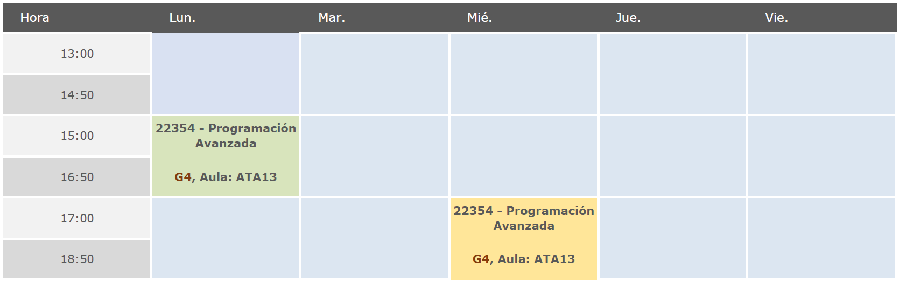
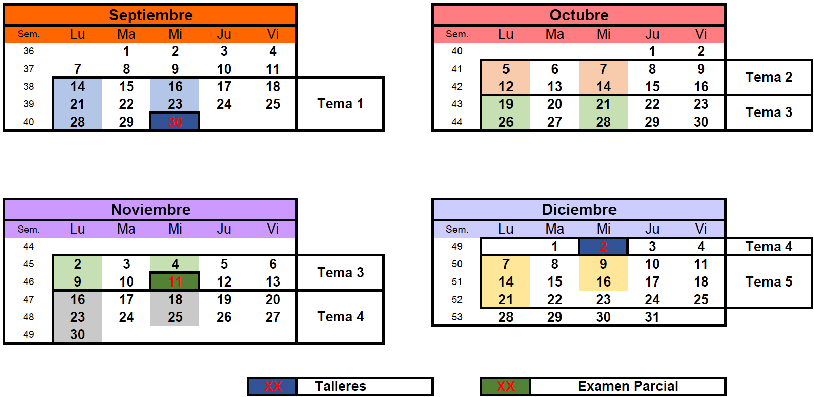

## Calendario de la EPS

El calendario académico de la Escuela Politécnica Superior (EPS) de la Universidad de las Islas Baleares (UIB) para el curso académico 2026-2027 se puede consultar en el siguiente enlace: [https://eps.uib.es/curs-2026-27/](https://eps.uib.es/curs-2026-27/).

---

## Horario de clases

---

## Horario de tutorías

Solicitar por correo electrónico a través del servicio de correo [**del Aula Digital**](https://ad.uib.es/estudis2627/course/view.php?id=1199).

---

## Calendario por temas

---

## Actividades de evaluación

| Actividad | Grupo | Fecha | Peso (\%) | Nota de validación |
| :--- | :--- | :--- | :--- | :--- |
| Primer Taller | G4 | 30/09/2026 | 10\% | - |
| Examen Parcial | G4 | 11/11/2026 | 40\% | 5 |
| Segundo Taller | G4 | 08/12/2026 | 10\% | - |
| Examen Global | G4 | Enero 2027 | 40\% | 5 |

